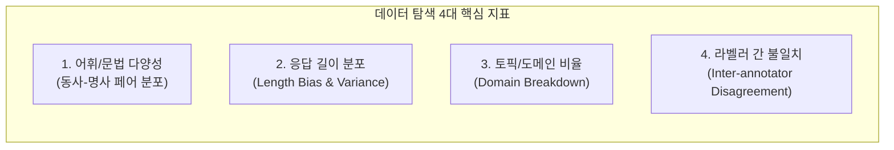
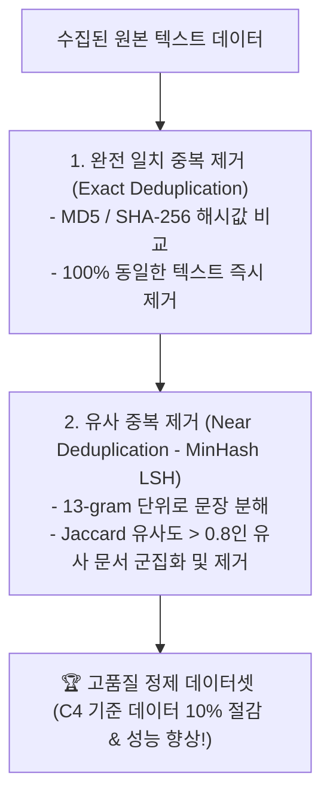

# 03. 데이터 탐색, 중복 제거 및 포맷팅 엔지니어링

## 📌 핵심 요약 & 전체 맥락
> **"데이터를 15분 동안 직접 눈으로 들여다보는 것이 수백 시간의 엔지니어링 삽질을 막아준다."**  
> 머신러닝 데이터 파이프라인의 완성은 **탐색적 데이터 분석(EDA), 중복 제거(Deduplication), 품질 필터링(Quality Filtering), 그리고 정밀한 학습 포맷팅(Formatting)**으로 이루어집니다.  
> 학습 데이터 내에 0.1%의 중복만 존재해도 모델 성능이 50% 수준으로 퇴화한다는 Anthropic의 실증 연구(Table 8-3)와 이를 해결하는 **MinHash LSH 유사 중복 제거 알고리즘**,  
> 그리고 지시 파인튜닝 시 사용자가 입력하는 프롬프트는 역전파 계산에서 제외하고 모델의 응답에만 그래디언트를 집중시키는 **프롬프트 손실 가중치(Prompt Loss Weight) 마스킹 기법**을 완벽하게 정리합니다.

---

## 🗺️ 도표(Figure & Table) 색인 및 매핑 가이드

본문의 핵심 원리를 시각적으로 확인할 수 있는 책 내 도표의 위치와 해설 매핑입니다:

| 도표 번호 | 도표 제목 및 핵심 내용 | 책 페이지 | 본문 해당 주제 |
| :---: | :--- | :---: | :--- |
| **Figure 8-6** | GPT-4 vs GPT-3의 지시 데이터 상위 25개 (동사, 목적어 명사) 페어 빈도 및 고유 어휘 다양성 비교 (Instruction Tuning with GPT-4) | **p. 398-422** | 1. 탐색적 데이터 분석 (EDA) |
| **Figure 8-7** | GPT-4(다양한 장문 꼬리 분포) vs GPT-3(단문 편중)의 생성 응답 토큰 길이 분포 비교 그래프 | **p. 398-422** | 1. 응답 길이 편향 분석 |
| **Table 8-3** | 중복 데이터가 특정 출력(빨간 연필 $20)으로 잘못된 상관관계를 유발하는 장난감 데이터셋 예시 | **p. 399-423** | 2. 중복 데이터의 위험성과 MinHash |
| **Table 8-4** | 음식 분류 태스크에서 3-shot 프롬프트를 파인튜닝용 입력-출력 쌍으로 변환한 구조화 데이터 예시 | **p. 402-426** | 4. 학습 데이터 포맷팅과 프롬프트 손실 |

---

## 1. 탐색적 데이터 분석 (EDA)과 분포 시각화 (Figure 8-6, 8-7)

> 💬 **Greg Brockman (OpenAI 공동창업자):**  
> *"데이터를 직접 수동으로 검사(Manual inspection)하는 것은 머신러닝의 모든 활동 중에서 **'노력 대비 가장 높은 가치를 창출하는(Highest value-to-prestige ratio)'** 작업이다."*



### ① 지시 데이터 어휘 및 문법 분석 (Figure 8-6)
* `(Verb, Direct Object Noun)` 페어 빈도 분석 (예: `Write (email)`, `Explain (concept)`, `Summarize (meeting)`).
* **GPT-4 vs GPT-3:** GPT-4는 상위 빈도 단어에 쏠리지 않고 **5,229개 이상의 고유한 동사-명사 조합**을 골고루 생성하여 압도적인 언어적 표현력을 보여줍니다.

### ② 응답 길이 분포와 길이 편향 (Figure 8-7)
* **GPT-3:** 100토큰 미만의 짧은 단문에 극단적으로 편중.
* **GPT-4:** 100~450토큰에 걸쳐 긴 꼬리(Long-tail)를 형성하며 논리적 근거와 세부 맥락을 풍부하게 생성함.

---

## 2. 중복 제거 (Deduplication)와 MinHash LSH (Table 8-3) ⭐

### ⚠️ 중복 데이터가 모델을 파괴하는 3대 이유
1. **잘못된 상관관계 학습 (Table 8-3):**  
   `{item: pencil, color: red}` ➔ `$20` 예시가 3번 중복되면, 모델은 *"모든 빨간 물건은 20달러다"*라는 거짓 규칙을 일반화해 버림.
2. **평가 데이터셋 오염 (Contamination)과 오염 제거 (Decontamination):**  
   훈련셋에 테스트셋(벤치마크) 문장이 침투하면 모델이 단순 암기로 점수를 부풀리게 됩니다. 이를 막기 위해 훈련 데이터와 평가 데이터 간의 **N-gram 오버랩(Overlap)을 엄격히 측정하여 겹치는 문장을 훈련셋에서 삭제(Decontamination)**해야 합니다.
3. **학습 효율성 급락 (Hernandez et al., Anthropic 2022):**  
   전체 데이터의 **단 0.1%를 100번 반복 학습**시키는 것만으로도, **800M 모델의 지능이 400M 모델 수준으로 반토막**남!

---

### 🛠️ 중복 제거 2단계 알고리즘



* **MinHash + Locality Sensitive Hashing (LSH):**  
  문서를 N-gram 토큰 집합으로 변환한 뒤 해시 시그니처를 생성하여, 수십억 개의 문장 사이에서 유사도(Jaccard Similarity)가 80% 이상인 유사 복제본을 $O(N)$ 시간 복잡도로 고속 탐색.

---

## 3. 텍스트 품질 필터링 파이프라인 (pp. 400 ~ 401)

```
[ 3단계 데이터 정제 필터링 ]

1단계 : 휴리스틱 규칙 필터 (Heuristic Rules)
  - 단어 수 < 5개 또는 > 10,000개 극단값 제거
  - 불용어(Stopwords) 비율 < 30% 제거 (의미 없는 키워드 나열 방지)
  - 대문자 비율 > 20% 또는 특수문자/HTML 태그 남발 데이터 제거

2단계 : 펄플렉서티 필터 (Perplexity Filtering)
  - 소형 참조 모델(예: KenLM, Llama-3-1B)로 텍스트의 당혹도(PPL) 측정
  - PPL이 너무 높으면 (난수/외계어/깨진 텍스트) ➔ 폐기
  - PPL이 너무 낮으면 (무의미한 단어의 무한 반복) ➔ 폐기

3단계 : 모델 기반 품질 분류기 (Quality Classifier)
  - Wikipedia, 교과서, 엄선된 책 데이터로 훈련된 FastText / RoBERTa 분류기
  - 고품질 확률 점수가 상위 50% 이상인 텍스트만 통과
```

---

## 4. 학습 데이터 포맷팅과 프롬프트 손실 마스킹 (Table 8-4, pp. 401 ~ 404) 🏆

### ① 데이터 포맷팅 (Prompt ➔ Instruction Mapping, Table 8-4)
3-shot 프롬프트의 예시들을 독립적인 훈련 튜플로 변환:

| 예시 ID | 입력 (Input) | 출력 (Expected Output) |
| :---: | :--- | :--- |
| **1** | `burger -->` | `edible` |
| **2** | `car -->` | `inedible` |
| **3** | `mushroom -->` | `edible` |

### 🛠️ 채팅 템플릿과 특수 토큰 (Chat Templates)
실제 SFT(지도 파인튜닝) 단계에서는 원시 텍스트를 그대로 넣지 않고, 모델이 대화의 역할을 인식하도록 **특수 토큰(Special Tokens)**으로 감싸는 채팅 템플릿 포맷팅이 필수적입니다.
* **형식 예시 (ChatML / Llama-3 구조):**  
  `<|im_start|>user\n서울의 수도는 어디인가요?<|im_end|>\n<|im_start|>assistant\n서울은 대한민국의 수도입니다.<|im_end|>`
* **엔지니어링 주의점:** 학습 시 사용한 템플릿과 추론 시 API 서버가 주입하는 템플릿 구조가 토큰 하나라도 다르면 모델 성능이 급격히 저하되므로 완벽한 일치가 필요합니다.

---

### ② 프롬프트 손실 가중치와 마스킹 (Prompt Loss Weight / Masking) ⭐

지시 파인튜닝(Instruction Tuning)에서 입력 데이터는 **프롬프트(User Prompt)**와 **응답(Assistant Response)**으로 구성됩니다:

$$\text{Total Loss} = \alpha \cdot \text{Loss}_{\text{prompt}} + (1 - \alpha) \cdot \text{Loss}_{\text{response}}$$

```mermaid
flowchart LR
    subgraph Tokens["학습 시퀀스 토큰 흐름"]
        P["User: 서울의 수도는 어디인가요?"] --> R["Assistant: 서울은 대한민국의 수도입니다."]
    end

    P -.->|Loss Masking (손실 계산 제외: α = 0)| NoGrad["그래디언트 0 (No Update)"]
    R -->|Cross-Entropy 손실 계산 & 역전파 집중| Update["가중치 업데이트 (Active Learning) 🚀"]
```

* **왜 프롬프트 손실 가중치($\alpha$)를 0% 또는 10%로 낮춰야 하는가?**  
  실제 추론(Inference) 환경에서 프롬프트는 사용자가 입력하는 고정된 입력값입니다. 모델이 사용자의 질문 문자열 자체를 예측하는 법을 배울 필요가 전혀 없으므로, **프롬프트 영역의 손실을 마스킹(0%)하여 모델의 모든 학습 용량을 '고품질 응답 생성'에만 100% 집중**시켜야 합니다.

---

## 🔗 연관 문서
* [[00-ch08-overview|00. Chapter 8 전체 개요 및 목차]]
* [[01-data-curation-quality-coverage-and-quantity|01. 데이터 큐레이션: 품질, 다양성 및 데이터 규모]]
* [[02-data-augmentation-and-synthesis|02. 데이터 증강과 AI 합성 데이터 (Self-Instruct & Model Collapse)]]
* [[chapter-qa/ch07-fine-tuning-qa/02-memory-math-and-quantization|Ch07-02. 학습 메모리 수학과 수치 정밀도 및 양자화]]
