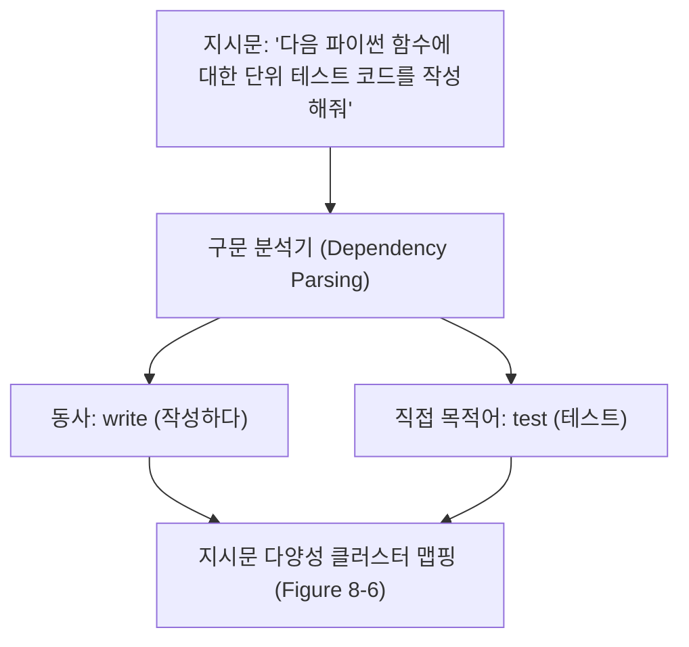
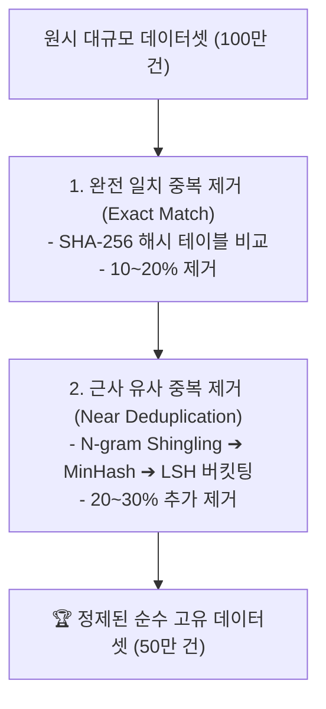

# 03. 데이터 검사, 중복 제거, 정제 및 표준 포맷팅

## 📌 핵심 요약 & 전체 맥락
> **"수집된 원시 데이터의 30~50%는 쓸모없는 중복과 노이즈입니다. 철저한 데이터 엔지니어링 파이프라인 없이는 모델의 진정한 잠재력을 끌어낼 수 없습니다."**  
> 데이터 수집과 증강이 끝난 후, 모델 학습에 투입하기 전 **데이터 탐색적 분석(EDA), 중복 제거(Deduplication), 품질 필터링, 그리고 표준 포맷팅**은 필수적인 전처리 관문입니다.  
> 특히 중복 데이터는 모델의 단순 암기(Memorization)를 유발하고 벤치마크 평가를 오염(Contamination)시키는 치명적인 악영향을 미칩니다 (Table 8-3).  
> 본 섹션에서는 `(동사, 직접목적어)` 쌍을 통한 **데이터 다양성 시각화(Figure 8-6)**와 응답 길이 분포 분석(Figure 8-7), 수십억 건의 텍스트에서 유사 문서를 초고속으로 걸러내는 **MinHash 및 LSH(Locality-Sensitive Hashing) 중복 제거 알고리즘**, 퍼플렉서티(Perplexity) 기반 노이즈 필터링, 그리고 **ChatML 및 ShareGPT 표준 학습 데이터 포맷팅(Table 8-4)**을 완벽히 정리합니다.

---

## 🗺️ 도표(Figure & Table) 색인 및 매핑 가이드

본문의 핵심 원리를 시각적으로 확인할 수 있는 책 내 도표의 위치와 해설 매핑입니다:

| 도표 번호 | 도표 제목 및 핵심 내용 | 책 페이지 | 본문 해당 주제 |
| :---: | :--- | :---: | :--- |
| **Figure 8-6** | Alpaca 데이터셋의 (동사, 직접목적어) 쌍 중심 원형 분포 분석 (지시 다양성 검증) | **p. 398** | 1. 데이터 탐색적 분석(EDA) |
| **Figure 8-7** | GPT-4(평균 1,200토큰)와 GPT-3(평균 400토큰)의 응답 길이 분포 비교 (품질 및 스타일 차이) | **p. 399** | 1. 데이터 탐색적 분석(EDA) |
| **Table 8-3** | 완전 중복 및 의미론적 근사 중복 데이터가 모델 암기와 성능 평가를 왜곡하는 실증 예시표 | **p. 400** | 2. 중복 제거 (Deduplication) |
| **Table 8-4** | 원시 비정형 데이터로부터 ChatML, Alpaca 포맷, JSON 키-값 형태로 변환된 표준 학습 데이터 예시표 | **p. 402** | 4. 데이터 표준 포맷팅 |

---

## 1. 데이터 탐색적 분석 (EDA, Figures 8-6, 8-7, pp. 396 ~ 399)

데이터를 모델에 주입하기 전에 데이터셋의 통계적 구조와 분포를 시각화하여 불균형을 진단해야 합니다.

### ① 지시문 의도 분포: (동사, 직접목적어) 분석 (Figure 8-6)
* **분석 기법:** spaCy 등의 의존 구문 분석기(Dependency Parser)를 사용하여 각 지시문의 **루트 동사(Root Verb)**와 **직접 목적어(Direct Object Noun)**를 추출하고 원형 트리 맵(Sunburst Chart)으로 시각화합니다.
* **불균형 진단:**
  * 예: `("write", "code")`, `("summarize", "article")`, `("translate", "sentence")` 등 특정 패턴이 전체 데이터의 80%를 차지하지 않는지 확인.
  * 데이터셋이 골고루 분산되어 있어야 모델이 광범위한 실제 사용자 요청에 일반화될 수 있습니다.



---

### ② 응답 길이(Response Length) 분포 비교 (Figure 8-7)
* **GPT-4 vs GPT-3 분포 차이 (Figure 8-7):**  
  * **GPT-3:** 평균 응답 길이가 300~400 토큰에 머물며, 단순하고 짤막한 답변 위주로 분포.
  * **GPT-4:** 평균 응답 길이가 1,000~1,500 토큰으로 대폭 확장되며, 단계별 추론 과정(CoT), 예외 처리, 서론/결론이 풍부하게 포함됨.
* ⚠️ **엔지니어링 주의점:**  
  파인튜닝된 모델은 학습 데이터셋의 **응답 길이 분포를 그대로 복제**합니다. 장황하고 상세한 답변을 원한다면 긴 응답 데이터셋을, 빠르고 간결한 챗봇을 원한다면 100~200토큰으로 정제된 데이터셋을 구축해야 합니다.

---

## 2. 중복 제거 (Deduplication, Table 8-3, pp. 399 ~ 401) ⭐

데이터셋에 동일하거나 유사한 텍스트가 중복 존재하면 **1) 학습 연산 자원 낭비, 2) 특정 문장의 무조건 암기(Overfitting), 3) 테스트셋 오염(Contamination)으로 인한 벤치마크 허위 고평가**가 발생합니다.



### ① 완전 일치 중복 제거 (Exact Deduplication)
* 공백 정규화(Strip & Lowercase) 후 **SHA-256 / MD5 해시값**을 계산하여 동일한 해시를 갖는 레코드를 $O(N)$으로 즉시 제거합니다.

### ② 근사 중복 제거 (Near Deduplication): MinHash + LSH
문장의 몇 단어만 바뀌었거나 순서가 살짝 다른 유사 중복은 단순 해시로 잡을 수 없습니다. 수억 건의 데이터에서 모든 쌍을 비교($O(N^2)$)하는 것은 불가능하므로 **MinHash + LSH** 알고리즘을 사용합니다:

1. **$N$-gram 슁글링 (Shingling):** 문장을 단어 단위의 슁글(예: 3-gram 집합)로 분해.
2. **자카드 유사도 (Jaccard Similarity):**  
   $$J(A, B) = \frac{|A \cap B|}{|A \cup B|}$$
3. **MinHash:** 각 문서를 $K$개(예: 128개)의 독립 해시 함수로 변환하여 고정 길이의 정수 서명(Signature) 벡터로 압축.
4. **LSH (Locality-Sensitive Hashing):** 서명 벡터를 여러 밴드(Bands)로 쪼개어, **유사한 문서들이 동일한 해시 버킷에 충돌할 확률을 극대화**함으로써 단 한 번의 해시 조회($O(N)$)로 90% 이상 유사한 문서를 모두 적발 및 제거.

---

## 3. 데이터 정제 및 품질 필터링 (p. 401)

```
[ 데이터 정제 3단계 필터링 파이프라인 ]

1. 휴리스틱 규칙 필터 (Heuristic Rule Filters) :
   • 길이 필터: 10토큰 미만의 무의미한 문장이나 4,096토큰 초과 텍스트 제거.
   • 특수문자 비율: 영숫자(Alphanumeric) 비율이 60% 미만인 코드 찌꺼기 제거.
   • 반복성 검사: "ㅋㅋㅋㅋㅋㅋ"나 "....." 등 동일 구문이 3회 이상 반복되는 텍스트 삭제.

2. 퍼플렉서티 필터링 (Perplexity / PPL Filtering) 🏆 :
   • 소형 고속 언어 모델(KenLM 또는 작은 Llama)로 텍스트의 PPL을 측정.
   • PPL이 극단적으로 높은 문장 ➔ 문법이 붕괴된 외계어/노이즈 텍스트 판정 후 삭제.
   • PPL이 극단적으로 낮은 문장 ➔ 저작권 경고문, 네비게이션 메뉴 등 기계적 반복문 삭제.

3. 안전성 & 개인정보 필터 (Safety & PII Masking) :
   • 이메일, 전화번호, 주민번호, 신용카드 번호 ➔ 정규식 및 NER로 `[REDACTED]` 마스킹.
   • 유해성 분류기(Toxicity Classifier)로 혐오 표현 및 불법 콘텐츠 제거.
```

---

## 4. 데이터 표준 포맷팅 (Table 8-4, pp. 401 ~ 403)

파인튜닝 프레임워크와 모델 아키텍처에 맞게 데이터를 표준 JSON 포맷으로 변환해야 합니다:

### ① 주요 3대 학습 데이터 포맷 비교 (Table 8-4)

#### 1. Alpaca 포맷 (단일 턴 지시 데이터에 최적)
```json
{
  "instruction": "다음 영문 텍스트를 한국어로 번역하라.",
  "input": "Large Language Models are transforming AI.",
  "output": "거대 언어 모델은 AI를 변화시키고 있습니다."
}
```

#### 2. ChatML 포맷 (OpenAI 및 현대 오픈소스 표준 🏆)
특수 토큰(`<|im_start|>`, `<|im_end|>`)으로 발화자(Role)의 경계를 명확히 분리하여 프롬프트 인젝션과 역할 혼선을 차단:
```
<|im_start|>system
당신은 친절하고 전문적인 금융 상담 비서입니다.<|im_end|>
<|im_start|>user
ISA 계좌의 비과세 한도가 얼마인가요?<|im_end|>
<|im_start|>assistant
일반형 기준 순소득 200만 원(서민형은 400만 원)까지 비과세 혜택이 적용됩니다.<|im_end|>
```

#### 3. ShareGPT / OpenAI Messages 포맷 (멀티턴 대화 표준)
```json
{
  "messages": [
    {"role": "system", "content": "너는 사내 결제 개발 지원 봇이다."},
    {"role": "user", "content": "카카오페이 정기결제 API 어떻게 호출해?"},
    {"role": "assistant", "content": "PaySDK.subscriptions.register()를 호출하시면 됩니다."},
    {"role": "user", "content": "에러 코드 4001 뜨면 어떻게 해야 해?"},
    {"role": "assistant", "content": "4001은 사용자 잔액 부족 에러입니다. 재시도 로직을 작성하세요."}
  ]
}
```

---

## 5. 엔지니어링 심화 Q&A

### Q1. 파인튜닝 데이터셋에서 중복 데이터를 완전히 제거하는 것이 왜 그렇게 중요한가요?
중복 데이터가 포함되면 역전파 학습 시 해당 샘플의 그래디언트가 과도하게 누적되어 **모델이 해당 특정 문장을 맹목적으로 암기(Memorization)하고 다른 일반 질의에 대해서도 해당 문장만 앵무새처럼 출력하는 과적합(Overfitting)**이 발생합니다. 또한 테스트셋과의 중복(Contamination)이 발생하면 실제 배포 환경에서의 성능을 전혀 신뢰할 수 없게 됩니다.

### Q2. ChatML 포맷에서 특수 토큰(`<|im_start|>`)은 모델 학습 시 어떤 역할을 하나요?
ChatML의 특수 토큰은 토크나이저(Tokenizer)에 사전 등록되어 단 1개의 고유 토큰 ID로 인코딩됩니다. 이를 통해 모델은 일반 텍스트 문자열 `system:`이나 `user:`와 시스템 제어 신호를 명확히 구분하여, **사용자가 프롬프트 안에 악의적으로 `system:`을 흉내 내더라도 시스템 프롬프트가 오염되지 않도록 완벽히 격리**합니다.

---

## 🔗 연관 문서
* [[00-ch08-overview|00. Chapter 8 전체 개요 및 목차]]
* [[01-data-curation-quality-coverage-and-quantity|01. 데이터 큐레이션: 품질, 다양성 및 데이터 규모]]
* [[02-data-augmentation-and-synthesis|02. 데이터 증강과 AI 기반 합성 데이터 생성 기법]]
* [[chapter-qa/ch07-fine-tuning-qa/05-finetuning-tactics-and-hyperparameters|Ch07-05. 파인튜닝 실무 전술과 하이퍼파라미터 최적화]]
