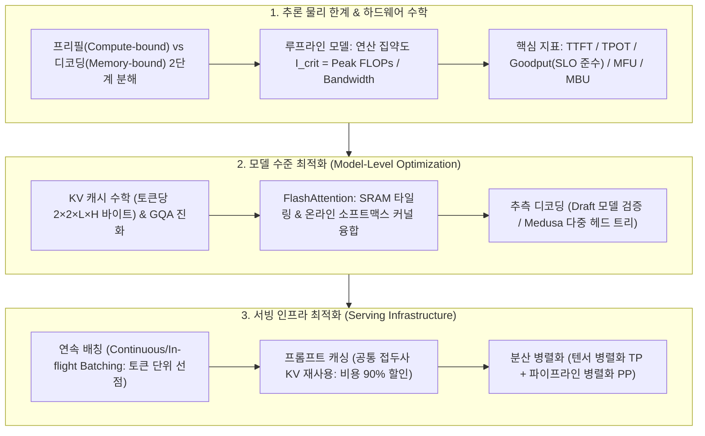

# Chapter 09. 생성형 AI 추론 최적화와 서빙 인프라 (Inference Optimization)

> **"학습(Training)이 일회성 자본 투자라면, 추론(Inference)은 매일 매초 발생하는 지속적인 운영 비용(OpEx)입니다. 추론을 2배 최적화하는 것은 회사의 서버 비용을 절반으로 줄이고 사용자 이탈률을 획기적으로 낮추는 최고의 비즈니스 레버리지입니다."**  
> 생성형 LLM은 입력 프롬프트를 한 번에 병렬 처리하는 **프리필(Prefill: 연산력 병목, Compute-bound)**과, 이전 토큰들을 기반으로 다음 토큰을 하나씩 순차 생성하는 **디코딩(Decode: 메모리 대역폭 병목, Memory Bandwidth-bound)**이라는 완전히 상이한 2단계 물리적 제약을 가지고 있습니다.  
> 본 챕터에서는 하드웨어 한계를 규명하는 **루프라인 모델(Roofline Model)**과 **추론 핵심 메트릭(TTFT, TPOT, Goodput, MFU, MBU)**부터,  
> 모델 수준의 혁신인 **추측 디코딩(Speculative Decoding, Medusa)**, **KV 캐시 메모리 수학(MQA/GQA)**, **FlashAttention 커널 융합**,  
> 그리고 서빙 인프라의 핵심인 **연속 배칭(Continuous Batching)**, **프롬프트 캐싱(Prompt Caching)**, **분산 병렬화(Tensor Parallelism, Pipeline Parallelism)**까지 추론 최적화의 A to Z를 심층적으로 다룹니다.

---

## 🗺️ Chapter 9 학습 로드맵 및 소챕터 구성

| 번호 | 문서 제목 | 핵심 내용 및 주요 키워드 | 원문 페이지 |
| :---: | :--- | :--- | :---: |
| **00** | [[00-ch09-overview\|00. Chapter 9 전체 개요 및 목차]] | 추론 최적화 전체 로드맵, 개념 지도 및 도표 총괄 색인 | pp. 405-448 |
| **01** | [[01-inference-fundamentals-and-hardware-math\|01. 추론 기초, 루프라인 모델 및 하드웨어 수학]] | 프리필 vs 디코딩 2단계(Figure 9-3), 루프라인 모델(Figure 9-2) 및 연산 집약도 수학, 추론 성능 메트릭(TTFT, TPOT, Throughput vs Goodput Figure 9-4), MFU/MBU 하드웨어 활용도(Table 9-1, Figure 9-5), AI 가속기 연산 구조 및 3단계 메모리 계층(Figure 9-6, 9-7, Table 9-2) (pp. 405-425) | `Roofline Model`, `Arithmetic Intensity`, `Prefill vs Decode`, `TTFT`, `TPOT`, `Goodput`, `MFU`, `MBU`, `Memory Hierarchy`, `SRAM`, `HBM` |
| **02** | [[02-kv-cache-flashattention-and-batching\|02. KV 캐시 수학, FlashAttention 및 연속 배칭]] | KV 캐시 메모리 산출 공식(Figure 9-12), MHA vs MQA vs GQA 어텐션 진화, FlashAttention 커널 융합 및 SRAM 타일링(Figure 9-13), PyTorch 2.0 10배 가속 실증(Figure 9-14), 정적/동적 배치 vs 연속 배치(Continuous/In-flight Batching Figure 9-15, 9-16) (pp. 426-442) | `KV Cache Math`, `MQA`, `GQA`, `FlashAttention`, `Kernel Fusion`, `Continuous Batching`, `vLLM`, `Orca` |
| **03** | [[03-speculative-decoding-caching-and-parallelism\|03. 추측 디코딩, 프롬프트 캐싱 및 분산 병렬화]] | 추측 디코딩 원리 및 가속 수학(Figure 9-9), Inference with Reference(Figure 9-10), Medusa 다중 헤드 트리 디코딩(Figure 9-11), 프롬프트 캐싱 경제학(Figure 9-17, Table 9-3), 텐서 병렬화(TP Figure 9-18) vs 파이프라인 병렬화(PP Figure 9-19) (pp. 427-447) | `Speculative Decoding`, `Medusa`, `Inference with Reference`, `Prompt Caching`, `Tensor Parallelism`, `Pipeline Parallelism` |

---

## 🧠 Chapter 9 전체 개념 아키텍처 다이어그램

---

## 📊 Chapter 9 주요 도표 & 수치 색인

| 도표 번호 | 도표 제목 및 핵심 내용 | 책 페이지 | 해당 소챕터 |
| :---: | :--- | :---: | :--- |
| **Figure 9-1** | 클라이언트 요청을 받아 로드 밸런서와 GPU 워커 풀을 통해 토큰을 생성하는 단순 추론 서비스 구조 | **p. 407** | 01 |
| **Figure 9-2** | 연산 집약도(FLOP/Byte)에 따른 메모리 대역폭 한계선과 피크 연산 지붕을 나타낸 루프라인 차트 (Roofline Chart) | **p. 409** | 01 |
| **Figure 9-3** | 병렬 프롬프트 처리 단계인 프리필(Prefill)과 토큰 순차 생성 단계인 디코딩(Decode)의 2단계 구조 | **p. 410** | 01 |
| **Figure 9-4** | 10건의 완료 요청(Throughput 10 RPS) 중 TTFT 및 TPOT의 SLO 기준을 충족한 유효 처리량(Goodput 3 RPS) 비교 | **p. 416** | 01 |
| **Table 9-1** | Google PaLM 540B(46.2%) 및 Megatron-Turing 530B(30.2%)의 실제 하드웨어 MFU 달성치 비교표 | **p. 418** | 01 |
| **Figure 9-5** | Llama 2-70B FP16 추론 시 동시 접속자 수 증가(1 ➔ 256명)에 따른 칩별(A100, H100, Gaudi2) MBU 하락 곡선 | **p. 418** | 01 |
| **Figure 9-6** | 스칼라(Scalar), 벡터(Vector / SIMD), 텐서(Tensor / 시스톨릭 어레이) 연산 프리미티브 비교 | **p. 421** | 01 |
| **Table 9-2** | NVIDIA H100 SXM의 수치 정밀도 포맷별(FP64, FP32, TF32, FP16/BF16, FP8) TFLOP/s 스펙표 | **p. 422** | 01 |
| **Figure 9-7** | GPU 온칩 SRAM(20MB, 10TB/s) ➔ GPU HBM(40~80GB, 1.5~3.3TB/s) ➔ CPU DRAM(1TB, 25GB/s) 메모리 계층도 | **p. 424** | 01 |
| **Figure 9-8** | 모델 압축(양자화, 가지치기, 증류) 및 시스템 최적화 기법 분류 트리 | **p. 426** | 02 |
| **Figure 9-9** | 소형 Draft 모델이 $K$개 토큰을 투기 생성하고 타겟 모델이 1회 병렬 검증하는 추측 디코딩 메커니즘 | **p. 428** | 03 |
| **Figure 9-10** | RAG 검색 문서나 참조 텍스트를 Draft 삼아 추측 디코딩하는 Inference with Reference 예시 | **p. 430** | 03 |
| **Figure 9-11** | 단일 모델 상단에 복수 예측 헤드를 부착하여 트리 구조로 토큰을 병렬 생성하는 Medusa 아키텍처 | **p. 432** | 03 |
| **Figure 9-12** | 순전파 시 이전 토큰들의 Key/Value 텐서를 캐싱하여 중복 연산을 제거하는 KV 캐시 구조 | **p. 434** | 02 |
| **Figure 9-13** | HBM I/O 병목을 제거하기 위해 SRAM 타일링과 온라인 소프트맥스를 적용한 FlashAttention 융합 커널 | **p. 437** | 02 |
| **Figure 9-14** | PyTorch 팀이 `torch.compile` + FlashAttention + INT8 양자화로 Llama 7B 처리량을 10배 가속한 실증 차트 | **p. 439** | 02 |
| **Figure 9-15** | 요청 도착 대기 시간과 패딩 낭비가 발생하는 전통적 정적/동적 배치(Dynamic Batching)의 한계 | **p. 441** | 02 |
| **Figure 9-16** | 토큰 단위로 새로운 요청을 즉시 끼워 넣고 완료된 요청을 즉시 반환하는 연속 배치(Continuous Batching) | **p. 442** | 02 |
| **Figure 9-17** | 여러 요청 간 공통 시스템 프롬프트 및 RAG 문맥의 KV 캐시를 공유하는 프롬프트 캐싱 구조 | **p. 443** | 03 |
| **Table 9-3** | Anthropic Claude의 프롬프트 캐싱 적용 시 비용 90% 할인 및 지연시간 80% 감소 실측표 | **p. 444** | 03 |
| **Figure 9-18** | 단일 노드 내 다중 GPU 간 행렬 곱셈을 열/행 단위로 분할하여 병렬 연산하는 텐서 병렬화 (Tensor Parallelism) | **p. 445** | 03 |
| **Figure 9-19** | 모델 레이어를 여러 GPU/노드에 분할하고 마이크로배치 파이프라인으로 처리하는 파이프라인 병렬화 (Pipeline Parallelism) | **p. 446** | 03 |

---

## 💡 주요 축약어 원문 및 해설 사전 (Abbreviations Glossary)

* **Prefill Phase (프리필 단계 / 프롬프트 처리):** 사용자의 입력 프롬프트 전체를 한 번에 병렬 연산하여 첫 번째 토큰의 KV 캐시를 생성하는 단계 (연산력 병목, Compute-bound).
* **Decode Phase (디코딩 단계 / 토큰 생성):** 이전까지 생성된 모든 토큰의 KV 캐시를 메모리에서 읽어와 다음 토큰을 하나씩 순차 생성하는 자기회귀 단계 (메모리 대역폭 병목, Memory-bound).
* **TTFT (Time To First Token, 첫 토큰 생성 시간):** 사용자가 요청을 보낸 시점부터 첫 번째 토큰이 출력될 때까지의 대기 시간 (프리필 연산 속도가 결정).
* **TPOT (Time Per Output Token, 토큰당 생성 시간):** 첫 토큰 이후 후속 토큰이 하나씩 생성되는 데 걸리는 평균 시간 (사용자가 체감하는 텍스트 출력 속도, 초당 토큰 수의 역수).
* **ITL (Inter-Token Latency, 토큰 간 지연시간):** 토큰과 토큰 사이의 개별 지연시간 (스트리밍 응답의 끊김 현상을 측정).
* **Goodput (유효 처리량):** 단순히 완료된 전체 RPS 중, 기업이 약속한 서비스 수준 목표(SLO, 예: TTFT < 500ms, TPOT < 50ms)를 실제로 충족한 요청의 초당 처리량.
* **Roofline Model (루프라인 모델):** 하드웨어의 피크 연산력(TFLOP/s)과 메모리 대역폭(TB/s)의 비율을 통해 특정 알고리즘의 물리적 병목 지점을 시각화하는 분석 프레임워크.
* **Arithmetic Intensity (연산 집약도):** 메모리에서 1바이트를 읽거나 쓸 때 몇 번의 부동소수점 연산(FLOPs)을 수행하는지 나타내는 지표 ($\text{FLOP/Byte}$).
* **MFU (Model FLOPs Utilization, 모델 연산 활용도):** 하드웨어의 이론적 최대 피크 FLOPs 대비 실제 유효 모델 연산에 사용된 FLOPs의 비율.
* **MBU (Model Bandwidth Utilization, 모델 대역폭 활용도):** 하드웨어의 이론적 메모리 대역폭 대비 실제 가중치 및 KV 캐시 로드에 사용된 대역폭의 비율.
* **KV Cache (Key-Value 캐시):** 이전 스텝에서 계산된 어텐션 Key와 Value 텐서를 VRAM에 저장하여 매 스텝마다 $O(N^2)$ 중복 재계산을 방지하는 필수 기법.
* **MQA / GQA (Multi-Query / Grouped-Query Attention):** Multi-Head Attention(MHA)의 막대한 KV 캐시 용량을 줄이기 위해 여러 쿼리 헤드가 단 1개(MQA) 또는 소수의 그룹(GQA) Key-Value 헤드를 공유하도록 설계한 아키텍처.
* **FlashAttention (플래시 어텐션):** 느린 GPU HBM 읽기/쓰기를 극적으로 줄이기 위해 초고속 온칩 SRAM 상에서 타일링(Tiling)과 온라인 소프트맥스를 융합하여 어텐션을 가속하는 표준 커널.
* **Continuous Batching (연속 배치 / In-flight Batching):** 시퀀스 전체가 끝날 때까지 기다리지 않고, 토큰 생성 스텝마다 완료된 요청은 즉시 반환하고 새 요청을 즉시 투입하는 최신 서빙 스케줄러.
* **Speculative Decoding (추측 디코딩):** 작고 빠른 초경량 모델(Draft Model)이 $K$개의 토큰을 빠르게 앞서 생성하고, 원본 거대 모델이 이를 단 한 번의 순전파로 병렬 검증하여 수학적 무손실 가속을 달성하는 기법.
* **Medusa (메두사):** 별도의 Draft 모델 없이 단일 베이스 모델 상단에 여러 개의 예측 헤드를 부착하여 다중 토큰 후보 트리를 병렬 생성 및 검증하는 추측 디코딩 기법.
* **Prompt Caching (프롬프트 캐싱):** 여러 사용자가 공유하는 긴 시스템 프롬프트나 RAG 컨텍스트의 사전 계산된 KV 캐시를 메모리에 보존하여 재사용함으로써 비용 90% 절감 및 TTFT를 단축하는 기술.
* **Tensor Parallelism (TP, 텐서 병렬화):** 단일 노드 내의 고속 NVLink로 연결된 여러 GPU에 개별 가중치 행렬을 행/열 단위로 분할하여 동시에 곱셈을 수행하는 병렬화 기법 (Megatron-LM).
* **Pipeline Parallelism (PP, 파이프라인 병렬화):** 모델의 전체 트랜스포머 레이어를 여러 노드/GPU에 순차 분할 배치하고 마이크로배치 단위로 파이프라인을 흘려보내는 분산 기법.
