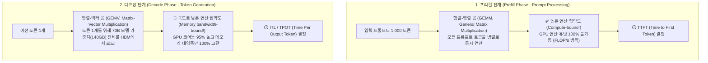

# 01. 추론 기초, 루프라인 모델 및 하드웨어 수학

## 📌 핵심 요약 & 전체 맥락
> **"첫 번째 토큰을 읽을 때는 연산력(Compute)이 부족하고, 이후 토큰을 하나씩 뱉어낼 때는 메모리 대역폭(Memory Bandwidth)이 모자랍니다."**  
> 생성형 AI 추론의 본질은 **프리필 (Prefill Phase: Compute-bound)**과 **디코딩 (Decode Phase: Memory Bandwidth-bound)**이라는 완전히 상이한 두 가지 물리적 병목을 해결하는 것입니다.  
> 본 섹션에서는 하드웨어의 최대 연산력과 메모리 대역폭 간의 관계를 명쾌하게 규명하는 **루프라인 모델 (Roofline Model: Figure 9-2)**, 실제 서비스의 사용자 경험과 SLA를 결정짓는 **추론 4대 핵심 메트릭 (TTFT, ITL/TPOT, Throughput, Goodput: Figure 9-4)**,  
> 그리고 하드웨어의 잠재력을 얼마나 알뜰하게 활용하고 있는지 측정하는 **MFU (Model FLOPs Utilization: Table 9-1)**와 **MBU (Model Bandwidth Utilization: Figure 9-5)**, 초고속 SRAM부터 HBM까지 이어지는 **GPU 3단계 메모리 계층(Figure 9-7)**을 완벽하게 정리합니다.

---

## 🗺️ 도표(Figure & Table) 색인 및 매핑 가이드

본문의 핵심 원리를 시각적으로 확인할 수 있는 책 내 도표의 위치와 해설 매핑입니다:

| 도표 번호 | 도표 제목 및 핵심 내용 | 책 페이지 | 본문 해당 주제 |
| :---: | :--- | :---: | :--- |
| **Figure 9-1** | 클라이언트 요청을 받아 로드 밸런서와 GPU 워커 풀을 통해 토큰을 생성하는 단순 추론 서비스 구조 | **p. 407-431** | 1. 추론 서비스 아키텍처 |
| **Figure 9-2** | 연산 집약도(FLOP/Byte)에 따른 메모리 대역폭 한계선과 피크 연산 지붕을 나타낸 루프라인 차트 (Roofline Chart) | **p. 409-433** | 2. 루프라인 모델 (Roofline Model) |
| **Figure 9-3** | 병렬 프롬프트 처리 단계인 프리필(Prefill)과 토큰 순차 생성 단계인 디코딩(Decode)의 2단계 구조 | **p. 410-434** | 3. 프리필 vs 디코딩 2단계 |
| **Figure 9-4** | 10건의 완료 요청(Throughput 10 RPS) 중 TTFT 및 TPOT의 SLO 기준을 충족한 유효 처리량(Goodput 3 RPS) 비교 | **p. 416-440** | 4. 추론 4대 핵심 성능 메트릭 |
| **Table 9-1** | Google PaLM 540B(46.2%) 및 Megatron-Turing 530B(30.2%)의 실제 하드웨어 MFU 달성치 비교표 | **p. 418-442** | 5. MFU와 MBU |
| **Figure 9-5** | Llama 2-70B FP16 추론 시 동시 접속자 수 증가(1 ➔ 256명)에 따른 칩별(A100, H100, Gaudi2) MBU 하락 곡선 | **p. 418-442** | 5. MFU와 MBU |
| **Figure 9-6** | 스칼라(Scalar), 벡터(Vector / SIMD), 텐서(Tensor / 시스톨릭 어레이) 연산 프리미티브 비교 | **p. 421-445** | 6. AI 가속기 연산 구조 |
| **Table 9-2** | NVIDIA H100 SXM의 수치 정밀도 포맷별(FP64, FP32, TF32, FP16/BF16, FP8) TFLOP/s 스펙표 | **p. 422-446** | 6. AI 가속기 연산 구조 |
| **Figure 9-7** | GPU 온칩 SRAM(20MB, 10TB/s) ➔ GPU HBM(40~80GB, 1.5~3.3TB/s) ➔ CPU DRAM(1TB, 25GB/s) 메모리 계층도 | **p. 424-448** | 7. GPU 3단계 메모리 계층 |

---

## 1. 루프라인 모델 (Roofline Model, Figure 9-2) ⭐

하드웨어의 최대 연산 성능은 **피크 연산 성능(Peak FLOPs, TFLOP/s)**과 **메모리 대역폭(Memory Bandwidth, TB/s)**이라는 두 개의 천장에 의해 물리적으로 제한됩니다:

```mermaid
flowchart LR
    subgraph Roofline["루프라인 모델 2대 영역 (Figure 9-2)"]
        Mem["1. 메모리 대역폭 병목 영역 (Memory-bound)\n- 연산 집약도 I < I_crit\n- 연산 속도 = 대역폭 × 연산집약도\n- 💡 해결책: 가중치 양자화, KV 캐시 절감"]
        Crit(("변곡점 (Knee Point)\nI_crit = Peak FLOPs / Bandwidth"))
        Comp["2. 연산력 병목 영역 (Compute-bound)\n- 연산 집약도 I > I_crit\n- 연산 속도 = 하드웨어 피크 FLOP/s\n- 💡 해결책: 배치 크기 확대, 연산자 융합")]
    end
    Mem --> Crit --> Comp
```

### 📐 연산 집약도 (Arithmetic Intensity) 수식
$$\text{Arithmetic Intensity } (I) = \frac{\text{총 부동소수점 연산량 (FLOPs)}}{\text{메모리에서 읽고 쓴 총 바이트 수 (Bytes)}}$$

* **NVIDIA H100 SXM 변곡점 실측 예시:**
  * FP16 피크 연산력: $\approx 1,000\text{ TFLOP/s}$
  * HBM3 메모리 대역폭: $\approx 3.35\text{ TB/s}$
  * 변곡점 $I_{\text{crit}} = \frac{1000}{3.35} \approx \mathbf{298.5\text{ FLOP/Byte}}$
  * **엔지니어링 의미:** 메모리에서 1바이트를 읽어올 때마다 **최소 300회 이상의 수학 연산을 수행해야만 GPU 연산 코어를 100% 낭비 없이 풀가동**할 수 있습니다!

---

## 2. 프리필(Prefill) vs 디코딩(Decode) 2단계 분석 (Figure 9-3) 🏆

LLM 추론은 두 개의 완전히 다른 물리적 병목 단계로 나뉩니다:



---

## 3. 추론 4대 핵심 성능 메트릭 (Figure 9-4, pp. 412 ~ 416)

```
[ LLM 추론 4대 핵심 성능 지표 ]

1. TTFT (Time To First Token, 첫 토큰 생성 지연시간) : 사용자가 프롬프트를 전송한 후 첫 글자가 화면에 뜰 때까지의 지연시간 (프리필 속도).
2. ITL (Inter-Token Latency, 토큰 간 지연시간) / TPOT (Time Per Output Token, 출력 토큰당 생성 시간) : 토큰이 하나씩 스트리밍되어 나오는 간격 (디코딩 속도, 사람이 읽는 편안함 결정).
3. 처리량 (Throughput) : 시스템이 초당 처리하는 총 요청 수(RPS) 또는 총 토큰 수(Tokens/sec).
4. 유효 처리량 (Goodput) : 전체 처리량 중 서비스 수준 협약(SLA / SLO) 지연시간 기준을 충족한 유효 RPS (Figure 9-4).
```

### 🎯 Throughput vs Goodput 실증 분석 (Figure 9-4)
* 서비스가 초당 10개의 요청을 완료(Throughput = 10 RPS)했더라도, **SLO (Service Level Objective, 서비스 수준 목표) 기준(예: TTFT $\le 200\text{ms}$ 및 TPOT $\le 100\text{ms}$)을 만족한 요청이 3건뿐이라면, 실질적인 비즈니스 유효 처리량(Goodput)은 3 RPS**에 불과합니다.

---

## 4. 하드웨어 효율성: MFU와 MBU (Table 9-1, Figure 9-5)

### ① MFU (Model FLOPs Utilization, 모델 연산력 활용도, Table 9-1)
하드웨어의 이론상 최대 피크 FLOP/s 대비 **모델이 실제 유의미한 순전파/역전파에 사용한 연산량의 비율**:

$$\text{MFU} = \frac{\text{실제 초당 수행된 유효 FLOPs}}{\text{하드웨어 이론상 피크 FLOP/s}}$$

| 모델 | 파라미터 수 | 가속기 칩 구성 | MFU 달성치 | 비고 |
| :--- | :---: | :---: | :---: | :--- |
| **GPT-3** | 175B | NVIDIA V100 | 21.3% | 초기 LLM 서빙 |
| **Gopher** | 280B | 4,096x TPU v3 | 32.5% | 구글 딥마인드 |
| **Megatron-Turing NLG** | 530B | 2,240x A100 | 30.2% | 마이크로소프트/엔비디아 |
| **PaLM** | 540B | 6,144x TPU v4 | **46.2% 🚀** | Pathways 아키텍처로 40% 돌파 |

---

### ② MBU (Memory Bandwidth Utilization, 메모리 대역폭 활용도, Figure 9-5)
가중치 행렬과 KV 캐시를 로드할 때 **GPU 메모리 버스 대역폭을 얼마나 효율적으로 빨아들이고 있는가**를 나타내는 지표:

$$\text{MBU} = \frac{(\text{모델 파라미터 크기} + \text{KV 캐시 크기}) \times \text{초당 생성 토큰 수}}{\text{하드웨어 HBM 최대 메모리 대역폭}}$$

* **동시 사용자 증가에 따른 MBU 하락 현상 (Figure 9-5):**  
  단일 사용자(Batch=1)일 때는 MBU가 40~45%로 높지만, **동시 접속자가 256명으로 늘어나면 배칭 효과로 인해 워크로드가 Compute-bound로 전환되면서 MBU는 15~20%로 감소**합니다.

---

## 5. GPU 3단계 메모리 계층 구조 (Figure 9-7, p. 424)

```mermaid
flowchart TD
    subgraph Hierarchy["GPU 3단계 메모리 피라미드 (Figure 9-7)"]
        SRAM["1. GPU 온칩 정적 메모리 (SRAM / L1/L2 Cache)\n- 용량: 20 ~ 50 MB (초미세 극소 용량)\n- 대역폭: 10 ~ 33 TB/s (빛의 속도 🚀)"]
        HBM["2. 고대역폭 메모리 (GPU HBM / VRAM)\n- 용량: 40 ~ 80 GB (A100/H100)\n- 대역폭: 1.5 ~ 3.35 TB/s"]
        DRAM["3. 호스트 CPU 동적 메모리 (Host DRAM)\n- 용량: 512 GB ~ 1 TB+\n- 대역폭: 25 ~ 64 GB/s (거북이 속도 🐢)"]
    end

    SRAM <-->|10~33 TB/s 초고속 전송| HBM
    HBM <-->|PCIe Gen5 (64 GB/s) 병목| DRAM
```

> 💡 **추론 최적화의 제1원칙:**  
> GPU 코어가 아무리 빨라도 데이터를 **HBM (1.5~3.3 TB/s)에서 온칩 SRAM (10~33 TB/s)으로 퍼 올리는 속도**가 느리면 GPU는 대부분의 시간을 멍하니 대기(Memory Stall)하게 됩니다.  
> 따라서 모든 추론 최적화는 **"데이터가 SRAM에 올라왔을 때 최대한 많은 연산을 끝내고 HBM 접근 횟수를 최소화(IO-Aware Optimization)"**하는 데 집중됩니다.

---

## 🔗 연관 문서
* [[00-ch09-overview|00. Chapter 9 전체 개요 및 목차]]
* [[02-kv-cache-flashattention-and-batching|02. KV 캐시, FlashAttention 및 연속 배칭]]
* [[03-speculative-decoding-caching-and-parallelism|03. 추측 디코딩, 프롬프트 캐싱 및 분산 병렬화]]
* [[chapter-qa/ch07-fine-tuning-qa/02-memory-math-and-quantization|Ch07-02. 학습 메모리 수학과 수치 정밀도 및 양자화]]
