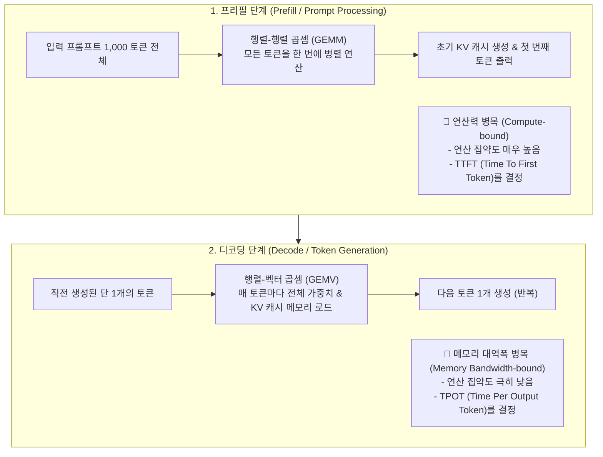
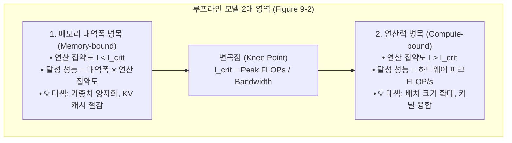
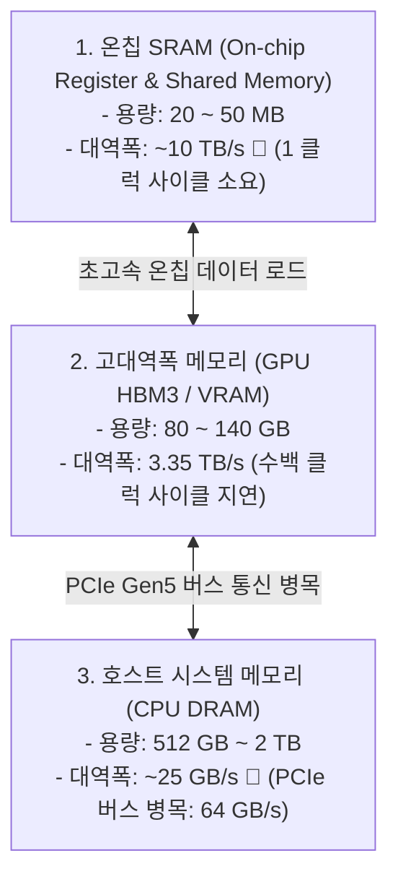

# 01. 추론 기초, 루프라인 모델 및 하드웨어 수학

## 📌 핵심 요약 & 전체 맥락
> **"첫 번째 토큰을 읽을 때는 연산력(Compute)이 부족하고, 이후 토큰을 하나씩 뱉어낼 때는 메모리 대역폭(Memory Bandwidth)이 모자랍니다."**  
> 생성형 AI 추론의 본질은 **프리필 (Prefill Phase: Compute-bound)**과 **디코딩 (Decode Phase: Memory Bandwidth-bound)**이라는 완전히 상이한 두 가지 물리적 병목을 해결하는 것입니다.  
> 본 섹션에서는 하드웨어의 최대 연산력과 메모리 대역폭 간의 관계를 명쾌하게 규명하는 **루프라인 모델 (Roofline Model: Figure 9-2)**과 연산 집약도 수학 공식,  
> 실제 서비스의 사용자 경험과 SLA를 결정짓는 **추론 4대 핵심 메트릭 (TTFT, TPOT, Throughput, Goodput: Figure 9-4)**,  
> 그리고 하드웨어의 잠재력을 얼마나 알뜰하게 활용하고 있는지 측정하는 **MFU (Table 9-1)**와 **MBU (Figure 9-5)**, 초고속 온칩 SRAM부터 HBM3까지 이어지는 **GPU 3단계 메모리 계층(Figure 9-7)**을 완벽하게 정리합니다.

---

## 🗺️ 도표(Figure & Table) 색인 및 매핑 가이드

본문의 핵심 원리를 시각적으로 확인할 수 있는 책 내 도표의 위치와 해설 매핑입니다:

| 도표 번호 | 도표 제목 및 핵심 내용 | 책 페이지 | 본문 해당 주제 |
| :---: | :--- | :---: | :--- |
| **Figure 9-1** | 클라이언트 요청을 받아 로드 밸런서와 GPU 워커 풀을 통해 토큰을 생성하는 단순 추론 서비스 구조 | **p. 407** | 1. 추론 서비스 아키텍처와 2단계 분해 |
| **Figure 9-2** | 연산 집약도(FLOP/Byte)에 따른 메모리 대역폭 한계선과 피크 연산 지붕을 나타낸 루프라인 차트 (Roofline Chart) | **p. 409** | 2. 루프라인 모델 (Roofline Model) |
| **Figure 9-3** | 병렬 프롬프트 처리 단계인 프리필(Prefill)과 토큰 순차 생성 단계인 디코딩(Decode)의 2단계 구조 | **p. 410** | 1. 추론 서비스 아키텍처와 2단계 분해 |
| **Figure 9-4** | 10건의 완료 요청(Throughput 10 RPS) 중 TTFT 및 TPOT의 SLO 기준을 충족한 유효 처리량(Goodput 3 RPS) 비교 | **p. 416** | 3. 추론 성능 메트릭과 Goodput |
| **Table 9-1** | Google PaLM 540B(46.2%) 및 Megatron-Turing 530B(30.2%)의 실제 하드웨어 MFU 달성치 비교표 | **p. 418** | 4. 하드웨어 효율성: MFU와 MBU |
| **Figure 9-5** | Llama 2-70B FP16 추론 시 동시 접속자 수 증가(1 ➔ 256명)에 따른 칩별(A100, H100, Gaudi2) MBU 하락 곡선 | **p. 418** | 4. 하드웨어 효율성: MFU와 MBU |
| **Figure 9-6** | 스칼라(Scalar), 벡터(Vector / SIMD), 텐서(Tensor / 시스톨릭 어레이) 연산 프리미티브 비교 | **p. 421** | 5. AI 가속기 연산 구조와 메모리 계층 |
| **Table 9-2** | NVIDIA H100 SXM의 수치 정밀도 포맷별(FP64, FP32, TF32, FP16/BF16, FP8) TFLOP/s 스펙표 | **p. 422** | 5. AI 가속기 연산 구조와 메모리 계층 |
| **Figure 9-7** | GPU 온칩 SRAM(20MB, 10TB/s) ➔ GPU HBM(40~80GB, 1.5~3.3TB/s) ➔ CPU DRAM(1TB, 25GB/s) 메모리 계층도 | **p. 424** | 5. AI 가속기 연산 구조와 메모리 계층 |

---

## 1. 추론의 2단계 물리적 분해: 프리필 vs 디코딩 (Figure 9-3, pp. 406 ~ 412)

트랜스포머 기반 언어 모델의 추론은 두 개의 완전히 다른 물리적 특성을 가진 단계로 나뉩니다:



| 비교 항목 | 프리필 단계 (Prefill Phase) | 디코딩 단계 (Decode Phase) |
| :--- | :--- | :--- |
| **입력 형태** | 사용자 프롬프트 전체 ($N$개 토큰) | 직전에 생성된 단 1개 토큰 |
| **연산 유형** | 행렬-행렬 곱셈 (GEMM, 병렬 처리) | 행렬-벡터 곱셈 (GEMV, 순차 처리) |
| **물리적 병목** | **연산력 병목 (Compute-bound)** ⚡ | **메모리 대역폭 병목 (Memory-bound)** 🐢 |
| **결정짓는 메트릭** | **TTFT (첫 토큰 생성 시간)** | **TPOT (토큰당 생성 시간 / 초당 토큰 수)** |
| **최적화 방향** | FlashAttention, Chunked Prefill, 고성능 연산 코어 | 가중치 양자화(INT8/INT4), KV 캐시 압축, 배치 묶기 |

---

## 2. 루프라인 모델과 연산 집약도 (Roofline Model, Figure 9-2, pp. 408 ~ 412) ⭐

하드웨어의 최대 연산 성능은 **피크 연산 성능(Peak Compute, TFLOP/s)**과 **메모리 대역폭(Memory Bandwidth, TB/s)**이라는 두 천장에 의해 물리적으로 구속됩니다:



### ① 연산 집약도 (Arithmetic Intensity, $I$) 수식
$$\text{Arithmetic Intensity } (I) = \frac{\text{총 부동소수점 연산량 (FLOPs)}}{\text{메모리에서 읽고 쓴 총 바이트 수 (Bytes)}} \quad [\text{FLOP/Byte}]$$

### ② 변곡점 ($I_{\text{crit}}$) 수치 유도 (NVIDIA H100 SXM vs A100 SXM)
* **NVIDIA H100 SXM (FP16 기준):**
  * FP16 피크 연산력: $\approx 1,000\text{ TFLOP/s}$ ($10^{15}\text{ FLOP/s}$)
  * HBM3 메모리 대역폭: $\approx 3.35\text{ TB/s}$ ($3.35 \times 10^{12}\text{ Bytes/s}$)
  * **변곡점:** $I_{\text{crit}} = \frac{1000 \times 10^{12}}{3.35 \times 10^{12}} \approx \mathbf{298.5\text{ FLOP/Byte}}$
* **엔지니어링 의미:**  
  메모리에서 가중치 1바이트를 읽어올 때마다 **최소 300회 이상의 수학 연산을 수행해야만 GPU 연산 코어를 100% 낭비 없이 풀가동(Compute-bound)**할 수 있습니다. 배치 크기가 1인 디코딩 단계에서는 2바이트를 읽어 곱셈 2번($I = 1\text{ FLOP/Byte}$)만 하므로 **GPU 연산 코어의 99%가 놀고 있는 극심한 메모리 대역폭 병목**에 빠집니다.

---

## 3. 추론 4대 성능 메트릭과 Goodput (Figure 9-4, pp. 412 ~ 419)

```
[ 추론 4대 핵심 성능 메트릭 ]

1. TTFT (Time To First Token) : 요청 전송 후 첫 글자가 화면에 뜰 때까지의 대기 시간 (목표: < 500ms)
2. TPOT (Time Per Output Token): 첫 글자 이후 1개 토큰이 생성되는 평균 주기 (목표: < 30~50ms / 즉 20~33 tokens/s)
3. Throughput (처리량)         : 단위 시간당 시스템 전체가 처리한 총 요청 수(RPS) 또는 총 토큰 수(tokens/s)
4. Goodput (유효 처리량) 🏆    : 완료된 전체 요청 중 '기업의 SLA/SLO 기준을 완벽히 충족한' 요청의 초당 처리량
```

### ⚠️ Throughput의 함정과 Goodput의 중요성 (Figure 9-4)

```
[ Throughput vs Goodput 실무 비교 (Figure 9-4) ]

• 서버의 전체 완료 처리량 (Throughput) : 10 RPS (초당 10개 요청 완료)
• 고객사와의 서비스 계약 (SLO)        : "TTFT < 800ms 이내 및 TPOT < 50ms 이내"
───────────────────────────────────────────────────────────────────
• 실제 결과: 10개 요청 중 7개는 서버 과부하로 지연시간 초과(SLA 위반), 단 3개만 기준 충족
• 실질 유효 처리량 (Goodput)           : 단 3 RPS! ❌ (70%의 처리량이 비즈니스적으로 무의미)
```

---

## 4. 하드웨어 효율성 지표: MFU와 MBU (Table 9-1, Figure 9-5, pp. 417 ~ 419)

### ① MFU (Model FLOPs Utilization, 모델 연산 활용도, Table 9-1)
하드웨어의 이론적 피크 연산력 대비 실제 유효 계산에 사용된 비율:

$$\text{MFU} = \frac{\text{모델 1회 순전파에 필요한 이론적 최소 연산량 (FLOPs)}}{\text{실제 소요 시간 (초)} \times \text{하드웨어 피크 FLOP/s}}$$

| 초대형 모델 (Table 9-1) | 파라미터 수 | 학습/추론 하드웨어 | 실제 MFU 달성률 | 비고 |
| :--- | :---: | :---: | :---: | :--- |
| **Google PaLM** | **540B** | TPU v4 (Pathways 분산) | **46.2% 🚀** | 세계 최고 수준의 하드웨어 연산 활용 |
| **Megatron-Turing** | 530B | A100 GPU 클러스터 | 30.2% | 통신 오버헤드로 인한 효율 저하 |

---

### ② MBU (Model Bandwidth Utilization, 모델 대역폭 활용도, Figure 9-5)
디코딩 단계에서 GPU의 메모리 대역폭을 얼마나 알뜰하게 쥐어짜고 있는지 측정하는 지표:

$$\text{MBU} = \frac{\text{토큰 1개 생성 시 로드해야 하는 최소 가중치 및 KV 캐시 용량 (Bytes)}}{\text{실제 토큰당 소요 시간 (초)} \times \text{하드웨어 피크 메모리 대역폭 (Bytes/s)}}$$

* **배치 크기 증가에 따른 변화 (Figure 9-5):** 동시 접속자가 1명일 때는 가중치를 읽는 대역폭이 100%에 가깝지만(MBU 높음), 배치를 수백 개로 묶을수록 시스템이 Compute-bound로 전환되며 MBU는 점차 감소하고 MFU가 상승합니다.

---

## 5. AI 가속기 연산 구조와 3단계 메모리 계층 (Figures 9-6, 9-7, Table 9-2)

### ① 연산 프리미티브의 진화 (Figure 9-6)
* **스칼라 (Scalar / CPU):** 한 번에 1개의 수치 연산 ($1 \times 1$).
* **벡터 (Vector / SIMD):** 한 번에 여러 개의 1차원 배열 연산 ($1 \times N$).
* **텐서 코어 (Tensor Cores / 시스톨릭 어레이):** $16 \times 16$ 크기의 행렬 곱셈-누산($D = A \times B + C$)을 단 1클럭 사이클에 하드웨어 레벨에서 직접 수행하여 연산 속도를 수십 배 가속.

| NVIDIA H100 SXM 연산 포맷 (Table 9-2) | 피크 성능 (TFLOP/s) | 주 용도 |
| :--- | :---: | :--- |
| **FP64 (이중 정밀도)** | 67 TFLOP/s | 과학 고성능 시뮬레이션 |
| **FP32 (단정밀도)** | 67 TFLOP/s | 마스터 가중치 및 표준 연산 |
| **TF32 (TensorFloat-32)** | 495 TFLOP/s | 코드 수정 없는 딥러닝 고속화 |
| **FP16 / BF16 (반정밀도) 🏆** | **990 TFLOP/s (~1,000 TFLOP/s)** | **표준 LLM 학습 및 고정밀 추론** |
| **FP8 (8-bit 부동소수점) 🚀** | **1,979 TFLOP/s (~2,000 TFLOP/s)** | **초고속 대규모 프로덕션 추론** |

---

### ② GPU 3단계 메모리 계층과 메모리 벽 (Figure 9-7)



* **메모리 벽 (Memory Wall):** 연산 코어의 속도는 매년 수십 배 빨라지지만, HBM에서 SRAM으로 데이터를 끌어오는 버스 대역폭은 물리적 한계로 느리게 증가합니다. 따라서 **HBM 접근을 최소화하고 SRAM 내부에서 모든 연산을 끝내는 것(FlashAttention 등)**이 현대 추론 최적화의 제1원칙입니다.

---

## 6. 엔지니어링 심화 Q&A

### Q1. 디코딩 단계에서 GPU 사용률(GPU Utilization)이 100%로 찍히는데 왜 처리 속도가 느린가요?
모니터링 도구(예: `nvidia-smi`)에 찍히는 GPU Utilization은 연산 코어가 실제로 수학 계산을 하고 있는 비율이 아니라, **"GPU의 메모리 컨트롤러나 코어 중 어느 하나라도 활성화되어 있는 시간의 비율"**을 의미합니다. 디코딩 중에는 GPU 연산 코어가 대부분 HBM에서 가중치 텐서가 도착하기를 기다리는 유휴 상태(Stall)임에도 사용률은 100%로 보일 수 있습니다. 정확한 측정을 위해서는 `nsight-compute`나 **MBU/MFU 메트릭**을 확인해야 합니다.

---

## 🔗 연관 문서
* [[00-ch09-overview|00. Chapter 9 전체 개요 및 목차]]
* [[02-kv-cache-flashattention-and-batching|02. KV 캐시 수학, FlashAttention 및 연속 배칭]]
* [[03-speculative-decoding-caching-and-parallelism|03. 추측 디코딩, 프롬프트 캐싱 및 분산 병렬화]]
* [[chapter-qa/ch07-fine-tuning-qa/02-memory-math-and-quantization|Ch07-02. 학습 메모리 수학과 수치 정밀도 및 양자화]]
