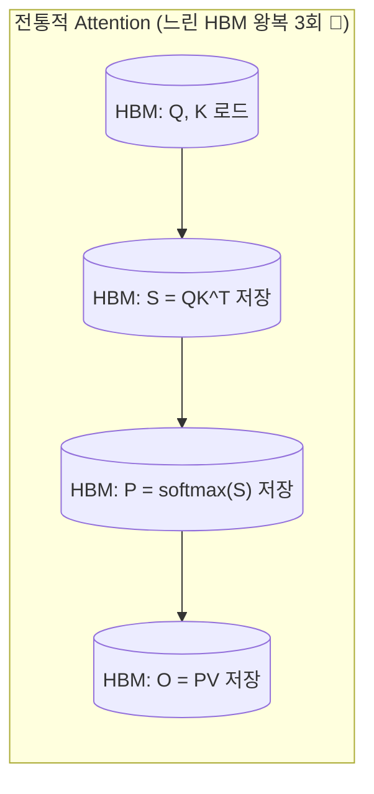
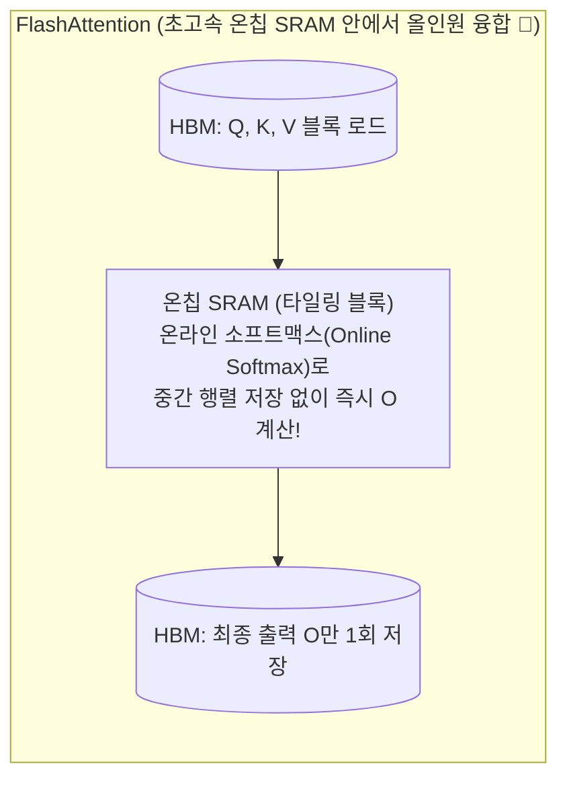

# 02. KV 캐시, FlashAttention 및 연속 배칭 (Continuous Batching)

## 📌 핵심 요약 & 전체 맥락
> **"토큰 1개를 생성할 때마다 과거 수천 개 토큰의 어텐션을 처음부터 다시 계산하지 마세요. 중간 Key/Value 벡터를 메모리에 캐싱하고, SRAM에서 연산자들을 한 번에 융합(Fusion)해야 합니다."**  
> 자기회귀적(Autoregressive) 토큰 생성에서 중복 연산을 제거하는 핵심 무기가 **KV 캐시 (Key-Value Cache)**입니다. 그러나 긴 컨텍스트에서 KV 캐시는 모델 가중치보다 더 많은 VRAM을 잠식하는 새로운 메모리 병목이 됩니다.  
> 이를 해결하기 위해 메모리 단편화를 0%로 없앤 **PagedAttention (vLLM)**, GPU 온칩 SRAM 타일링과 온라인 소프트맥스로 HBM 입출력을 획기적으로 줄인 **FlashAttention-1/2/3**, 그리고 정적 배칭의 패딩 낭비와 블로킹을 없애 처리량을 10배 이상 끌어올린 **연속 배칭 (Continuous / In-flight Batching)**을 완벽하게 정리합니다.

---

## 🗺️ 도표(Figure & Table) 색인 및 매핑 가이드

본문의 핵심 원리를 시각적으로 확인할 수 있는 책 내 도표의 위치와 해설 매핑입니다:

| 도표 번호 | 도표 제목 및 핵심 내용 | 책 페이지 | 본문 해당 주제 |
| :---: | :--- | :---: | :--- |
| **Figure 9-8** | 무손실 최적화(FlashAttention, PagedAttention) vs 손실성 최적화(양자화, 가지치기) 분류 체계 | **p. 426** | 1. 최적화 기법의 품질 손실 분류 |
| **Figure 9-12** | 디코딩 스텝마다 이전 토큰들의 Key/Value 벡터를 VRAM 캐시에 누적하고 재사용하는 KV 캐시 메커니즘 | **p. 428-430** | 2. KV 캐시의 원리와 메모리 수학 |
| **Figure 9-13** | 고속 온칩 SRAM에서 작은 블록 단위(타일링)로 어텐션과 소프트맥스를 즉시 융합 연산하는 FlashAttention 원리 | **p. 431-433** | 3. FlashAttention IO 최적화 |
| **Figure 9-14** | 순수 PyTorch ➔ torch.compile ➔ 커널 융합 ➔ 배칭 단계별 처리량(Throughput) 비약적 향상 곡선 | **p. 434** | 4. PyTorch 최적화 단계 |
| **Figure 9-15** | 가장 긴 요청 길이에 맞춰 짧은 요청에 0(패딩)을 채우느라 연산력을 낭비하는 정적 배칭의 한계 | **p. 436** | 5. 배칭의 진화: 정적 vs 동적 배칭 |
| **Figure 9-16** | 토큰 단위(Iteration-level)로 완료된 요청을 즉시 내보내고 새 요청을 끼워 넣는 연속 배칭 (Continuous Batching) | **p. 437-438** | 5. 연속 배칭 (Continuous Batching) |

---

## 1. KV 캐시 (Key-Value Cache)의 원리와 메모리 수학 (Figure 9-12, pp. 427 ~ 430)

트랜스포머 디코더에서 $t$번째 토큰을 생성할 때, $1 \sim (t-1)$번째 토큰들의 **Key 벡터와 Value 벡터는 값이 변하지 않습니다**. 따라서 이를 GPU VRAM에 저장해 두고 매 스텝 재사용합니다.

```
[ KV 캐시 메모리 크기 계산 공식 ]

KV Cache Size (Bytes) = 2 (Key, Value) × 2 (16-bit FP16) × n_layers × n_heads × d_head × b × s
                      = 4 × n_layers × n_heads × d_head × b × s

• n_layers : 트랜스포머 레이어 수
• n_heads  : 어텐션 헤드 수 (MQA/GQA 적용 시 헤드 수 감소)
• d_head   : 헤드당 차원 크기
• b        : 동시 서빙 배치 크기 (Batch size)
• s        : 총 시퀀스 길이 (Context length = Prompt + Generated)
```

* **Llama 2-70B (80개 헤드, 80개 레이어, $d=128$, $s=4096$) 기준:**
  * 동시 접속자 $b=16$명만 들어와도 KV 캐시만 **약 10.7 GB** 소모!
  * 컨텍스트 길이가 32K로 늘어나면 KV 캐시가 **수십~수백 GB로 폭증하여 모델 가중치보다 커지는 현상** 발생.
* 💡 **PagedAttention과 vLLM:**  
  운영체제(OS)의 가상 메모리 페이징 기법처럼 KV 캐시를 고정 크기 블록(Block)으로 나누어 불연속 물리 메모리에 동적 할당함으로써, **메모리 단편화 낭비를 60~80%에서 4% 미만으로 절감**.

---

## 2. FlashAttention: SRAM 타일링과 커널 융합 (Figure 9-13, pp. 430 ~ 434) 🏆

전통적인 표준 셀프 어텐션은 $QK^T$, Softmax, Dropout, $V$ 곱셈 단계마다 중간 결과를 **느린 GPU HBM(주 메모리)에 썼다가 다시 읽어오는 극심한 IO 오버헤드**를 갖습니다:





* **핵심 혁신 (Dao et al.):**
  1. **타일링 (Tiling):** 큰 $Q, K, V$ 행렬을 20MB 온칩 SRAM 크기에 맞게 작은 사각형 블록으로 쪼갬.
  2. **온라인 소프트맥스 (Online Softmax):** 전체 행렬을 HBM에 쓰지 않고도 블록 단위로 소프트맥스 분모를 점진적으로 누적 업데이트.
  3. **결과:** 총 FLOPs 연산량은 줄이지 않고도 **HBM 메모리 접근 횟수를 $O(N^2)$에서 $O(N)$으로 줄여 2~4배의 속도 가속 및 메모리 절감 달성**.

---

## 3. 배칭의 진화: 정적 ➔ 동적 ➔ 연속 배칭 (Figures 9-15, 9-16, pp. 435 ~ 438) ⭐

```
[ 배칭(Batching) 기술의 3단계 발전사 ]

1. 정적 배칭 (Static Batching, Figure 9-15) :
   - 가장 긴 요청(1,000토큰)에 맞춰 짧은 요청(10토큰)에 의미 없는 0(패딩)을 채움 ➔ 연산력 90% 낭비
   - 1명이 끝날 때까지 새로운 사용자가 들어오지 못하고 전체가 블로킹됨.

2. 동적 배칭 (Dynamic Batching) :
   - 일정 시간(예: 100ms) 동안 들어온 요청들을 모아서 하나의 배치로 묶음. 여전히 패딩 낭비 존재.

3. 연속 배칭 (Continuous / In-flight Batching, Figure 9-16, Orca / vLLM 🏆) :
   - 매 토큰 생성 스텝(Iteration-level)마다 검사하여, 생성이 끝난 요청은 즉시 사용자에게 반환하고 
     큐에 대기 중이던 새 요청을 빈 슬롯에 즉시 끼워 넣음 (인터리빙).
   - 패딩 낭비 0%, GPU 처리량(Throughput) 10배 이상 수직 상승!
```

---

## 🔗 연관 문서
* [[00-ch09-overview|00. Chapter 9 전체 개요 및 목차]]
* [[01-inference-fundamentals-and-hardware-math|01. 추론 기초, 루프라인 모델 및 하드웨어 수학]]
* [[03-speculative-decoding-caching-and-parallelism|03. 추측 디코딩, 프롬프트 캐싱 및 분산 병렬화]]
* [[chapter-qa/ch07-fine-tuning-qa/02-memory-math-and-quantization|Ch07-02. 학습 메모리 수학과 수치 정밀도 및 양자화]]
