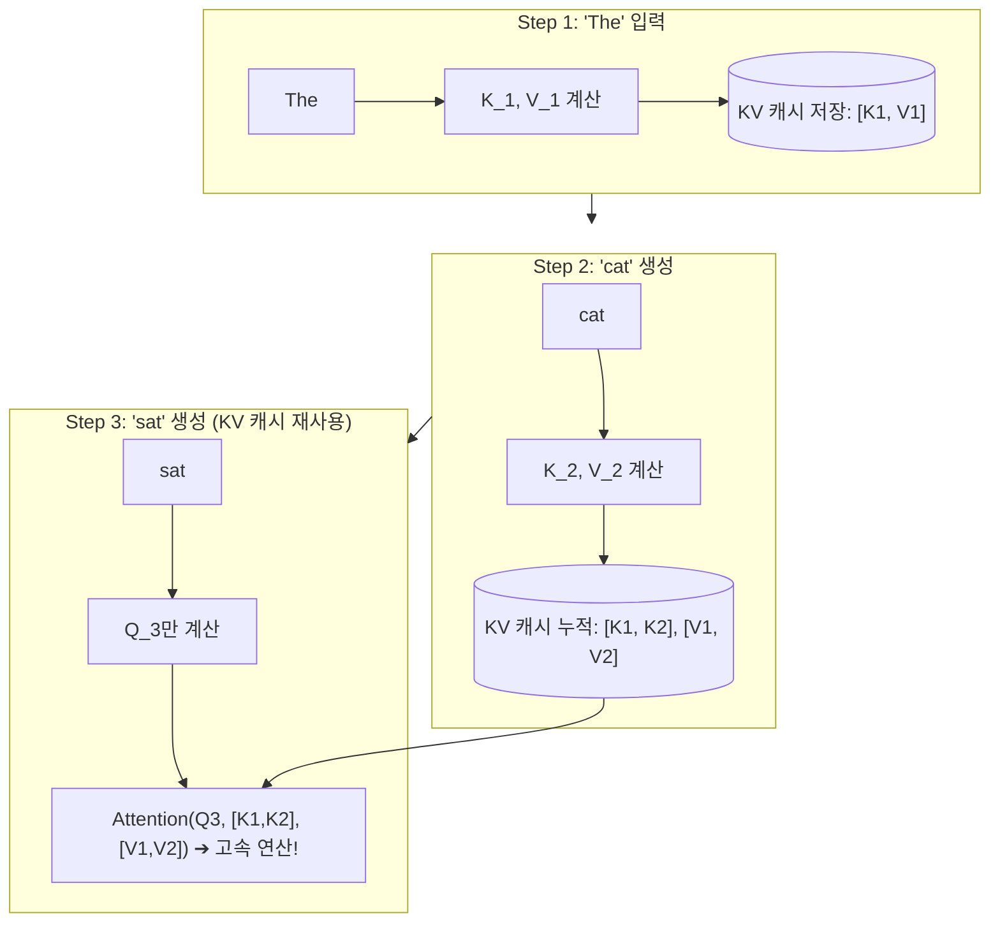
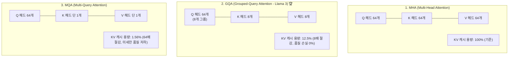
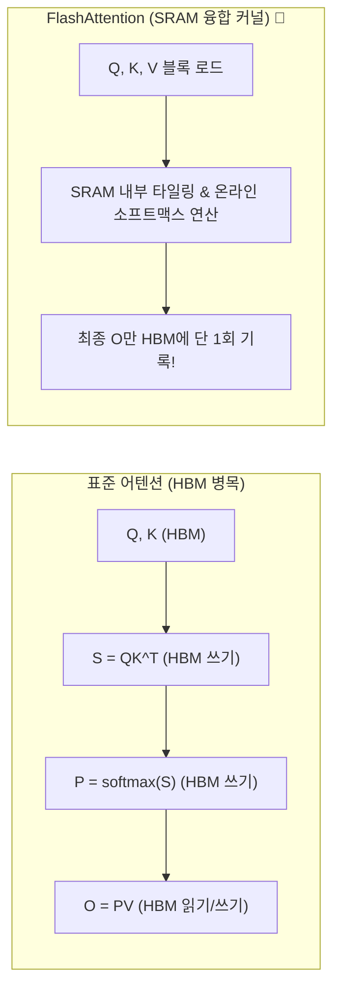
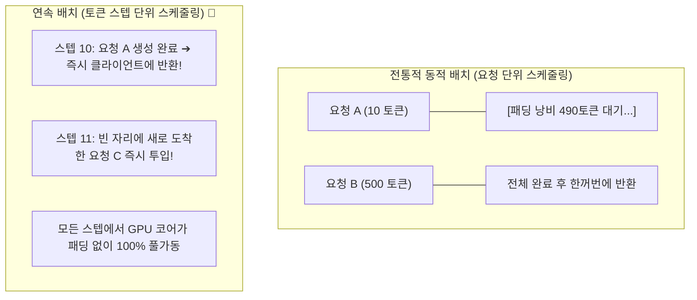

# 02. KV 캐시 수학, FlashAttention 및 연속 배칭

## 📌 핵심 요약 & 전체 맥락
> **"트랜스포머의 어텐션(Attention) 연산은 시퀀스 길이가 길어질수록 $O(N^2)$의 메모리와 I/O를 요구합니다. 이를 정복하지 못하면 긴 문맥(Long Context)과 대규모 동시 접속 처리는 불가능합니다."**  
> 생성형 모델 추론에서 메모리를 가장 많이 집어삼키는 주범은 **KV 캐시 (Key-Value Cache)**입니다. 70B 모델에서 단 1명의 사용자가 4,096 토큰을 대화할 때 KV 캐시만 **10.7 GB**를 차지합니다.  
> 본 섹션에서는 KV 캐시의 원리와 **정밀 메모리 산출 수학 공식(Figure 9-12)**, 메모리를 8배 절감한 **MQA 및 GQA (Grouped-Query Attention)**의 구조,  
> 느린 GPU HBM 접근을 제거하고 초고속 SRAM 타일링과 온라인 소프트맥스로 연산을 가속한 **FlashAttention 커널 융합 (Figure 9-13, 9-14)**,  
> 그리고 패딩 낭비를 없애고 처리량을 극대화하는 **연속 배치 (Continuous / In-flight Batching, Figures 9-15, 9-16) 및 PagedAttention**의 원리를 완벽하게 정리합니다.

---

## 🗺️ 도표(Figure & Table) 색인 및 매핑 가이드

본문의 핵심 원리를 시각적으로 확인할 수 있는 책 내 도표의 위치와 해설 매핑입니다:

| 도표 번호 | 도표 제목 및 핵심 내용 | 책 페이지 | 본문 해당 주제 |
| :---: | :--- | :---: | :--- |
| **Figure 9-8** | 모델 압축(양자화, 가지치기, 증류) 및 시스템 최적화 기법 분류 트리 | **p. 426** | 1. 모델 수준 최적화 개요 |
| **Figure 9-12** | 순전파 시 이전 토큰들의 Key/Value 텐서를 캐싱하여 중복 연산을 제거하는 KV 캐시 구조 | **p. 434** | 1. KV 캐시 수학과 어텐션 구조 |
| **Figure 9-13** | HBM I/O 병목을 제거하기 위해 SRAM 타일링과 온라인 소프트맥스를 적용한 FlashAttention 융합 커널 | **p. 437** | 2. FlashAttention과 커널 융합 |
| **Figure 9-14** | PyTorch 팀이 `torch.compile` + FlashAttention + INT8 양자화로 Llama 7B 처리량을 10배 가속한 실증 차트 | **p. 439** | 2. PyTorch 2.0 추론 가속 실증 |
| **Figure 9-15** | 요청 도착 대기 시간과 패딩 낭비가 발생하는 전통적 정적/동적 배치(Dynamic Batching)의 한계 | **p. 441** | 3. 서빙 배치 기법의 진화 |
| **Figure 9-16** | 토큰 단위로 새로운 요청을 즉시 끼워 넣고 완료된 요청을 즉시 반환하는 연속 배치(Continuous Batching) | **p. 442** | 3. 서빙 배치 기법의 진화 |

---

## 1. KV 캐시의 원리와 메모리 수학 공식 (Figure 9-12, pp. 433 ~ 436) ⭐

### ① 왜 KV 캐시가 필수적인가?
트랜스포머의 자기회귀 디코딩에서 $t$번째 토큰을 생성할 때, 이전 $1 \dots t-1$번째 토큰들과의 어텐션을 계산해야 합니다:
$$\text{Attention}(Q, K, V) = \text{softmax}\left(\frac{QK^T}{\sqrt{d_k}}\right)V$$
* **KV 캐시가 없을 때:** 매 토큰을 생성할 때마다 이전 모든 토큰의 $K, V$ 벡터를 처음부터 다시 계산해야 하므로 시퀀스 전체에 **$O(N^2)$의 중복 연산**이 발생합니다.
* **KV 캐시 적용 시:** 이전 토큰들의 $K, V$ 텐서를 GPU VRAM에 저장해두고 직전 토큰의 $Q$ 벡터와 곱하기만 하므로, 매 스텝의 연산량이 **$O(N)$으로 축소**됩니다.

---

### ② KV 캐시 메모리 정밀 산출 수학 공식 (16-bit FP16 기준)

$$\text{KV Cache Size per Token} = 2 \times 2 \times n_{\text{layers}} \times d_{\text{model}} \quad [\text{Bytes}]$$

* 첫 번째 $2$: Key와 Value **2개의 텐서**
* 두 번째 $2$: 16-bit 부동소수점(FP16/BF16)은 **2 Bytes / Element**
* $n_{\text{layers}}$: 트랜스포머 레이어 수
* $d_{\text{model}}$: 은닉 상태 차원 크기 ($n_{\text{heads}} \times d_{\text{head}}$)

#### 📐 Llama 2-70B 실전 계산 ($n_{\text{layers}} = 80$, $d_{\text{model}} = 8192$)
$$\text{토큰 1개당 KV 캐시} = 2 \times 2 \times 80 \times 8192 = 2,621,440\text{ Bytes} \approx \mathbf{2.62\text{ MB / token}}$$

* **단 1개 요청 (4,096 토큰 문맥):** $2.62\text{ MB} \times 4096 \approx \mathbf{10.74\text{ GB}}$
* **동시 요청 16개 (배치 크기 16):** $10.74\text{ GB} \times 16 \approx \mathbf{171.8\text{ GB}}$ 🚨  
  ➔ **단 16명의 사용자만 접속해도 80GB A100 GPU 2장이 KV 캐시만으로 가득 차서 OOM 발생!**

---

### ③ 어텐션 아키텍처 진화: MHA ➔ MQA ➔ GQA

KV 캐시의 폭증을 막기 위해 현대 모델들은 Key/Value 헤드의 개수를 축소하는 아키텍처를 채택합니다:

---

## 2. FlashAttention과 커널 융합 (Figures 9-13, 9-14, pp. 436 ~ 439) ⭐

### ① 표준 어텐션의 HBM I/O 병목 (Standard Attention)
표준 어텐션은 중간 결과물인 $N \times N$ 크기의 거대한 어텐션 행렬 $S = QK^T$와 $P = \text{softmax}(S)$를 **느린 GPU HBM에 썼다가 다시 읽어오는 작업**을 반복합니다 ($O(N^2)$ 메모리 트래픽).

### ② FlashAttention의 2대 혁신 (Dao et al., 2022, Figure 9-13)
1. **SRAM 타일링 (Tiling):**  
   $Q, K, V$ 행렬을 초고속 온칩 **SRAM(대역폭 10TB/s)**의 작은 블록 크기(예: $128 \times 128$)로 쪼개어 로드한 뒤, HBM을 거치지 않고 SRAM 내부에서 어텐션 계산을 끝냅니다.
2. **온라인 소프트맥스 (Online Softmax):**  
   전체 $N \times N$ 행렬을 한 번에 보지 않고도, 블록 단위로 누적 최댓값과 정규화 분모를 갱신하며 점진적으로 정확한 소프트맥스 값을 계산합니다.
3. **결과:** HBM 메모리 접근량을 $O(N^2)$에서 **$O(N)$으로 극적 단축**하여 추론 및 학습 속도를 2~4배 가속!

---

### ③ PyTorch 2.0 추론 가속 실증 (Figure 9-14)
PyTorch 엔지니어링 팀은 Llama-7B 모델에 3가지 최적화 기법을 점진적으로 결합하여 놀라운 처리량 향상을 입증했습니다:
1. `기본 PyTorch (Eager Mode)`: 기준 처리량 **1.0x** (약 25 tokens/s)
2. `+ torch.compile (연산자 융합)`: **2.1x 가속**
3. `+ FlashAttention (SRAM I/O 단축)`: **4.5x 가속**
4. `+ INT8 Weight-Only 양자화 (메모리 대역폭 절감)`: **10.2x 초고속 달성 🏆** (250+ tokens/s)

---

## 3. 서빙 배치 기법의 진화: 정적 배치 vs 연속 배치 (Figures 9-15, 9-16, pp. 440 ~ 442) ⭐

### ① 전통적 동적 배치 (Dynamic Batching, Figure 9-15)의 한계
* 짧은 문장을 요청한 사용자 A(10토큰)와 긴 문장을 요청한 사용자 B(500토큰)가 같은 배치로 묶이면, **사용자 A는 출력이 이미 끝났음에도 사용자 B가 끝날 때까지 GPU에 붙잡혀 대기**해야 합니다.
* 모든 시퀀스를 가장 긴 요청(500토큰)에 맞춰 의미 없는 `<pad>` 토큰으로 채우므로 **엄청난 GPU 연산 및 메모리 낭비**가 발생합니다.

---

### ② 연속 배치 (Continuous Batching / In-flight Batching, Orca / vLLM, Figure 9-16)

* **원리:** 시퀀스 전체가 아니라 **매 토큰 생성 이터레이션(Iteration-level) 단위로 스케줄링**.
* 토큰 생성이 끝난 요청은 즉시 연결을 끊고 반환하며, 큐에 대기 중이던 새 요청을 **다음 토큰 생성 스텝에 즉시 끼워 넣어(In-flight)** 처리량을 2~3배 극대화합니다.

---

### ③ PagedAttention (vLLM, Kwon et al., 2023)
* **메모리 단편화 문제:** 연속 배치 환경에서 각 요청의 응답 길이를 미리 알 수 없으므로, 전통적 방식은 최대 길이(예: 4,096토큰)의 연속된 메모리를 미리 할당하여 **60~80%의 VRAM 메모리 낭비(내부/외부 단편화)**가 발생했습니다.
* **해결책:** 운영체제(OS)의 가상 메모리 페이징(Paging) 기법을 모방하여, **KV 캐시를 고정 크기의 작은 블록(예: 16토큰 단위)으로 쪼개어 물리적으로 불연속한 VRAM 공간에 동적 할당**.
* **효과:** 메모리 낭비율을 **4% 미만**으로 낮추어, 동일한 GPU에서 **동시 수용 가능한 배치 크기(Concurrency)를 2~4배 증가**시킴!

---

## 4. 엔지니어링 심화 Q&A

### Q1. MQA/GQA를 적용하면 모델의 추론 정확도가 떨어지지 않나요?
사전 학습 단계부터 GQA로 훈련된 최신 모델(Llama 3, Mistral 등)의 경우, Key/Value 헤드 수를 8개로 줄여도 Multi-Head Attention(MHA) 대비 **MMLU, GSM8K 등의 벤치마크 점수 하락이 0.5% 미만으로 거의 측정되지 않습니다.** 반면 KV 캐시 메모리는 8배 감소하므로 프로덕션에서는 GQA가 필수 표준으로 자리 잡았습니다.

---

## 🔗 연관 문서
* [[00-ch09-overview|00. Chapter 9 전체 개요 및 목차]]
* [[01-inference-fundamentals-and-hardware-math|01. 추론 기초, 루프라인 모델 및 하드웨어 수학]]
* [[03-speculative-decoding-caching-and-parallelism|03. 추측 디코딩, 프롬프트 캐싱 및 분산 병렬화]]
* [[chapter-qa/ch07-fine-tuning-qa/03-peft-lora-and-qlora|Ch07-03. 매개변수 효율적 파인튜닝(PEFT)과 LoRA]]
