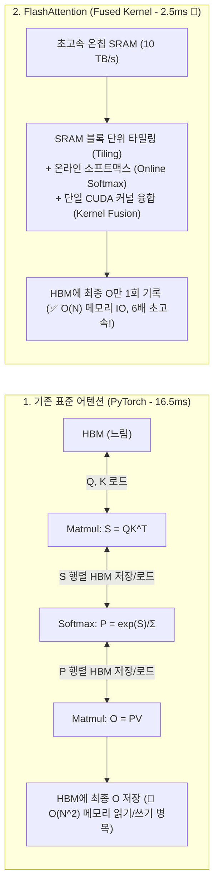
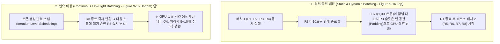

# 02. KV 캐시, FlashAttention 및 연속 배칭

## 📌 핵심 요약 & 전체 맥락
> **"트랜스포머 추론의 3대 병목: $O(N^2)$ 어텐션 재계산, HBM 메모리 IO 지연, 그리고 정적 배칭의 패딩 낭비."**  
> 언어 모델의 추론 속도와 처리량을 10배 이상 폭발적으로 끌어올린 혁신은 모델 가중치를 줄인 것이 아니라 **어텐션 연산과 서빙 시스템 아키텍처의 혁신**에서 나왔습니다.  
> 과거 토큰들의 Key/Value 벡터를 저장하여 재계산을 없애는 **KV 캐시와 PagedAttention(vLLM: Figure 9-12)**,  
> 중간 어텐션 행렬을 느린 HBM에 쓰지 않고 초고속 SRAM 상에서 타일링과 온라인 소프트맥스로 단번에 융합 처리하는 **FlashAttention(Figure 9-13)**,  
> 그리고 토큰 생성이 끝난 요청을 즉시 반환하고 빈자리에 새 요청을 즉시 채워 넣는 **연속 배칭(Continuous / In-flight Batching: Figure 9-16)**을 완벽하게 정리합니다.

---

## 🗺️ 도표(Figure & Table) 색인 및 매핑 가이드

본문의 핵심 원리를 시각적으로 확인할 수 있는 책 내 도표의 위치와 해설 매핑입니다:

| 도표 번호 | 도표 제목 및 핵심 내용 | 책 페이지 | 본문 해당 주제 |
| :---: | :--- | :---: | :--- |
| **Figure 9-8** | 무손실 최적화(FlashAttention, 배칭, KV캐시) vs 손실성 최적화(양자화, 가지치기, 증류)의 품질-속도 트레이드오프 | **p. 426-450** | 1. 추론 최적화의 2대 갈래 |
| **Figure 9-12** | 디코딩 단계에서 과거 토큰들의 Key 및 Value 벡터를 재계산하지 않고 캐시에서 꺼내 쓰는 KV 캐시 메커니즘 | **p. 434-458** | 2. KV 캐시와 PagedAttention |
| **Figure 9-13** | PyTorch 표준 어텐션(16.5ms) 대비 커널 융합 및 SRAM 타일링을 적용한 FlashAttention(2.5ms, 6배 가속) 실행 시간 비교 | **p. 437-461** | 3. FlashAttention과 커널 융합 |
| **Figure 9-14** | PyTorch 환경에서 FlashAttention, torch.compile, Segmented KV, INT8 양자화 적용에 따른 처리량 향상 곡선 | **p. 439-463** | 3. 엔드투엔드 최적화 스택 |
| **Figure 9-15** | 고정 주기로 묶는 정적 배칭(Static) vs 지연시간을 방어하며 묶는 동적 배칭(Dynamic) 비교 | **p. 441-465** | 4. 배칭의 진화 |
| **Figure 9-16** | 완료된 요청(R3)이 빠져나간 자리에 대기 중인 요청(R5)을 즉시 투입하여 패딩 낭비를 0으로 만드는 연속 배칭 (Continuous Batching) | **p. 442-466** | 4. 연속 배칭 (In-Flight Batching) |

---

## 1. KV 캐시 (KV Caching)와 메모리 수학 (Figure 9-12) ⭐

### ① 왜 KV 캐시가 필요한가?
자기회귀(Autoregressive) 생성에서 $t$번째 토큰을 예측하려면 이전 $1 \dots t-1$번째 모든 토큰의 Key와 Value 벡터가 필요합니다:
* **KV 캐시 미사용 시:** 매 토큰 생성마다 처음부터 끝까지 모든 토큰의 $K, V$를 다시 계산 ➔ **$O(N^2)$의 중복 연산 폭증!**
* **KV 캐시 사용 시 (Figure 9-12):** 이전 토큰들의 $K, V$ 벡터를 GPU VRAM에 보관하고, **새로 들어온 토큰의 $Q_t, K_t, V_t$ (단 1개 토큰분)만 계산**하여 기존 캐시와 곱함 ➔ **연산량 $O(N)$으로 급감!**

---

### ② KV 캐시 메모리 수학 공식 (Memory Math, p. 434)
$$\text{KV Cache Size (Bytes)} = 2 \times 2 \times n_{\text{layers}} \times n_{\text{heads\_kv}} \times d_{\text{head}} \times \text{seq\_len} \times \text{batch\_size} \times \text{bytes\_per\_elem}$$

> **실제 계산 예시 (Llama 2-70B, GQA 적용 $n_{\text{heads\_kv}} = 8$, $d_{\text{head}}=128$, 80 layers, FP16 2바이트):**  
> * 토큰당 KV 캐시 크기: $2 \times 2 \times 80 \times 8 \times 128 \times 2 = \mathbf{655,360\text{ Bytes}} \approx \mathbf{655\text{ KB/token}}$  
> * 컨텍스트 4,096토큰, 배치 크기 32 운영 시:  
>   $$655\text{ KB} \times 4,096 \times 32 \approx \mathbf{86\text{ GB 🚨}}$$  
>   *(➔ 모델 가중치 140GB 외에 **KV 캐시만으로 80GB A100 GPU 1장 이상의 VRAM이 통째로 증발**함!)*

---

### ③ PagedAttention: 메모리 파편화 해결 (vLLM: Kwon et al., 2023)
* **기존 메모리 할당의 한계:** 요청마다 최대 컨텍스트 길이(예: 4,096)만큼 메모리를 미리 연속 할당 ➔ **실제 대화가 500토큰에 끝나면 60~80%의 VRAM이 내부 단편화(Internal Fragmentation)로 낭비됨**.
* **PagedAttention 혁신:** 운영체제(OS)의 가상 메모리 페이징 기법을 차용하여, **KV 캐시를 고정 크기(예: 16개 토큰)의 '페이지 블록' 단위로 쪼개어 물리적 불연속 메모리에 동적 할당** ➔ **메모리 낭비율을 4% 미만으로 압축하여 처리량을 2~4배 향상!**

### ④ KV 캐시 양자화 (KV Cache Quantization)
PagedAttention으로 단편화를 잡아도 절대적인 용량 자체가 너무 큰 문제를 해결하기 위해 도입됩니다. 모델의 가중치뿐만 아니라, 메모리에 쌓이는 **KV 캐시 텐서 자체를 FP16(16비트)에서 FP8 또는 INT4로 실시간 압축(Quantization)**하여 저장합니다. 약간의 정확도(Perplexity) 하락을 대가로 동시 처리 가능한 배치 크기(Batch Size)를 2~4배 늘려줍니다.

---

## 2. FlashAttention과 IO-Aware 커널 최적화 (Dao et al., 2022, Figure 9-13) 🏆

### 🌟 FlashAttention의 3대 수학적·구조적 혁신
1. **SRAM 타일링 (Tiling):** 입력을 블록($B_r \times B_c$) 단위로 쪼개어 용량이 작은(20~50MB) SRAM에 쏙 들어가도록 분할 적재.
2. **온라인 소프트맥스 (Online Softmax):** 분모의 합($\sum e^{x_i}$)을 구하기 위해 전체 행렬을 기다리지 않고, **블록 단위로 누적 최댓값($m$)과 누적 정규화 계수($l$)를 갱신하며 부분 소프트맥스를 수학적으로 완벽 복원**.
3. **커널 융합 (Kernel Fusion, Figure 9-13):** 행렬곱 $\rightarrow$ 마스킹 $\rightarrow$ 소프트맥스 $\rightarrow$ 드롭아웃 $\rightarrow$ 행렬곱을 **단 하나의 GPU 커널로 융합하여 중간 $N \times N$ 행렬의 HBM 입출력을 완전히 제거**.

---

## 3. 배칭의 진화: 정적 배칭에서 연속 배칭까지 (Figure 9-15, Figure 9-16) ⭐

* **Orca / vLLM 연속 배칭의 위력 (Figure 9-16):**  
  배칭 단위를 '요청(Request)' 단위가 아니라 **'토큰 생성 반복(Iteration)' 단위로 전환**.  
  짧은 질의는 생성 즉시 사용자에게 반환하고, 빈 GPU 연산 슬롯에 대기열의 새 요청을 즉시 인터리빙(Interleaving)하여 GPU 코어 가동률을 100%로 유지합니다.

---

## 4. 프리필-디코드 분리 아키텍처 (Disaggregated Prefill-Decode, p. 442)

* **문제점:** 연산 집약적인 프리필(Compute-bound)과 메모리 집약적인 디코딩(Memory-bound)을 한 GPU에서 동시에 돌리면, **프리필 작업이 디코딩 작업의 리소스를 빼앗아 기존 사용자들의 스트리밍 속도(TPOT)가 뚝뚝 끊기는 간섭(Interference)**이 발생함.
* **해결책 (DistServe, 2024):**  
  프리필 전용 GPU 노드 풀과 디코드 전용 GPU 노드 풀을 물리적으로 분리하고, 프리필이 끝난 KV 캐시를 고속 NVLink로 디코드 노드로 전송하여 **TTFT와 TPOT을 독립적으로 최적화**.

---

## 🔗 연관 문서
* [[00-ch09-overview|00. Chapter 9 전체 개요 및 목차]]
* [[01-inference-fundamentals-and-hardware-math|01. 추론 기초, 루프라인 모델 및 하드웨어 수학]]
* [[03-speculative-decoding-caching-and-parallelism|03. 추측 디코딩, 프롬프트 캐싱 및 분산 병렬화]]
* [[chapter-qa/ch07-fine-tuning-qa/02-memory-math-and-quantization|Ch07-02. 학습 메모리 수학과 수치 정밀도 및 양자화]]
