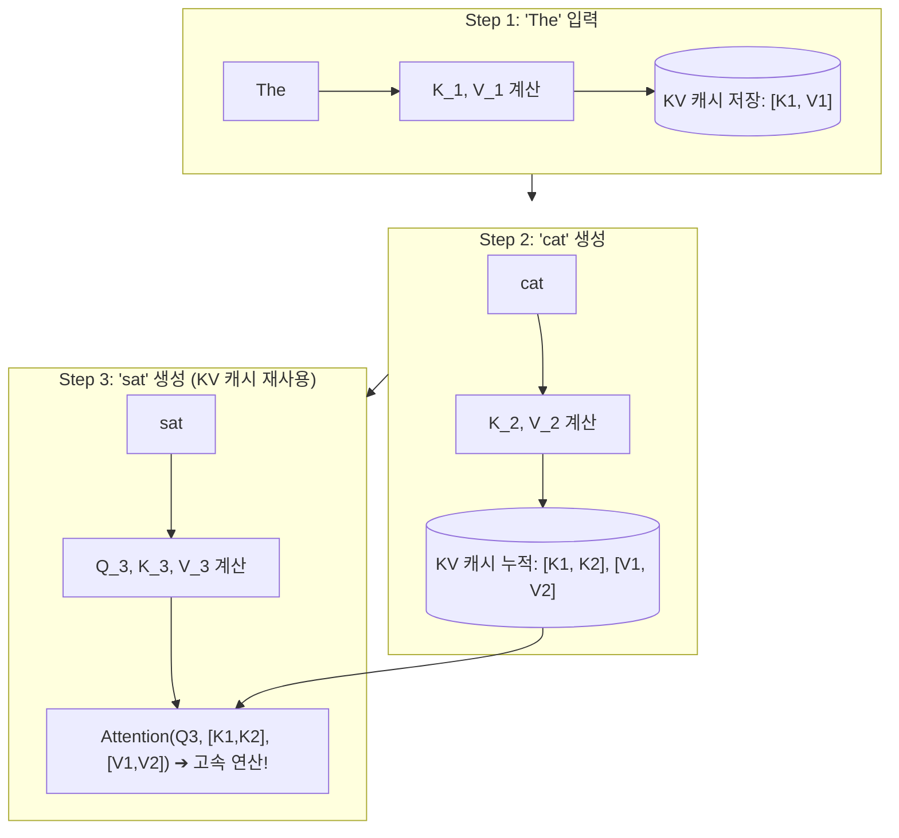
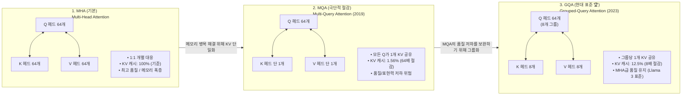
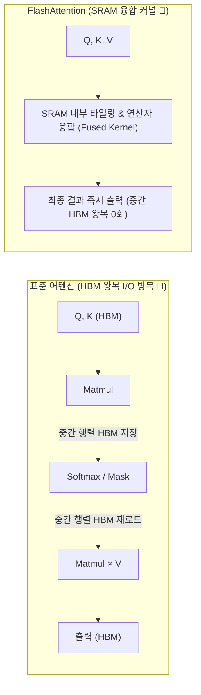
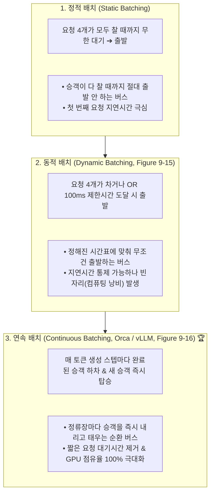

# 02. KV 캐시 수학, FlashAttention 및 연속 배칭

## 📌 핵심 요약 & 전체 맥락
> 어텐션은 긴 시퀀스에서 계산·메모리 비용이 커지는 핵심 병목이다. 특히 KV 캐시의 크기는 시퀀스 길이와 배치 크기에 따라 선형으로 증가한다(p.433-435).
> 책의 예시로 Llama 2-13B는 배치 32, 시퀀스 2,048에서 비최적화 KV 캐시가 54GB에 달한다(p.435).
> 본 섹션에서는 KV 캐시의 원리와 메모리 산출 공식, MQA/GQA, FlashAttention의 커널 융합, PyTorch 최적화 사례, 정적·동적·연속 배칭과 prefill/decode 분리를 정리합니다.

---

## 🗺️ 도표(Figure & Table) 색인 및 매핑 가이드

본문의 핵심 원리를 시각적으로 확인할 수 있는 책 내 도표의 위치와 해설 매핑입니다:

| 도표 번호 | 도표 제목 및 핵심 내용 | 책 페이지 | 본문 해당 주제 |
| :---: | :--- | :---: | :--- |
| **Figure 9-8** | 서비스 제공자별 최적화가 같은 모델의 품질에 미칠 수 있는 차이를 보여주는 비교 그래프 | **p. 426** | 1. 모델 수준 최적화 개요 |
| **Figure 9-12** | 순전파 시 이전 토큰들의 Key/Value 텐서를 캐싱하여 중복 연산을 제거하는 KV 캐시 구조 | **p. 434** | 1. KV 캐시 수학과 어텐션 구조 |
| **Figure 9-13** | PyTorch의 여러 어텐션 연산을 하나의 FlashAttention fused kernel로 결합한 비교 | **p. 437** | 2. FlashAttention과 커널 융합 |
| **Figure 9-14** | Llama-7B에 `torch.compile`, INT8, INT4, speculative decoding을 순차 적용한 PyTorch 처리량 비교 | **p. 439** | 2. PyTorch 추론 가속 사례 |
| **Figure 9-15** | 정적 배칭과 동적 배칭의 대기시간·compute 효율 trade-off | **p. 441** | 3. 서빙 배치 기법의 진화 |
| **Figure 9-16** | 토큰 단위로 새로운 요청을 즉시 끼워 넣고 완료된 요청을 즉시 반환하는 연속 배치(Continuous Batching) | **p. 442** | 3. 서빙 배치 기법의 진화 |

---

## 1. 모델 압축과 KV 캐시 (pp. 426 ~ 436) ⭐

모델 수준 최적화는 모델 크기·autoregressive decoding·attention의 비용을 줄이는 것이다. 책은 양자화와 distillation을 앞 장에서 다루고, pruning은 노드를 제거하거나 유용성이 낮은 파라미터를 0으로 만들어 희소성을 높이는 방식으로 설명한다(p.426-427). 실무에서는 weight-only quantization이 널리 사용되지만, 품질·하드웨어 지원·속도 사이의 trade-off를 확인해야 한다.

### ① 어텐션 수식과 Q, K, V의 수학적/개념적 의미 (Figure 9-12, pp. 433 ~ 436)

트랜스포머의 스케일드 닷 프로덕트 어텐션(Scaled Dot-Product Attention)의 기본 수식은 다음과 같습니다:

$$\text{Attention}(Q, K, V) = \text{softmax}\left(\frac{QK^T}{\sqrt{d_k}}\right)V$$

#### ⚠️ 핵심 개념 구분: '사용자의 질문(Prompt)' vs '어텐션 쿼리($q_t$)'
* **사람의 일상적 직관 (Prompt):** 사용자가 챗봇 입력창에 넣는 전체 질문 문장 (예: *"대한민국의 수도는 어디인가요?"*).
* **트랜스포머 내부의 $q_t$ (Token-level Query):** LLM은 질문을 한 번에 답하는 것이 아니라 **"지금까지 나온 단어들을 보고 바로 다음 단어 1개를 맞추는 게임"**을 수백 번 반복합니다. 이때 **'$t$번째 개별 단어(토큰)'**가 다음 단어를 예측하기 위해 이전 단어들에게 던지는 내부 신경망 검색 벡터가 바로 $q_t$입니다.
* 즉, LLM이 문장을 100개 토큰에 걸쳐 생성한다면, 매 토큰을 생성할 때마다 **$q_1, q_2, \dots, q_{100}$ 총 100개의 서로 다른 독립적인 $q_t$ 벡터가 매 스텝마다 새롭게 계산되고 1회성으로 사용된 뒤 폐기**됩니다.

```
[ $Q_t$의 실제 동작 시나리오 예시 ]

1. 상황: 문장이 [대한민국, 의, 수도, 는]까지 생성된 상태 (Step t=4)
   • 이제 5번째 단어를 예측해야 합니다.
   • 4번째 단어인 '는'이 트랜스포머 레이어를 거쳐 자기 자신의 q_4 (Query 벡터)를 만듭니다.
   • q_4의 질문: "나는 방금 나온 단어 '는'이야. 내 바로 뒤에 올 5번째 단어를 맞추려면 앞 단어들(대한민국, 의, 수도, 는) 중 누구를 가장 집중해서 봐야 하지?"
   • q_4는 앞선 단어들의 Key(K)들과 내적하여 연관도를 계산 (수도: 98%, 대한민국: 95%, 의/는: 10%).
   • 연관도가 높은 '수도'와 '대한민국'의 Value(V)를 가중합하여 5번째 단어로 '서울'을 생성합니다.

2. 다음 상황: 문장이 [대한민국, 의, 수도, 는, 서울]까지 생성된 상태 (Step t=5)
   • 이제 6번째 단어를 예측해야 합니다.
   • 방금 생성된 5번째 단어 '서울'이 자기 자신의 새로운 q_5 (Query 벡터)를 만듭니다.
   • q_5의 질문: "나는 이제 '서울'이야. 내 뒤에 올 다음 단어를 맞추려면 앞 단어들을 어떻게 조합해야 하지?"
   • q_5가 앞선 모든 단어들을 훑어보고 다음 단어로 '입니다'를 결정합니다.
   • ⚠️ 이때 이전 스텝에서 썼던 q_4는 '서울'을 뽑는 데 쓰이고 역할이 끝났으므로 다시는 쓰이지 않고 버려집니다!
```

#### 🔹 각 구성 요소의 역할 및 의미
1. **$Q$ (Query, $t$번째 토큰의 질의 벡터 $q_t$):**
   - **"나는 지금 막 등장한 $t$번째 단어야. 내 다음에 올 단어를 맞추려면 앞 단어들 중 누구를 참고해야 하지?"**
   - 현재 시점의 토큰이 앞서 나온 과거 단어들의 정보를 탐색하기 위해 던지는 검색어 벡터입니다.
2. **$K$ (Key, 각 단어의 색인/주제 벡터):**
   - **"각 단어가 어떤 특징과 주제 정보를 담고 있는가?"**
   - 문장 내 각 단어가 가진 식별용 레이블(키워드/주제 분류표) 역할을 합니다.
3. **$V$ (Value, 각 단어의 실질적 의미 내용):**
   - **"각 단어가 실제로 전달하고자 하는 실질적인 의미/정보는 무엇인가?"**
   - 어텐션 가중치에 따라 최종적으로 합산되어 다음 레이어로 전달될 실제 정보의 내용물입니다.
4. **$QK^T$ (내적 연산, Dot Product):**
   - 현재 단어의 Query($q_t$)와 모든 이전 단어들의 Key($k_1 \dots k_t$)를 내적하여 **"단어 간 연관도/유사도 원시 점수(Raw Attention Scores)"**를 계산합니다.
5. **$\frac{1}{\sqrt{d_k}}$ (스케일링 인자, Scaling Factor):**
   - Key 벡터의 차원 수 $d_k$가 커질수록 내적 결과값($QK^T$)의 분산이 비례해서 커집니다.
   - 분산이 너무 커지면 softmax 함수가 극단적인 값(0 또는 1)으로 치우쳐 역전파 시 그래디언트 소실(Gradient Vanishing)이 발생하고 출력이 왜곡되므로, $\sqrt{d_k}$로 나누어 분산을 1로 정규화(Scaling)합니다.
6. **$\text{softmax}(\dots)$ (확률 분포 정규화):**
   - 계산된 점수들을 0~1 사이의 확률값(합이 1)으로 변환하여 **"현재 단어가 과거 단어들에 각각 몇 %씩 주의(Attention)를 기울여야 하는지"**를 나타내는 어텐션 가중치(Attention Weights)를 도출합니다.
7. **$\dots \times V$ (가중합, Weighted Sum):**
   - 계산된 어텐션 확률 가중치를 Value 벡터들과 곱하여 가중 평균(합산)을 구합니다.
   - 결과적으로 현재 문맥에서 중요한 단어들의 의미 정보($V$)가 풍부하게 반영된 **새로운 문맥 표현(Context Vector)**이 최종 출력됩니다.

---

### ② 왜 'QKV 캐시'가 아니라 'KV 캐시'인가?

트랜스포머의 자기회귀(Autoregressive) 생성 과정에서 $t$번째 토큰을 생성할 때의 수식:

$$\text{Output}_t = \text{softmax}\left(\frac{q_t [k_1, k_2, \dots, k_t]^T}{\sqrt{d_k}}\right) \begin{bmatrix} v_1 \\ v_2 \\ \vdots \\ v_t \end{bmatrix}$$

#### 💡 $Q$는 버리고, $K$와 $V$만 메모리에 저장(Cache)하는 이유
* **$Q$ (Query)를 캐싱하지 않는 이유:**
  - $q_t$는 $t$번째 토큰이 과거 단어들을 훑어보고 **바로 다음 토큰($t+1$)을 결정하는 그 순간(Step $t$)에만 1회성으로 사용**되고 즉시 폐기됩니다.
  - 다음 스텝($t+1$)이 되면 새로운 토큰의 새로운 $q_{t+1}$이 생성되므로, 이전의 $q_1, \dots, q_t$는 다시는 쓰이지 않습니다.
* **$K$ (Key)와 $V$ (Value)를 반드시 캐싱해야 하는 이유:**
  - 과거 $1 \sim t$번째 단어들의 $K$와 $V$는 **한 번 계산되면 값이 절대 변하지 않지만**, 미래에 등장할 $t+1, t+2, \dots$ 모든 후속 토큰들이 문맥을 이해하기 위해 계속해서 반복적으로 읽어와야 합니다.
  - 따라서 과거의 $K, V$를 GPU VRAM에 누적 저장(Cache)해 두면 매 스텝 $O(N^2)$의 중복 선형 변환을 방지할 수 있습니다.
* 📌 **결론:** $Q$는 저장할 필요가 없고 오직 $K$와 $V$만 메모리에 캐싱하므로 **'KV 캐시(Key-Value Cache)'**라고 부릅니다.

| 구성 요소 | 1회 스텝에서의 역할 | 캐싱(VRAM 저장) 여부 | 이유 |
| :--- | :--- | :---: | :--- |
| **$Q$ (Query)** | 현재 단어가 던지는 질문 | ❌ **저장 안 함** | 해당 스텝에서 다음 단어를 생성하고 나면 역할 종료 (즉시 폐기) |
| **$K$ (Key)** | 과거 단어들의 식별 레이블 | ⭕ **캐싱 필수** | 미래의 모든 단어가 유사도 계산을 위해 계속 참조해야 함 |
| **$V$ (Value)** | 과거 단어들의 실질적 정보 내용 | ⭕ **캐싱 필수** | 미래의 모든 단어가 문맥 정보를 합산하기 위해 계속 참조해야 함 |



---

### ③ KV 캐시 메모리 산출 공식 및 실전 계산 (p. 435) ⭐

최적화가 적용되지 않은 기본 멀티헤드 어텐션(MHA) 환경에서 전체 KV 캐시의 메모리 소모량을 구하는 공식은 다음과 같습니다:

$$\text{Total KV Cache Memory} = 2 \times B \times S \times L \times H \times M \quad [\text{Bytes}]$$

#### 🔹 공식의 각 변수별 의미

| 변수 | 명칭 | 설명 | 책의 예시 값 (Llama 2-13B) |
| :---: | :--- | :--- | :---: |
| **$2$** | KV 쌍 (Key & Value) | Key 텐서와 Value 텐서 **2개의 텐서**를 각각 저장 | $2$ |
| **$B$** | 배치 크기 (Batch Size) | 동시 처리 중인 사용자 요청(배치) 수 | **$32$** |
| **$S$** | 시퀀스 길이 (Sequence Length) | 프롬프트와 생성된 응답을 합친 총 토큰 수 | **$2,048$** |
| **$L$** | 레이어 수 (Layers) | 트랜스포머 블록 레이어의 개수 | **$40$** |
| **$H$** | 은닉 차원 (Model Dimension, $d_{\text{model}}$) | 은닉 상태 벡터의 차원 크기 ($n_{\text{heads}} \times d_{\text{head}}$) | **$5,120$** |
| **$M$** | 수치 정밀도 바이트 (Precision Bytes) | FP16/BF16은 2 Bytes, FP32는 4 Bytes, INT8은 1 Byte | **$2\text{ Bytes}$** (16-bit) |

---

#### 📐 책의 실전 계산 사례 (Llama 2-13B 기준, p. 435)

```
[ Llama 2-13B KV 캐시 계산 단계별 전개 ]

1. 토큰 1개당 1개 레이어의 KV 캐시 크기:
   = 2 (Key, Value) × 5,120 (차원) × 2 Bytes (FP16)
   = 20,480 Bytes (~20.48 KB)

2. 토큰 1개당 전체 40개 레이어의 KV 캐시 크기:
   = 20,480 Bytes × 40 (Layers)
   = 819,200 Bytes (~800 KB / 토큰)

3. 배치 32개, 시퀀스 2,048 토큰 기준 총 메모리 요구량:
   = 2 × 32 (Batch) × 2,048 (Seq) × 40 (Layers) × 5,120 (Dim) × 2 Bytes
   = 56,294,995,340 Bytes
   ≈ 53.68 GB (약 54 GB) 💥
```

#### 💡 엔지니어링 통찰: 왜 이 수치가 충격적인가?
* **모델 가중치 자체의 용량:** $13\text{B} \times 2\text{ Bytes} = \mathbf{26\text{ GB}}$
* **동시 요청 32개 시 KV 캐시 용량:** $\mathbf{54\text{ GB}}$ **(모델 크기의 2배 이상!)**
* ➔ 모델 자체는 80GB GPU 1장에 여유롭게 올라가지만, 동시 요청 32개에 컨텍스트가 조금만 길어져도 **KV 캐시가 GPU 메모리의 대부분을 집어삼켜 즉시 OOM(Out Of Memory)이 발생**합니다.
* ➔ 이것이 바로 현대 LLM 서빙에서 **MQA/GQA, PagedAttention(vLLM), KV 캐시 양자화(INT8/INT4)** 같은 최적화가 필수적인 이유입니다.

---

### ④ 어텐션 아키텍처 재설계와 진화: MHA ➔ MQA ➔ GQA (pp. 435 ~ 436) ⭐

KV 캐시의 메모리 폭증을 근본적으로 막기 위해, 모델 아키텍처 수준에서 Key/Value 헤드 수를 줄이는 재설계 기법들이 도입되었습니다.



#### 🔹 3대 어텐션 구조 비교 및 진화 배경

| 아키텍처 | Key / Value 헤드 구성 | 장점 | 단점 및 엔지니어링 시사점 |
| :--- | :--- | :--- | :--- |
| **MHA**<br>(Multi-Head Attention) | Query 헤드 수와 **1:1로 동일**하게 KV 헤드 유지 (예: 64개) | 각 어텐션 헤드가 독립적인 문맥을 포착하여 **최고의 표현력/품질** 제공 | 긴 컨텍스트 및 대규모 배치 서빙 시 **KV 캐시가 수십 GB로 폭증하여 OOM 유발** |
| **MQA**<br>(Multi-Query Attention, 2019) | 모든 Query 헤드가 **단 1개의 KV 헤드를 공유** | KV 캐시 용량을 **헤드 수만큼(예: 64배) 극적으로 압축**, 추론 대역폭 극대화 | KV 다양성이 완전히 사라져 복잡한 추론 태스크에서 **모델 성능/품질 저하** 발생 |
| **GQA**<br>(Grouped-Query Attention, 2023) | Query 헤드를 $G$개 그룹으로 묶고, **그룹당 1개의 KV 헤드를 공유** (예: 8개) | **MHA에 필적하는 높은 품질을 유지하면서도 KV 캐시를 8배 절감 (Llama 3, Mistral 채택)** | MHA와 MQA 사이의 최적 균형점(Pareto Frontier) 달성 |

---

#### 🔹 책에 언급된 기타 어텐션 구조 최적화 기법 (p. 435)
1. **로컬 윈도우 어텐션 (Local Windowed Attention, Beltagy et al., 2020):**
   - 이전의 모든 토큰이 아니라, 고정된 크기(예: 최근 1,000토큰)의 윈도우 안의 토큰들에만 어텐션을 수행합니다.
   - 평균 시퀀스가 10,000토큰일 때 윈도우를 1,000으로 제한하면 KV 캐시와 연산량을 **10배 즉시 절감**할 수 있습니다 (전체 문맥은 글로벌 어텐션과 교차 배치하여 보완).
2. **크로스 레이어 어텐션 (Cross-Layer Attention, Brandon et al., 2024):**
   - 인접한 여러 레이어가 동일한 Key/Value 텐서를 공유하여 캐싱합니다.
   - 예: 3개 레이어가 1개의 KV를 공유하면 KV 캐시 메모리가 **3배 절감**됩니다.
3. **Character.AI의 실전 사례 (2024, p. 435):**
   - 대화 히스토리가 평균 180턴에 달하는 긴 시퀀스 환경에서 **MQA + 로컬/글로벌 교차 어텐션 + 크로스 레이어 어텐션** 3가지를 결합하여 **KV 캐시를 20배 이상 절감**하고, 메모리 병목 없이 대규모 배치를 서빙했습니다.

---

## 2. FlashAttention과 커널 및 컴파일러 최적화 (Figures 9-13, 9-14, pp. 436 ~ 440) ⭐

### ① 커널(Kernel)과 컴파일러의 역할 및 로어링(Lowering)
* **커널(Kernel):** GPU/TPU 등 특정 하드웨어 가속기에서 반복적인 고부하 연산을 병렬로 초고속 실행하도록 최적화된 저수준(Low-level) 코드 (CUDA, OpenAI Triton, AMD ROCm).
* **로어링(Lowering)과 컴파일러:** 파이썬 모델 코드를 하드웨어가 이해하는 고성능 커널 코드로 변환하는 과정을 **로어링(Lowering)**이라 하며, 이를 수행하는 도구가 **컴파일러(Compiler)**입니다:
  * **독립형 컴파일러 (Standalone):** Apache TVM, MLIR (Multi-Level Intermediate Representation)
  * **프레임워크 통합형 컴파일러:** `torch.compile` (PyTorch 2.0), XLA / OpenXLA (TensorFlow/JAX), TensorRT (NVIDIA)

---

### ② 4대 핵심 커널 최적화 기법 (p. 438)

| 최적화 기법 | 동작 원리 | 효과 |
| :--- | :--- | :--- |
| **1. 벡터화 (Vectorization)** | 루프 실행 시 데이터를 하나씩 처리하지 않고, 메모리에 연속된 여러 데이터를 한 번에 동시에 연산 | 데이터 I/O 오버헤드 대폭 감소 |
| **2. 병렬화 (Parallelization)** | 다차원 배열을 독립적인 청크(Chunk)로 쪼개어 여러 GPU 코어/스레드에서 동시 처리 | 연산 처리 속도 극대화 |
| **3. 루프 타일링 (Loop Tiling)** | 하드웨어의 캐시 및 메모리 레이아웃에 맞춰 루프 내 데이터 접근 순서를 블록 단위로 재배치 | 캐시 적중률(Cache Hit) 향상 |
| **4. 연산자 융합 (Operator Fusion) 🏆** | 연속된 여러 연산자(Matmul + Softmax + Mask 등)를 1개의 통합 루프로 합쳐 중간 메모리 왕복 제거 | **HBM 읽기/쓰기 병목 원천 차단** |

---

### ③ FlashAttention: 어텐션 연산자 융합 (Dao et al., 2022, Figure 9-13)
* **기존 표준 어텐션의 병목:** $Q, K, V$ 행렬 곱셈, 마스킹, 소프트맥스, 드롭아웃을 수행할 때마다 중간 $N \times N$ 크기의 거대한 어텐션 행렬을 느린 GPU HBM(High Bandwidth Memory)에 썼다가 다시 읽어오는 I/O 병목 발생.
* **FlashAttention의 해결책:** SRAM(고속 온칩 메모리) 내부에서 타일링 기법과 연산자 융합(Operator Fusion)을 적용하여 **중간 행렬 저장 없이 단 한 번의 Fused Kernel로 어텐션을 계산** (A100용 FlashAttention ➔ H100용 FlashAttention-3로 진화).



---

### ④ PyTorch 2.0 추론 가속 실증 사례 (Llama-7B, A100 80GB, Figure 9-14, p. 439)

PyTorch 팀이 Llama-7B 모델에 다양한 최적화 기법을 단계별로 누적 적용했을 때의 사용자당 처리량(Tokens/s/user) 변화:

```
[ PyTorch 추론 가속 4단계 누적 성능 ]

1. Eager 모드 (기본 실행)                :  25.5 tok/s/user (기준)
2. + torch.compile (커널 컴파일 적용)    : 107.0 tok/s/user (4.2배 🚀)
3. + INT8 가중치 양자화                  : 157.4 tok/s/user (6.2배)
4. + INT4 가중치 양자화                  : 202.1 tok/s/user (7.9배)
5. + Speculative Decoding (추측 디코딩)  : 244.7 tok/s/user (9.6배 🏆)

* ⚠️ 책의 주의사항: 처리량은 비약적으로 상승했지만, 극단적인 양자화와 최적화가 모델의 최종 출력 품질에 미친 영향은 명확히 검증되지 않았음을 명시.
```

---

## 3. 서빙 배치 기법의 진화: 정적 배치 vs 연속 배치 (Figures 9-15, 9-16, pp. 440 ~ 443) ⭐

서비스 수준 최적화는 모델 가중치를 수정하지 않고 자원(Compute & Memory) 스케줄링을 개선하여 비용과 지연시간을 줄입니다.

### ① 3대 배치 기법 비교 (버스 비유)



* **정적 배치 (Static Batching):** 지정된 배치 크기(예: 4개)가 채워질 때까지 먼저 온 요청이 무기한 대기합니다.
* **동적 배치 (Dynamic Batching, Figure 9-15):** 최대 시간 윈도우(예: 100ms) 또는 최대 배치 크기 중 먼저 도달하는 조건으로 실행하여 지연시간을 방어하지만, 배치가 덜 찼을 때 컴퓨팅 자원이 낭비됩니다.
* **연속 배치 (Continuous Batching / In-Flight Batching, Yu et al., 2022 Orca, Figure 9-16):**
  * **전통적 배치의 문제점:** 짧은 문장(10토큰) 사용자 A와 긴 문장(1,000토큰) 사용자 B가 묶이면, A는 생성이 끝났음에도 B가 끝날 때까지 갇혀 대기해야 함.
  * **해결책 (토큰 이터레이션 단위 스케줄링):** 매 토큰 생성 스텝마다 요청 A가 10번째 스텝에서 끝나면 즉시 결과를 반환하고, 그 빈자리에 새로 도착한 요청 C를 다음 스텝에 즉시 투입합니다.

---

### ② PagedAttention (vLLM, Kwon et al., 2023, p. 436)
* **메모리 단편화 문제:** 전통적인 서빙 엔진은 최대 시퀀스 길이에 맞춰 연속된 메모리 공간을 사전 할당하므로, 실제 생성 길이가 짧으면 60~80%의 GPU 메모리가 낭비(Internal Fragmentation)됩니다.
* **해결책:** 운영체제(OS)의 가상 메모리 페이징 기법을 도입하여, KV 캐시를 고정 크기의 **비연속 블록(Non-contiguous Block Pages)**으로 쪼개어 동적 할당함으로써 메모리 낭비를 0%에 가깝게 제거하고 배치 크기를 수 배 확장합니다.

---

### ③ Prefill과 Decode 분리 (Disaggregation, pp. 442 ~ 443) ⭐

LLM 추론은 성격이 완전히 다른 2단계로 나뉩니다:
* **프리필 (Prefill Phase):** 입력 프롬프트 전체를 한 번에 처리 ➔ **Compute-bound (연산 집약적)**
* **디코드 (Decode Phase):** 토큰을 1개씩 순차 생성 ➔ **Memory Bandwidth-bound (메모리 대역폭 집약적)**

> ⚠️ **동일 인스턴스 실행 시의 충돌:**  
> 디코딩 중인 GPU에 긴 프롬프트의 새로운 프리필 작업이 들어오면 연산 자원을 독점하여 기존 사용자들의 토큰 생성 속도(TPOT)가 급격히 저하됩니다.

* **해결책 (DistServe, Zhong et al., 2024 / Inference Without Interference, Hu et al., 2024):**
  * 프리필 전용 GPU 인스턴스와 디코드 전용 GPU 인스턴스를 물리적으로 분리합니다.
  * 초고속 NVLink를 통해 프리필 완료 후 생성된 KV 캐시만 디코드 인스턴스로 초고속 전송합니다.

#### 📐 책의 실무 인스턴스 분할 비율 가이드 (p. 443, Meta 2024)
* **입력 프롬프트가 길고 첫 토큰 응답 속도(TTFT)가 중요할 때:**
  $$\text{Prefill 인스턴스} : \text{Decode 인스턴스} = \mathbf{2 : 1} \sim \mathbf{4 : 1}$$
* **입력 프롬프트가 짧고 토큰당 출력 속도(TPOT)가 중요할 때:**
  $$\text{Prefill 인스턴스} : \text{Decode 인스턴스} = \mathbf{1 : 2} \sim \mathbf{1 : 1}$$

---

## 4. 엔지니어링 심화 Q&A

### Q1. MQA/GQA를 적용하면 모델의 추론 정확도가 떨어지지 않나요?
책은 특정 벤치마크 점수나 품질 하락률을 제시하지 않는다. GQA는 MQA와 MHA 사이에서 query head 그룹별로 KV를 공유해, KV 캐시 용량과 표현력 사이의 균형을 조절하는 설계다. 따라서 모델·학습 방식·workload별 품질 검증이 필요하다.

---

## 🔗 연관 문서
* [[00-ch09-overview|00. Chapter 9 전체 개요 및 목차]]
* [[01-inference-fundamentals-and-hardware-math|01. 추론 기초, 루프라인 모델 및 하드웨어 수학]]
* [[03-speculative-decoding-caching-and-parallelism|03. 추측 디코딩, 프롬프트 캐싱 및 분산 병렬화]]
* [[chapter-qa/ch07-fine-tuning-qa/03-peft-lora-and-qlora|Ch07-03. 매개변수 효율적 파인튜닝(PEFT)과 LoRA]]
