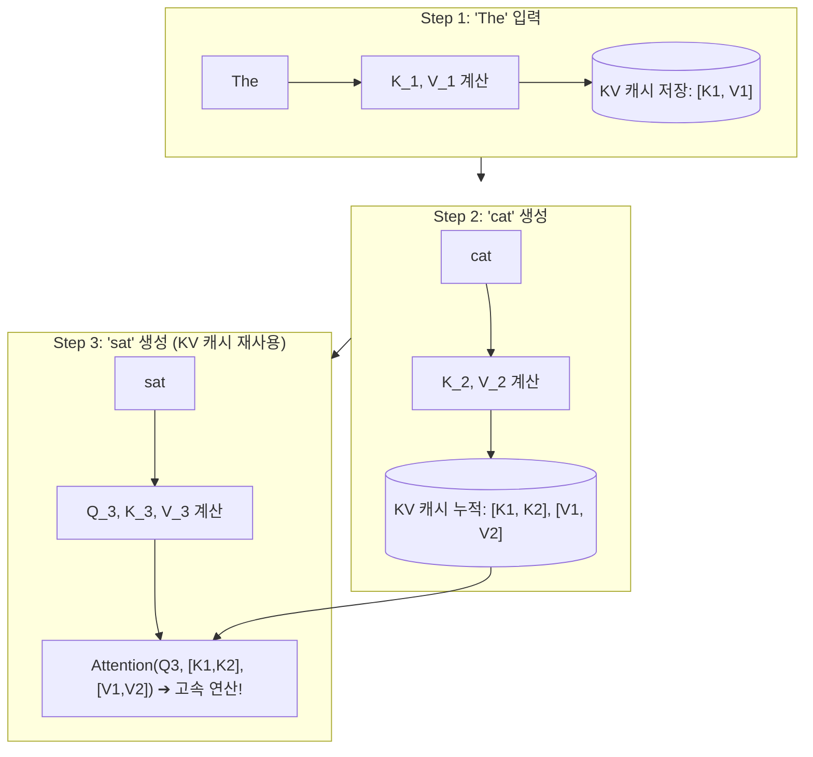
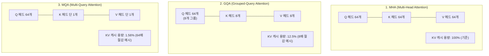
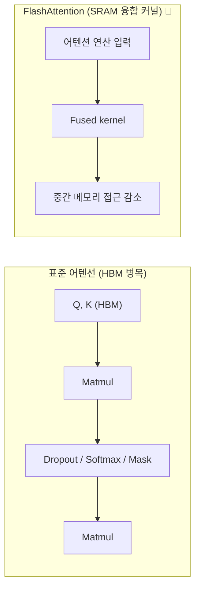
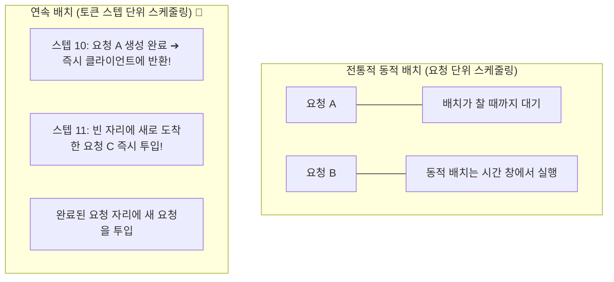

# 02. KV 캐시 수학, FlashAttention 및 연속 배칭

## 📌 핵심 요약 & 전체 맥락
> 어텐션은 긴 시퀀스에서 계산·메모리 비용이 커지는 핵심 병목이다. 특히 KV 캐시의 크기는 시퀀스 길이와 배치 크기에 따라 선형으로 증가한다(p.433-435).
> 책의 예시로 Llama 2-13B는 배치 32, 시퀀스 2,048에서 비최적화 KV 캐시가 54GB에 달한다(p.435).
> 본 섹션에서는 KV 캐시의 원리와 메모리 산출 공식, MQA/GQA, FlashAttention의 커널 융합, PyTorch 최적화 사례, 정적·동적·연속 배칭과 prefill/decode 분리를 정리합니다.

---

## 🗺️ 도표(Figure & Table) 색인 및 매핑 가이드

본문의 핵심 원리를 시각적으로 확인할 수 있는 책 내 도표의 위치와 해설 매핑입니다:

| 도표 번호 | 도표 제목 및 핵심 내용 | 책 페이지 | 본문 해당 주제 |
| :---: | :--- | :---: | :--- |
| **Figure 9-8** | 서비스 제공자별 최적화가 같은 모델의 품질에 미칠 수 있는 차이를 보여주는 비교 그래프 | **p. 426** | 1. 모델 수준 최적화 개요 |
| **Figure 9-12** | 순전파 시 이전 토큰들의 Key/Value 텐서를 캐싱하여 중복 연산을 제거하는 KV 캐시 구조 | **p. 434** | 1. KV 캐시 수학과 어텐션 구조 |
| **Figure 9-13** | PyTorch의 여러 어텐션 연산을 하나의 FlashAttention fused kernel로 결합한 비교 | **p. 437** | 2. FlashAttention과 커널 융합 |
| **Figure 9-14** | Llama-7B에 `torch.compile`, INT8, INT4, speculative decoding을 순차 적용한 PyTorch 처리량 비교 | **p. 439** | 2. PyTorch 추론 가속 사례 |
| **Figure 9-15** | 정적 배칭과 동적 배칭의 대기시간·compute 효율 trade-off | **p. 441** | 3. 서빙 배치 기법의 진화 |
| **Figure 9-16** | 토큰 단위로 새로운 요청을 즉시 끼워 넣고 완료된 요청을 즉시 반환하는 연속 배치(Continuous Batching) | **p. 442** | 3. 서빙 배치 기법의 진화 |

---

## 1. 모델 압축과 KV 캐시 (pp. 426 ~ 436) ⭐

모델 수준 최적화는 모델 크기·autoregressive decoding·attention의 비용을 줄이는 것이다. 책은 양자화와 distillation을 앞 장에서 다루고, pruning은 노드를 제거하거나 유용성이 낮은 파라미터를 0으로 만들어 희소성을 높이는 방식으로 설명한다(p.426-427). 실무에서는 weight-only quantization이 널리 사용되지만, 품질·하드웨어 지원·속도 사이의 trade-off를 확인해야 한다.

### ① KV 캐시의 원리와 메모리 수학 공식 (Figure 9-12, pp. 433 ~ 436)

### ② 왜 KV 캐시가 필수적인가?
트랜스포머의 자기회귀 디코딩에서 $t$번째 토큰을 생성할 때, 이전 $1 \dots t-1$번째 토큰들과의 어텐션을 계산해야 합니다:
$$\text{Attention}(Q, K, V) = \text{softmax}\left(\frac{QK^T}{\sqrt{d_k}}\right)V$$
* **KV 캐시가 없을 때:** 매 토큰 생성마다 이전 토큰들의 $K,V$를 다시 계산해야 한다.
* **KV 캐시 적용 시:** 이전 토큰의 $K,V$를 GPU 메모리에 저장하고 최신 토큰의 $K,V$만 계산해 캐시에 추가한다. 이전 벡터 재계산을 피하지만, 현재 토큰의 query가 모든 이전 key와 attention하는 비용은 남는다.

---

### ③ KV 캐시 메모리 산출 공식 (16-bit 예시)

$$\text{KV Cache Size per Token} = 2 \times 2 \times n_{\text{layers}} \times d_{\text{model}} \quad [\text{Bytes}]$$

* 첫 번째 $2$: Key와 Value **2개의 텐서**
* 두 번째 $2$: 16-bit 부동소수점(FP16/BF16)은 **2 Bytes / Element**
* $n_{\text{layers}}$: 트랜스포머 레이어 수
* $d_{\text{model}}$: 은닉 상태 차원 크기 ($n_{\text{heads}} \times d_{\text{head}}$)

#### 📐 책의 예시 (Llama 2-13B)
책은 40 layers, model dimension 5,120, batch size 32, sequence length 2,048, 2 bytes/value를 사용해 다음과 같이 계산한다(p.435).
$$2 \times 32 \times 2048 \times 40 \times 5120 \times 2 = 54\text{ GB}$$

일반식은 어텐션의 KV head 수까지 포함해야 한다. GQA 모델에서는 d_model 전체가 아니라 n_kv_heads × head_dim을 사용하므로, KV head 축소 효과를 반영해야 한다.

---

### ④ 어텐션 아키텍처 진화: MHA ➔ MQA ➔ GQA

KV 캐시의 폭증을 막기 위해 현대 모델들은 Key/Value 헤드의 개수를 축소하는 아키텍처를 채택합니다:

---

## 2. FlashAttention과 커널 융합 (Figures 9-13, 9-14, pp. 436 ~ 439) ⭐

### ① 표준 어텐션의 HBM I/O 병목 (Standard Attention)
표준 어텐션은 중간 결과물인 $N \times N$ 크기의 어텐션 행렬을 메모리에 저장하고 다시 읽는 작업이 병목이 될 수 있습니다. FlashAttention은 여러 연산을 하나의 하드웨어별 커널로 융합해 메모리 접근을 줄입니다.

### ② FlashAttention의 2대 혁신 (Dao et al., 2022, Figure 9-13)
1. **커널 융합:** Matmul, dropout, softmax, mask 등 여러 연산을 한 번의 fused kernel로 결합합니다.
2. **하드웨어 고려:** 커널은 메모리 계층과 실행 가속기에 맞춰 작성되므로 구현·성능은 하드웨어와 workload에 따라 달라집니다.

---

### ③ PyTorch 2.0 추론 가속 실증 (Figure 9-14)
PyTorch 사례는 A100 80GB에서 Llama-7B에 다음을 순차 적용한 처리량 비교다(p.439):
1. eager: 25.5 tok/s/user
2. torch.compile: 107.0 tok/s/user
3. INT8: 157.4 tok/s/user
4. INT4: 202.1 tok/s/user
5. INT4 + speculative decoding: 244.7 tok/s/user

책은 이 최적화가 모델 출력 품질에 미친 영향은 불명확하다고 덧붙인다.

### ④ 커널과 컴파일러

커널은 특정 가속기에서 반복 연산을 효율적으로 수행하는 하드웨어별 코드다. 책은 vectorization, parallelization, loop tiling, operator fusion을 대표적인 최적화 기법으로 소개하고, CUDA·Triton·ROCm과 torch.compile, XLA, TensorRT 같은 컴파일러가 모델 연산을 하드웨어용 커널로 lowering한다고 설명한다(p.437-440).

---

## 3. 서빙 배치 기법의 진화: 정적 배치 vs 연속 배치 (Figures 9-15, 9-16, pp. 440 ~ 442) ⭐

### ① 전통적 동적 배치 (Dynamic Batching, Figure 9-15)의 한계
* 짧은 문장을 요청한 사용자 A(10토큰)와 긴 문장을 요청한 사용자 B(500토큰)가 같은 배치로 묶이면, **사용자 A는 출력이 이미 끝났음에도 사용자 B가 끝날 때까지 GPU에 붙잡혀 대기**해야 합니다.
* 정적·동적 배칭 자체의 핵심 단점은 배치가 항상 가득 차지 않을 수 있다는 점이다. LLM에서는 요청별 출력 길이가 달라 naive batching을 사용하면 짧은 응답도 긴 응답이 끝날 때까지 기다릴 수 있다(p.441).

---

### ② 연속 배치 (Continuous Batching / In-flight Batching, Orca / vLLM, Figure 9-16)

* **원리:** 시퀀스 전체가 아니라 **매 토큰 생성 이터레이션(Iteration-level) 단위로 스케줄링**.
* 완료된 요청을 즉시 반환하고 그 자리에 새 요청을 넣어 GPU 점유율과 처리량을 높인다. 구체적인 개선 폭은 workload에 따라 달라진다.

---

### ③ PagedAttention (vLLM, Kwon et al., 2023)
* **메모리 단편화 문제:** 요청별 KV 캐시를 연속 영역에 할당하면 길이가 달라질 때 단편화가 생긴다.
* **해결책:** PagedAttention은 KV 캐시를 non-contiguous block으로 나눠 관리하고, 메모리 단편화를 줄이며 유연한 공유를 가능하게 한다(p.436).

### ④ Prefill과 Decode 분리

프리필은 compute-bound이고 디코드는 memory-bandwidth-bound이므로 같은 인스턴스에서 경쟁시키면 TTFT와 TPOT가 모두 나빠질 수 있다. 책은 DistServe와 Inference Without Interference를 사례로, 서로 다른 인스턴스에 prefill과 decode를 배치하는 disaggregation을 소개한다(p.442-443). 필요한 인스턴스 비율은 입력 길이와 지연시간 목표에 따라 달라진다.

---

## 4. 엔지니어링 심화 Q&A

### Q1. MQA/GQA를 적용하면 모델의 추론 정확도가 떨어지지 않나요?
책은 특정 벤치마크 점수나 품질 하락률을 제시하지 않는다. GQA는 MQA와 MHA 사이에서 query head 그룹별로 KV를 공유해, KV 캐시 용량과 표현력 사이의 균형을 조절하는 설계다. 따라서 모델·학습 방식·workload별 품질 검증이 필요하다.

---

## 🔗 연관 문서
* [[00-ch09-overview|00. Chapter 9 전체 개요 및 목차]]
* [[01-inference-fundamentals-and-hardware-math|01. 추론 기초, 루프라인 모델 및 하드웨어 수학]]
* [[03-speculative-decoding-caching-and-parallelism|03. 추측 디코딩, 프롬프트 캐싱 및 분산 병렬화]]
* [[chapter-qa/ch07-fine-tuning-qa/03-peft-lora-and-qlora|Ch07-03. 매개변수 효율적 파인튜닝(PEFT)과 LoRA]]
