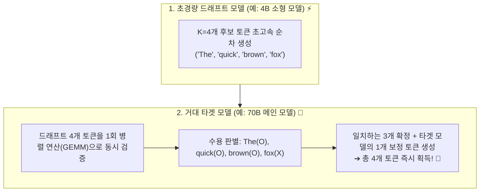
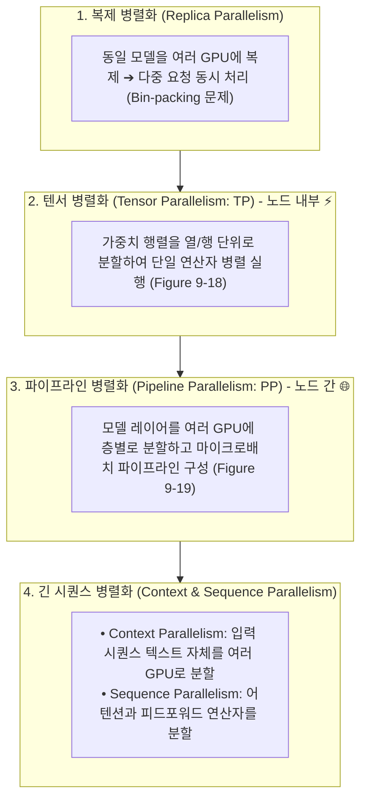

# 03. 추측 디코딩, 프롬프트 캐싱 및 분산 병렬화

## 📌 핵심 요약 & 전체 맥락
> 추측 디코딩은 작은 draft model이 후보 토큰을 만들고 target model이 이를 병렬 검증해, 순차 디코딩의 병목을 완화하는 방법이다. 검증이 생성보다 병렬화하기 쉽다는 점과 workload별 acceptance rate가 핵심이다(p.428-430).
> 단일 GPU와 단일 모델 아키텍처의 한계를 돌파하기 위해 현대 AI 시스템은 **추측 디코딩(Speculative Decoding)**, **프롬프트 캐싱(Prompt Caching)**, 그리고 **분산 병렬화(Distributed Parallelism)**라는 3대 첨단 엔지니어링 기술을 결합합니다.  
> 본 섹션에서는 추측 디코딩, 입력 참조 기반 가속, Medusa·Jacobi 계열 병렬 디코딩, 프롬프트 캐싱, 그리고 여러 병렬화 전략을 책의 사례와 trade-off 중심으로 정리합니다.

---

## 🗺️ 도표(Figure & Table) 색인 및 매핑 가이드

본문의 핵심 원리를 시각적으로 확인할 수 있는 책 내 도표의 위치와 해설 매핑입니다:

| 도표 번호 | 도표 제목 및 핵심 내용 | 책 페이지 | 본문 해당 주제 |
| :---: | :--- | :---: | :--- |
| **Figure 9-9** | 소형 Draft 모델이 $K$개 토큰을 투기 생성하고 타겟 모델이 1회 병렬 검증하는 추측 디코딩 메커니즘 | **p. 428** | 1. 추측 디코딩 원리와 수학 |
| **Figure 9-10** | 입력 문서·코드의 텍스트를 draft로 활용하는 Inference with Reference 예시 | **p. 430** | 1. 참조 텍스트 기반 추측 디코딩 |
| **Figure 9-11** | 단일 모델 상단에 복수 예측 헤드를 부착하여 트리 구조로 토큰을 병렬 생성하는 Medusa 아키텍처 | **p. 432** | 1. Medusa 다중 헤드 디코딩 |
| **Figure 9-17** | 여러 요청 간 공통 시스템 프롬프트 및 RAG 문맥의 KV 캐시를 공유하는 프롬프트 캐싱 구조 | **p. 443** | 2. 프롬프트 캐싱 경제학 |
| **Table 9-3** | Anthropic 자료의 사용 사례별 캐시 전후 TTFT와 비용 감소 | **p. 444** | 2. 프롬프트 캐싱 경제학 |
| **Figure 9-18** | 여러 장치에 행렬을 분할해 병렬 연산하는 텐서 병렬화 (Tensor Parallelism) | **p. 445** | 3. 분산 추론: 텐서 병렬화 (TP) |
| **Figure 9-19** | 모델 레이어를 여러 GPU/노드에 분할하고 마이크로배치 파이프라인으로 처리하는 파이프라인 병렬화 (Pipeline Parallelism) | **p. 446** | 3. 분산 추론: 파이프라인 병렬화 (PP) |

---

## 1. 추측 디코딩과 병렬 디코딩 (Figures 9-9 ~ 9-11, pp. 427 ~ 433) ⭐

### ① 추측 디코딩의 작동 원리 (Speculative Decoding, Figure 9-9)

순차적 자기회귀(Autoregressive) 생성의 병목을 우회하기 위해, 가벼운 모델이 먼저 여러 토큰을 추측 생성하고 메인 모델이 이를 일괄 검증하는 기법입니다:

#### 💡 추측 디코딩이 가능한 3대 핵심 물리적 원리 (p. 429)
1. **검증 속도 >> 생성 속도:** 여러 토큰을 순차 생성하는 것은 느리지만, 이미 생성된 $K$개 토큰을 검증하는 것은 **단 한 번의 행렬 곱셈(GEMM, Compute-bound)으로 병렬 처리(Prefill과 동일)**할 수 있어 시간이 거의 동일하게 소요됩니다.
2. **쉬운 토큰의 존재:** 자연어와 코드에는 예측하기 쉬운 토큰(관사, 문법적 연결어 등)이 많아, 약한 소형 모델도 높은 수용률(Acceptance Rate)로 맞출 수 있습니다.
3. **유휴 연산 자원 활용 (Idle FLOPs):** 디코딩 단계는 **메모리 대역폭 병목(Memory-bound)** 상태이므로 연산 코어(FLOPs)가 놀고 있습니다. 이 유휴 연산력을 활용해 검증을 수행하므로 **'추가 비용 없는 공짜 검증(Free Verification)'**이 가능합니다.

---

#### 📐 책의 실증 사례 및 엔지니어링 고려사항 (pp. 429 ~ 430)
* **Chinchilla-70B 실측 사례 (DeepMind, Chen et al., 2023):**
  * 4B 드래프트 모델은 토큰당 **1.8 ms** (타겟 70B 모델은 **14.1 ms**로 8배 차이).
  * 모델 출력 품질의 저하(손실) 없이 **전체 응답 지연시간을 50% 이상 단축**.
* **$K$ (드래프트 토큰 수)의 트레이드오프:**
  * $K$가 너무 크면 타겟 모델 호출 횟수는 줄지만, 뒤쪽 토큰이 거절당할 확률이 높아져 드래프트 연산이 낭비됨.
* **드래프트 모델 요구조건:** 타겟 모델과 동일한 **어휘집(Vocabulary)과 토크나이저(Tokenizer)**를 공유하는 것이 이상적임.

---

### ② 참조 텍스트 기반 추측 디코딩 (Inference with Reference, Figure 9-10, p. 430)
* **아이디어:** RAG 문서 요약, 코드 버그 수정, 멀티턴 대화 등에서는 **출력 텍스트의 상당 부분이 입력 프롬프트의 내용을 그대로 복사(Repeat)**하는 특성이 있습니다.
* **작동 방식:** 별도의 드래프트 모델 없이, **입력 문맥에서 일치하는 텍스트 스팬(Text Span)을 직접 복사하여 드래프트 토큰으로 투입**하고 타겟 모델이 검증합니다.
* **효과:** 별도 모델 서빙 비용 0원으로 텍스트 중복이 많은 태스크에서 **2배의 생성 속도 향상(2x Speedup)**을 달성합니다 (Yang et al., 2023).

---

### ③ 병렬 디코딩 기법: Medusa vs Lookahead (pp. 432 ~ 433, Figure 9-11)

순차 생성 자체를 깨고 여러 미래 토큰($x_{t+1}, \dots, x_{t+k}$)을 한 번에 동시 예측하는 기술:

| 기법 | 구조 및 메커니즘 | 검증 방식 | 실전 성능 및 특징 |
| :--- | :--- | :--- | :--- |
| **Lookahead Decoding** (Fu et al., 2024) | 단일 디코더가 야코비 반복법(Jacobi Iteration)으로 미래 토큰을 병렬 생성 | **야코비(Jacobi) 검증:** 불일치한 토큰만 선택적으로 재생성 및 미세조정 | 별도 헤드 추가 없이 단일 모델로 수행 |
| **Medusa** (Cai et al., 2024, Figure 9-11) | 기본 모델 위에 **복수 개의 예측 헤드(Medusa Heads)**를 부착하여 미래 위치($t+1, t+2, \dots$) 예측 | **트리 기반 어텐션 (Tree-based Attention):** 각 헤드의 후보군을 트리 구조로 구성해 최적 경로 검증 | **Llama 3.1 토큰 생성 속도 최대 1.9배 가속** (NVIDIA HGX H200) |

---

## 2. 프롬프트 캐싱 경제학 (Prompt Caching, Figure 9-17, Table 9-3, pp. 443 ~ 444) ⭐

### ① 공통 접두사(Prefix) 재사용 메커니즘
시스템 프롬프트, 긴 RAG 참조 문서, 다중 턴 대화 내역 등 여러 요청 간에 겹치는 텍스트의 **KV 캐시를 버리지 않고 메모리에 보관하여 다음 요청에서 재사용**합니다 (Context / Prefix Cache).

* **엄청난 비용 절감 효과 (책의 예시):**
  * 시스템 프롬프트가 1,000토큰이고 하루 100만 회 API 호출이 발생할 때:
  * ➔ 프롬프트 캐싱 적용 시 **하루 약 10억 개(1 Billion)의 중복 입력 토큰 연산을 완전히 절감!**

---

### ② 상용 모델 API별 캐싱 정책 및 Anthropic 실측 데이터 (Table 9-3)
* **Google Gemini:** 캐시된 입력 토큰에 대해 **75% 가격 할인** 적용 (캐시 스토리지 비용: 100만 토큰당 시간당 $1.00).
* **Anthropic Claude:** 최대 **90% 비용 절감** 및 **75% TTFT(첫 토큰 지연시간) 단축** 보장.

#### 📊 Anthropic 실측 사용 사례별 절감 효과 (Table 9-3, p. 444)

| 사용 사례 | 캐시 전 TTFT | 캐시 후 TTFT (지연 단축) | 비용 감소율 |
| :--- | :---: | :---: | :---: |
| **10만 토큰 분량 책 기반 질의응답 (Book Q&A)** | 11.5초 | **2.4초 (-79% 🚀)** | **-90% 🏆** |
| **1만 토큰 퓨샷 프롬프팅 (Many-shot)** | 1.6초 | **1.1초 (-31%)** | **-86%** |
| **긴 시스템 프롬프트의 10턴 대화 (Multi-turn)** | 약 10초 | **약 2.5초 (-75%)** | **-53%** |

---

## 3. 분산 추론: 4대 병렬화 아키텍처 (Figures 9-18, 9-19, pp. 444 ~ 447) ⭐

거대 모델을 여러 대의 가속기에 분산하여 서빙하는 핵심 전략:

### ① 4대 병렬화 기법 상세 비교

| 병렬화 유형 | 분할 단위 및 작동 메커니즘 | 주요 장점 | 단점 및 실무 가이드라인 |
| :--- | :--- | :--- | :--- |
| **복제 병렬화** (Replica Parallelism) | 모델 전체를 각 GPU마다 1개씩 온전히 복제 | 구현이 가장 단순하며 개별 요청 지연시간 증가 없음 | 모델이 단일 GPU 메모리(24G/40G/80G)에 완전히 들어갈 때만 가능 |
| **텐서 병렬화 (TP)** (Tensor Parallelism, Figure 9-18) | 단일 행렬 곱셈 연산자 내부의 **가중치 텐서를 열(Column)/행(Row) 단위로 쪼개어 연산** (Megatron-LM) | 단일 장치에 안 들어가는 거대 모델 서빙 가능, **추론 지연시간(Latency) 직접 단축** | GPU 간 고속 통신(All-Reduce)이 빈번하므로 **초고속 NVLink가 지원되는 단일 노드 내부**에서만 사용 |
| **파이프라인 병렬화 (PP)** (Pipeline Parallelism, Figure 9-19) | 모델의 **레이어(Layer)들을 여러 머신으로 분할**하고 마이크로배치 단위로 순차 전달 | 노드 간 느린 네트워크(이더넷) 환경에서도 거대 모델 분산 가능 | 통신 대기(Bubble)로 인해 **개별 요청의 총 지연시간(Latency) 증가** (학습에는 유리하나 엄격한 실시간 추론에서는 기피) |
| **컨텍스트 / 시퀀스 병렬화** (Context / Sequence Parallelism) | 초장문(Long-context) 입력 시퀀스 토큰 또는 어텐션/FFN 연산자를 여러 GPU로 분할 | 수십만 토큰의 초장문 컨텍스트 추론 지원 | 통신 동기화 오버헤드 관리 필요 |

---

## 4. 엔지니어링 심화 Q&A

### Q1. 프롬프트 캐싱을 프로덕션에서 극대화하려면 프롬프트를 어떻게 작성해야 하나요?
실무 보충: 캐시는 반복되는 prefix/context를 재사용하므로, 변하지 않는 시스템 프롬프트와 긴 문서를 앞에 두고 매번 달라지는 질문은 뒤에 두는 구성이 유리하다. 다만 캐시 hit율·TTL·가격 정책은 제공자별로 다르며, 책은 이를 일반 규칙이나 90% hit율로 보장하지 않는다.

---

## 🔗 연관 문서
* [[00-ch09-overview|00. Chapter 9 전체 개요 및 목차]]
* [[01-inference-fundamentals-and-hardware-math|01. 추론 기초, 루프라인 모델 및 하드웨어 수학]]
* [[02-kv-cache-flashattention-and-batching|02. KV 캐시 수학, FlashAttention 및 연속 배칭]]
* [[chapter-qa/ch07-fine-tuning-qa/03-peft-lora-and-qlora|Ch07-03. 매개변수 효율적 파인튜닝(PEFT)과 LoRA]]
