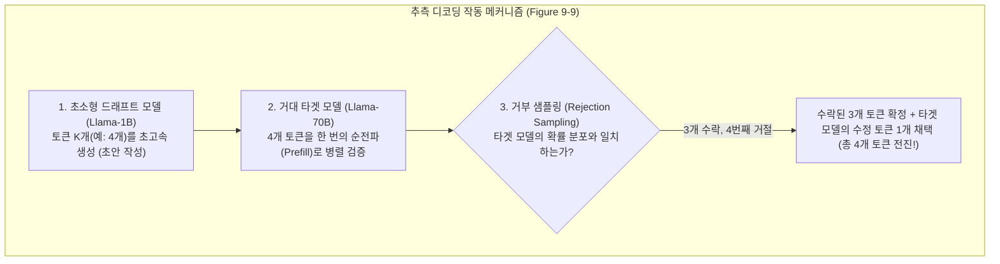
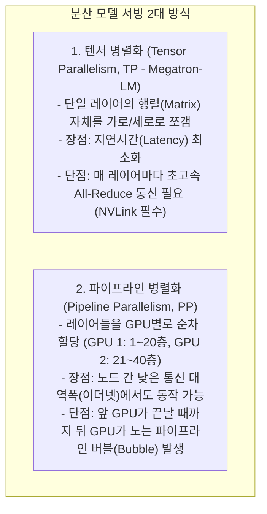

# 03. 추측 디코딩, 프롬프트 캐싱 및 분산 병렬화 (TP, PP)

## 📌 핵심 요약 & 전체 맥락
> **"작고 빠른 보조 모델로 초안을 빠르게 작성하고 큰 주 모델로 한 번에 검증하면, 수학적으로 100% 동일한 출력을 2~3배 빠르게 얻을 수 있습니다."**  
> 본 섹션에서는 디코딩 단계의 지연시간을 무손실(Lossless)로 단축하는 **추측 디코딩 (Speculative Decoding: Figure 9-9)**, 긴 시스템 프롬프트나 RAG 문서의 프리필 비용과 지연시간을 90% 절감하는 **프롬프트 캐싱 (Prompt / Prefix Caching: Figure 9-17 & Table 9-3)**을 다룹니다.  
> 나아가 70B 이상의 거대 모델을 여러 대의 GPU에 쪼개어 서빙하는 분산 병렬화 기법인 **텐서 병렬화(TP: Megatron-LM의 Column/Row Split, Figure 9-18)**와 **파이프라인 병렬화(PP: 1F1B 스케줄링, Figure 9-19)**의 통신 오버헤드와 장단점을 완벽하게 정리합니다.

---

## 🗺️ 도표(Figure & Table) 색인 및 매핑 가이드

본문의 핵심 원리를 시각적으로 확인할 수 있는 책 내 도표의 위치와 해설 매핑입니다:

| 도표 번호 | 도표 제목 및 핵심 내용 | 책 페이지 | 본문 해당 주제 |
| :---: | :--- | :---: | :--- |
| **Figure 9-9** | 드래프트 모델(Draft)이 $K$개 토큰을 빠르게 생성하고 타겟 모델(Target)이 한 번에 병렬 검증하는 추측 디코딩 흐름도 | **p. 427-429** | 1. 추측 디코딩 (Speculative Decoding) |
| **Figure 9-10** | 입력 문서나 검색된 참조 텍스트에서 직접 N-gram 토큰을 복사하여 드래프트하는 Prompt Lookup Decoding | **p. 429-430** | 1. 참조 텍스트 기반 추측 디코딩 |
| **Figure 9-11** | 별도의 드래프트 모델 없이 추가 어텐션 헤드를 붙여 미래 토큰 트리를 예측하는 Medusa 멀티헤드 구조 | **p. 430-431** | 1. Medusa 멀티헤드 추측 디코딩 |
| **Figure 9-17** | 공통 시스템 프롬프트의 KV 캐시를 메모리에 영구 보존하여 재사용하는 프롬프트 캐싱 (Prompt/Prefix Caching) | **p. 439-441** | 2. 프롬프트 캐싱 (Prompt Caching) |
| **Table 9-3** | Anthropic Claude의 프롬프트 캐싱 적용 전후 비용(최대 90% 할인) 및 TTFT 지연시간(85% 단축) 실측표 | **p. 441** | 2. Anthropic 프롬프트 캐싱 비용표 |
| **Figure 9-18** | 단일 선형 계층의 가중치를 GPU 간 열(Column)과 행(Row)으로 쪼개고 All-Reduce로 통신하는 텐서 병렬화 (TP) | **p. 444-446** | 3. 텐서 병렬화 (Tensor Parallelism, TP) |
| **Figure 9-19** | 트랜스포머 레이어들을 GPU별로 순차 배치하고 1F1B 마이크로배치로 버블을 최소화하는 파이프라인 병렬화 (PP) | **p. 446-448** | 3. 파이프라인 병렬화 (Pipeline Parallelism, PP) |

---

## 1. 추측 디코딩 (Speculative Decoding, Leviathan et al., 2023, Figure 9-9) 🏆

타겟 모델(예: Llama 3-70B)로 토큰을 하나씩 생성하는 것은 HBM 대역폭 병목으로 인해 매우 느립니다.



* **수학적 무손실성 (Lossless Guarantee):**  
  특수한 거부 샘플링(Rejection Sampling) 알고리즘을 사용하므로, **최종 출력 텍스트의 확률 분포는 큰 타겟 모델 단독으로 생성했을 때와 수학적으로 100% 동일**함이 보증됩니다.
* **파생 기법:**
  1. **Prompt Lookup Decoding (Figure 9-10):** 별도의 작은 모델도 없이, 입력 프롬프트나 RAG 문서 안에서 겹치는 단어(N-gram)를 찾아 초안으로 즉석 복사.
  2. **Medusa (Figure 9-11):** 모델 상단에 $K$개의 추가 예측 헤드를 달아 트리 형태로 미래 토큰을 예측.

---

## 2. 프롬프트 캐싱 (Prompt / Prefix Caching, Figure 9-17, Table 9-3) ⭐

많은 비즈니스 쿼리는 **긴 시스템 프롬프트(5,000토큰)나 사내 매뉴얼 RAG 문서(50,000토큰)가 매 요청마다 100% 동일하게 반복**됩니다:

```
[ 프롬프트 캐싱 (Prompt Caching)의 비용 및 지연시간 절감 효과 (Table 9-3) ]

• 미적용 시 : 매 요청마다 50,000토큰의 프리필(Prefill)을 처음부터 다시 계산 ➔ 비싼 입력 비용 + 5초 대기
• 캐싱 적용 : 공통 접두사의 KV 캐시를 GPU 메모리에 상주 ➔ 입력 토큰 비용 90% 할인 + TTFT 85% 단축 🚀
```

---

## 3. 분산 서빙 병렬화: TP vs PP (Figures 9-18, 9-19, pp. 443 ~ 448)

70B 모델은 FP16 기준 약 140GB이므로 80GB GPU 1장에 올라가지 않습니다. 모델을 여러 GPU로 쪼개야 합니다:



| 비교 항목 | 텐서 병렬화 (TP, Figure 9-18) | 파이프라인 병렬화 (PP, Figure 9-19) |
| :--- | :--- | :--- |
| **분할 단위** | 레이어 내부 행렬 분할 (Column / Row Split) | 레이어 층위 분할 (Layer Stacking) |
| **네트워크 요구조건** | ⚡ **극도로 높은 대역폭 필수 (NVLink 900 GB/s)** | 🌐 일반 이더넷 / InfiniBand에서도 구동 가능 |
| **통신 패턴** | 레이어당 2회의 **All-Reduce** 동기 통신 | 단계 간 **P2P (Point-to-Point)** 활성화값 전송 |
| **주요 활용처** | **동일 서버 노드 내의 8개 GPU 간 병렬화 (Scale-up)** | **서로 다른 물리 서버 노드 간의 병렬화 (Scale-out)** |

---

## 🔗 연관 문서
* [[00-ch09-overview|00. Chapter 9 전체 개요 및 목차]]
* [[01-inference-fundamentals-and-hardware-math|01. 추론 기초, 루프라인 모델 및 하드웨어 수학]]
* [[02-kv-cache-flashattention-and-batching|02. KV 캐시, FlashAttention 및 연속 배칭]]
* [[chapter-qa/ch07-fine-tuning-qa/04-model-merging-and-weight-arithmetic|Ch07-04. 모델 병합(Model Merging)과 가중치 산술 연산]]
