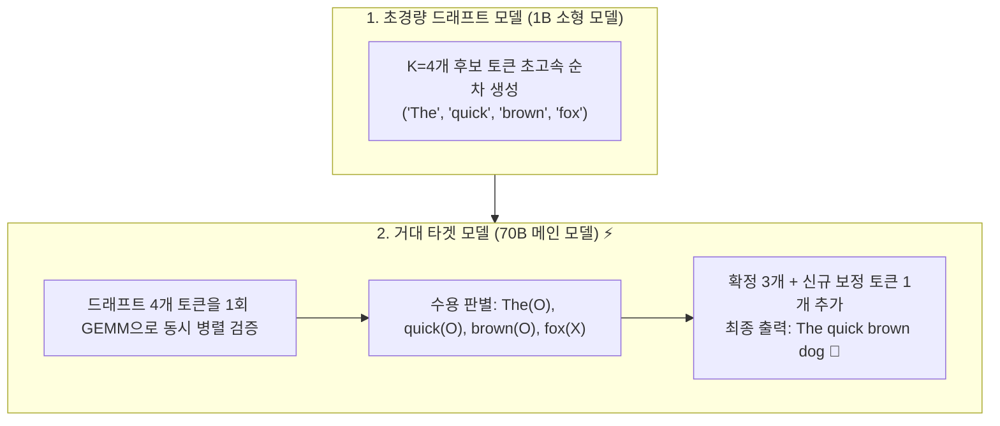
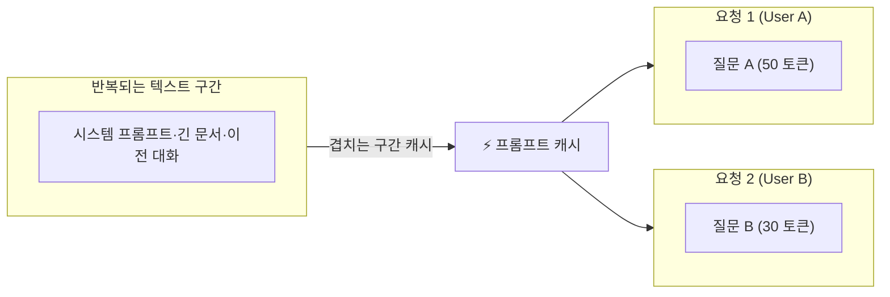
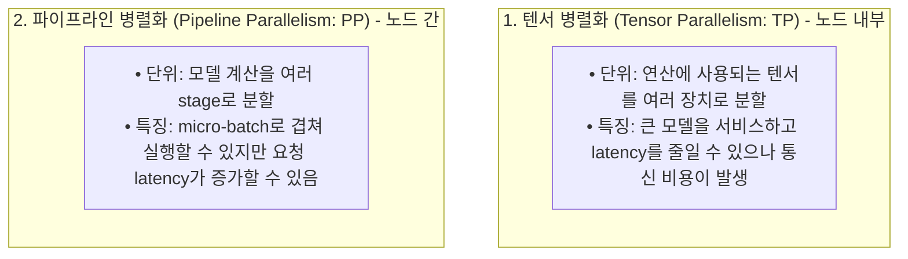

# 03. 추측 디코딩, 프롬프트 캐싱 및 분산 병렬화

## 📌 핵심 요약 & 전체 맥락
> 추측 디코딩은 작은 draft model이 후보 토큰을 만들고 target model이 이를 병렬 검증해, 순차 디코딩의 병목을 완화하는 방법이다. 검증이 생성보다 병렬화하기 쉽다는 점과 workload별 acceptance rate가 핵심이다(p.428-430).
> 단일 GPU와 단일 모델 아키텍처의 한계를 돌파하기 위해 현대 AI 시스템은 **추측 디코딩(Speculative Decoding)**, **프롬프트 캐싱(Prompt Caching)**, 그리고 **분산 병렬화(Distributed Parallelism)**라는 3대 첨단 엔지니어링 기술을 결합합니다.  
> 본 섹션에서는 추측 디코딩, 입력 참조 기반 가속, Medusa·Jacobi 계열 병렬 디코딩, 프롬프트 캐싱, 그리고 여러 병렬화 전략을 책의 사례와 trade-off 중심으로 정리합니다.

---

## 🗺️ 도표(Figure & Table) 색인 및 매핑 가이드

본문의 핵심 원리를 시각적으로 확인할 수 있는 책 내 도표의 위치와 해설 매핑입니다:

| 도표 번호 | 도표 제목 및 핵심 내용 | 책 페이지 | 본문 해당 주제 |
| :---: | :--- | :---: | :--- |
| **Figure 9-9** | 소형 Draft 모델이 $K$개 토큰을 투기 생성하고 타겟 모델이 1회 병렬 검증하는 추측 디코딩 메커니즘 | **p. 428** | 1. 추측 디코딩 원리와 수학 |
| **Figure 9-10** | 입력 문서·코드의 텍스트를 draft로 활용하는 Inference with Reference 예시 | **p. 430** | 1. 참조 텍스트 기반 추측 디코딩 |
| **Figure 9-11** | 단일 모델 상단에 복수 예측 헤드를 부착하여 트리 구조로 토큰을 병렬 생성하는 Medusa 아키텍처 | **p. 432** | 1. Medusa 다중 헤드 디코딩 |
| **Figure 9-17** | 여러 요청 간 공통 시스템 프롬프트 및 RAG 문맥의 KV 캐시를 공유하는 프롬프트 캐싱 구조 | **p. 443** | 2. 프롬프트 캐싱 경제학 |
| **Table 9-3** | Anthropic 자료의 사용 사례별 캐시 전후 TTFT와 비용 감소 | **p. 444** | 2. 프롬프트 캐싱 경제학 |
| **Figure 9-18** | 여러 장치에 행렬을 분할해 병렬 연산하는 텐서 병렬화 (Tensor Parallelism) | **p. 445** | 3. 분산 추론: 텐서 병렬화 (TP) |
| **Figure 9-19** | 모델 레이어를 여러 GPU/노드에 분할하고 마이크로배치 파이프라인으로 처리하는 파이프라인 병렬화 (Pipeline Parallelism) | **p. 446** | 3. 분산 추론: 파이프라인 병렬화 (PP) |

---

## 1. 추측·병렬 디코딩의 원리 (Figures 9-9 ~ 9-11, pp. 427 ~ 433) ⭐

### ① 추측 디코딩 (Speculative Decoding, Figure 9-9)

* **물리적 핵심 원리:**  
  거대 모델(70B)이 1개 토큰을 생성하는 데 걸리는 시간(메모리 로드 병목)과, 소형 모델이 미리 만든 $K$개 토큰을 **단 한 번의 행렬-행렬 곱셈(GEMM, Compute-bound)으로 병렬 검증하는 시간은 물리적으로 거의 같습니다.**
* **품질 보존:** 책은 speculative decoding이 모델의 품질을 바꾸지 않는 접근이라고 설명한다. 구현과 샘플링 방식에 따라 검증이 필요하다.

책은 고정된 speedup 공식을 제시하지 않는다. acceptance rate는 도메인에 따라 달라지고, K를 크게 하면 target 검증 호출은 줄지만 draft 토큰이 거부될 가능성도 커진다. Chinchilla-70B에 4B draft model을 사용한 사례에서는 draft가 1.8ms/token, target이 14.1ms/token이었고 전체 응답 latency가 절반 이상 줄었다(p.429).

---

### ② Inference with Reference (참조 텍스트 기반 추측 디코딩, Figure 9-10)
* 문서·코드·대화처럼 입력의 일부가 출력에 반복되는 경우, 입력에서 관련 텍스트 span을 골라 draft sequence로 사용한다.
* 별도 draft model은 필요 없지만 입력과 출력의 겹침이 큰 경우에만 유용하며, 책은 이런 사용 사례에서 약 2배 generation speedup을 보고한다(p.430).

---

### ③ Medusa: 다중 예측 헤드 기반 추측 디코딩 (Cai et al., 2024, Figure 9-11)
* 별도 draft model 대신 원래 모델에 여러 decoding head를 추가한다. 원래 모델은 frozen 상태로 두고 head를 학습해 각 미래 위치의 토큰을 예측한다.
* 각 head가 여러 후보를 만들고 tree-based attention으로 후보를 검증·통합한다. NVIDIA는 Llama 3.1에서 최대 1.9배 향상을 보고했다(p.432-433).

Lookahead decoding처럼 Jacobi 방법으로 미래 토큰을 병렬 생성·검증하는 계열도 있으며, Medusa는 그와 달리 여러 decoding head와 tree-based attention을 사용한다.

---

## 2. 프롬프트 캐싱 경제학 (Prompt Caching, Figure 9-17, Table 9-3, pp. 442 ~ 445) ⭐

### ① 공통 접두사 KV 캐시 공유 메커니즘 (Figure 9-17)
애플리케이션의 시스템 프롬프트, many-shot 예시, 긴 문서, 이전 대화처럼 여러 요청에 반복되는 텍스트 구간은 프롬프트 캐시로 재사용할 수 있다.

### ② Anthropic 프롬프트 캐싱 실측 효과 (Table 9-3)

| 사용 사례 | 캐시 전 TTFT | 캐시 후 TTFT | 비용 감소 |
| :--- | :---: | :---: | :---: |
| 100K 토큰 책과 대화 | 11.5초 | 2.4초 (-79%) | -90% |
| 10K 토큰 many-shot | 1.6초 | 1.1초 (-31%) | -86% |
| 긴 시스템 프롬프트의 10턴 대화 | 약 10초 | 약 2.5초 (-75%) | -53% |

---

## 3. 분산 추론: 텐서 병렬화 vs 파이프라인 병렬화 (Figures 9-18, 9-19, pp. 445 ~ 447) ⭐

큰 모델은 단일 장치에 맞지 않을 수 있어 모델을 여러 장치에 나눠야 한다.

### ① 텐서 병렬화 (Tensor Parallelism / Megatron-LM, Figure 9-18)
* **열 병렬화 (Column Parallel):** 가중치 행렬 $W$를 열 단위로 쪼개어 각 GPU가 독립적으로 행렬 곱셈 $XW_1, XW_2$ 수행.
* **행 병렬화 (Row Parallel):** 다음 레이어에서 행 단위로 쪼갠 가중치와 곱한 뒤 `All-Reduce (Sum)` 통신을 통해 최종 합산.
* **장점:** 한 장치에 맞지 않는 모델을 서비스하고 latency를 줄일 수 있다. 다만 장치 간 통신 오버헤드가 이득을 줄일 수 있다.

### ② 파이프라인 병렬화 (Pipeline Parallelism, Figure 9-19)
* 모델 계산을 여러 장치의 stage로 나누고, 활성화를 다음 stage로 전달한다. 배치를 작은 **마이크로배치(Micro-batches)**로 나눠 stage 간 계산을 겹칠 수 있다.
* 각 요청의 총 latency가 증가할 수 있으므로 latency가 엄격한 추론에서는 replica parallelism을 선호할 수 있다.

### ③ 그 밖의 병렬화

Replica parallelism은 모델 복제본을 여러 개 만들어 동시 요청을 처리하는 가장 단순한 방법이다. 모델과 GPU가 여러 종류라면 어떤 복제본을 어떤 장치에 배치할지 bin-packing 문제가 생긴다. 긴 입력 처리에는 context parallelism(입력 시퀀스 분할)과 sequence parallelism(전체 입력에 필요한 연산을 장치별 분할)도 사용할 수 있다(p.445-447).

---

## 4. 엔지니어링 심화 Q&A

### Q1. 프롬프트 캐싱을 프로덕션에서 극대화하려면 프롬프트를 어떻게 작성해야 하나요?
실무 보충: 캐시는 반복되는 prefix/context를 재사용하므로, 변하지 않는 시스템 프롬프트와 긴 문서를 앞에 두고 매번 달라지는 질문은 뒤에 두는 구성이 유리하다. 다만 캐시 hit율·TTL·가격 정책은 제공자별로 다르며, 책은 이를 일반 규칙이나 90% hit율로 보장하지 않는다.

---

## 🔗 연관 문서
* [[00-ch09-overview|00. Chapter 9 전체 개요 및 목차]]
* [[01-inference-fundamentals-and-hardware-math|01. 추론 기초, 루프라인 모델 및 하드웨어 수학]]
* [[02-kv-cache-flashattention-and-batching|02. KV 캐시 수학, FlashAttention 및 연속 배칭]]
* [[chapter-qa/ch07-fine-tuning-qa/03-peft-lora-and-qlora|Ch07-03. 매개변수 효율적 파인튜닝(PEFT)과 LoRA]]
