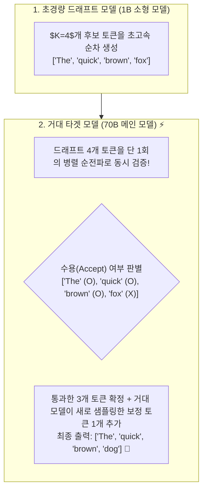
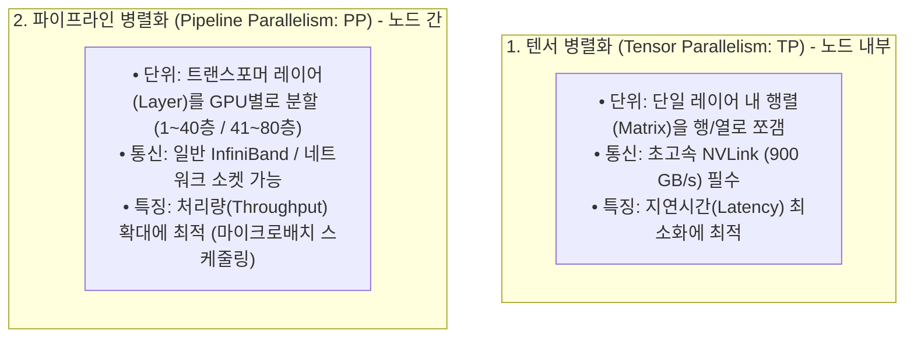

# 03. 추측 디코딩, 프롬프트 캐싱 및 분산 병렬화

## 📌 핵심 요약 & 전체 맥락
> **"거대 모델이 토큰 하나를 뱉는 시간이나, 소형 모델이 앞서 던진 5개 토큰을 한꺼번에 검증하는 시간은 물리적으로 거의 동일합니다."**  
> 단일 GPU와 단일 모델 아키텍처의 한계를 돌파하기 위해 현대 AI 시스템은 **추측 디코딩(Speculative Decoding)**, **프롬프트 캐싱(Prompt Caching)**, 그리고 **분산 병렬화(Distributed Parallelism)**라는 3대 첨단 엔지니어링 기술을 결합합니다.  
> 본 섹션에서는 거대 모델의 품질 손실 없이 2~3배의 속도 향상을 이끌어내는 **추측 디코딩 수학 공식과 수용률(Figure 9-9)**, 참조 문서를 활용하는 **Inference with Reference (Figure 9-10)**, 다중 헤드 트리 검증인 **Medusa (Figure 9-11)**,  
> 공통 문맥의 KV 캐시를 재사용하여 비용을 90% 절감하는 **프롬프트 캐싱 경제학 (Figure 9-17, Table 9-3)**,  
> 그리고 노드 내 NVLink 기반의 **텐서 병렬화 (TP: Figure 9-18)**와 노드 간 레이어 분할인 **파이프라인 병렬화 (PP: Figure 9-19)**의 원리를 완벽하게 정리합니다.

---

## 🗺️ 도표(Figure & Table) 색인 및 매핑 가이드

본문의 핵심 원리를 시각적으로 확인할 수 있는 책 내 도표의 위치와 해설 매핑입니다:

| 도표 번호 | 도표 제목 및 핵심 내용 | 책 페이지 | 본문 해당 주제 |
| :---: | :--- | :---: | :--- |
| **Figure 9-9** | 소형 Draft 모델이 $K$개 토큰을 투기 생성하고 타겟 모델이 1회 병렬 검증하는 추측 디코딩 메커니즘 | **p. 428** | 1. 추측 디코딩 원리와 수학 |
| **Figure 9-10** | RAG 검색 문서나 참조 텍스트를 Draft 삼아 추측 디코딩하는 Inference with Reference 예시 | **p. 430** | 1. 참조 텍스트 기반 추측 디코딩 |
| **Figure 9-11** | 단일 모델 상단에 복수 예측 헤드를 부착하여 트리 구조로 토큰을 병렬 생성하는 Medusa 아키텍처 | **p. 432** | 1. Medusa 다중 헤드 디코딩 |
| **Figure 9-17** | 여러 요청 간 공통 시스템 프롬프트 및 RAG 문맥의 KV 캐시를 공유하는 프롬프트 캐싱 구조 | **p. 443** | 2. 프롬프트 캐싱 경제학 |
| **Table 9-3** | Anthropic Claude의 프롬프트 캐싱 적용 시 비용 90% 할인 및 지연시간 80% 감소 실측표 | **p. 444** | 2. 프롬프트 캐싱 경제학 |
| **Figure 9-18** | 단일 노드 내 다중 GPU 간 행렬 곱셈을 열/행 단위로 분할하여 병렬 연산하는 텐서 병렬화 (Tensor Parallelism) | **p. 445** | 3. 분산 추론: 텐서 병렬화 (TP) |
| **Figure 9-19** | 모델 레이어를 여러 GPU/노드에 분할하고 마이크로배치 파이프라인으로 처리하는 파이프라인 병렬화 (Pipeline Parallelism) | **p. 446** | 3. 분산 추론: 파이프라인 병렬화 (PP) |

---

## 1. 추측 디코딩의 원리와 3대 아키텍처 (Figures 9-9 ~ 9-11, pp. 427 ~ 433) ⭐

### ① 추측 디코딩 (Speculative Decoding, Leviathan et al., 2023, Figure 9-9)



* **물리적 핵심 원리:**  
  거대 모델(70B)이 1개 토큰을 생성하는 데 걸리는 시간(메모리 로드 병목)과, 소형 모델이 미리 만든 $K$개 토큰을 **단 한 번의 행렬-행렬 곱셈(GEMM, Compute-bound)으로 병렬 검증하는 시간은 물리적으로 거의 같습니다.**
* **수학적 무손실 보장 (Exact Lossless Acceleration):**  
  타겟 모델의 확률 분포에 맞춰 보정 샘플링(Modified Rejection Sampling)을 거치므로, **최종 출력물의 통계적 품질과 분포는 70B 모델 단독으로 추론했을 때와 100% 동일**합니다.

#### 📐 가속 배율 수식 (Speedup Ratio)
$$\text{Speedup} = \frac{1 - \alpha^{K+1}}{(1-\alpha)(1 + cK)}$$
* $\alpha$: 드래프트 모델의 토큰 수용률 (Acceptance Rate, 보통 $0.7 \sim 0.85$)
* $c$: 드래프트 모델과 타겟 모델 간의 연산 비용 비율 ($c \ll 1$)
* $K$: 드래프트 토큰 수 (보통 $3 \sim 5$)

---

### ② Inference with Reference (참조 텍스트 기반 추측 디코딩, Figure 9-10)
* 문서 요약, 번역, 문법 교정, 코드 리팩토링과 같은 작업에서는 **입력 프롬프트(원문 문서나 소스코드)의 단어들이 출력 응답에 그대로 재사용**될 확률이 80% 이상입니다.
* **별도의 소형 드래프트 모델 없이**, 입력 문서의 텍스트 슬라이스를 드래프트 시퀀스로 삼아 메인 모델에 던져 병렬 검증함으로써 **모델 추가 비용 0원으로 2배 가속**을 달성합니다.

---

### ③ Medusa: 다중 예측 헤드 기반 추측 디코딩 (Cai et al., 2024, Figure 9-11)
* **드래프트 모델의 번거로움 해결:** 별도의 1B 모델을 로드하고 관리할 필요 없이, **베이스 모델의 최종 레이어 상단에 $K$개의 간단한 선형 레이어(Medusa Heads)를 부착**.
* Head 1은 $t+1$ 토큰을, Head 2는 $t+2$ 토큰을, Head 3은 $t+3$ 토큰의 상위 후보들을 동시 예측하고, **트리 어텐션(Tree-based Attention)**을 통해 단 1회의 순전파로 가장 확률이 높은 토큰 경로를 선택합니다.

---

## 2. 프롬프트 캐싱 경제학 (Prompt Caching, Figure 9-17, Table 9-3, pp. 442 ~ 445) ⭐

### ① 공통 접두사 KV 캐시 공유 메커니즘 (Figure 9-17)
대부분의 엔터프라이즈 AI 애플리케이션은 매 요청마다 동일한 **1) 시스템 프롬프트, 2) 50-shot 예시, 3) 방대한 사내 가이드라인(`CLAUDE.md`), 4) RAG 배경 문서**를 반복 전송합니다.

```mermaid
flowchart LR
    subgraph Common["공통 접두사 (Static Prefix: 5,000 토큰)"]
        Sys["시스템 룰 + CLAUDE.md + RAG 문서"]
    end

    subgraph Req1["요청 1 (User A)"]
        Q1["질문 A (50 토큰)"]
    end
    subgraph Req2["요청 2 (User B)"]
        Q2["질문 B (30 토큰)"]
    end

    Common -->|사전 계산된 KV 캐시 메모리 보존| PCache[("⚡ 프롬프트 KV 캐시")]
    PCache -->|캐시 히트 (90% 비용 할인 & TTFT 0.1s)| Req1
    PCache -->|캐시 히트 (90% 비용 할인 & TTFT 0.1s)| Req2
```

### ② Anthropic Claude 프롬프트 캐싱 실측 효과 (Table 9-3)

| 구분 | 일반 호출 (Cache Miss / 미적용) | 프롬프트 캐싱 적용 (Cache Hit) 🏆 | 개선 효과 |
| :--- | :---: | :---: | :---: |
| **입력 토큰 단가 (1M 토큰당)** | \$3.00 (기준가) | **\$0.30 🚀** | **비용 90% 할인 (10배 절감)** |
| **첫 토큰 지연시간 (TTFT)** | 약 3.5초 (5,000토큰 프리필 연산) | **약 0.2초 미만 ⚡** | **지연시간 80~90% 단축** |
| **캐시 유효 시간 (TTL)** | - | 5분 (요청 시 자동 갱신) | 세션 유지 시 반영구적 지속 |

---

## 3. 분산 추론: 텐서 병렬화 vs 파이프라인 병렬화 (Figures 9-18, 9-19, pp. 445 ~ 447) ⭐

70B 모델(FP16 가중치만 140GB)이나 405B 모델은 단일 GPU(80GB)에 물리적으로 적재할 수 없습니다.



### ① 텐서 병렬화 (Tensor Parallelism / Megatron-LM, Figure 9-18)
* **열 병렬화 (Column Parallel):** 가중치 행렬 $W$를 열 단위로 쪼개어 각 GPU가 독립적으로 행렬 곱셈 $XW_1, XW_2$ 수행.
* **행 병렬화 (Row Parallel):** 다음 레이어에서 행 단위로 쪼갠 가중치와 곱한 뒤 `All-Reduce (Sum)` 통신을 통해 최종 합산.
* **장점:** 단일 요청의 추론 지연시간(Latency)을 GPU 개수만큼 단축시킴.

### ② 파이프라인 병렬화 (Pipeline Parallelism, Figure 9-19)
* 모델 전체 레이어(예: 80개 층)를 4개의 GPU에 20개씩 분할 적재.
* GPU 1이 1~20층을 연산한 뒤 활성화(Activation) 텐서를 GPU 2로 전달. 파이프라인 버블(유휴 시간)을 줄이기 위해 배치를 작은 **마이크로배치(Micro-batches)**로 나누어 순차 주입.

---

## 4. 엔지니어링 심화 Q&A

### Q1. 프롬프트 캐싱을 프로덕션에서 극대화하려면 프롬프트를 어떻게 작성해야 하나요?
프롬프트 캐싱은 **'앞에서부터 일치하는 접두사(Prefix)'** 단위로 작동합니다. 따라서 **1) 변하지 않는 고정된 시스템 프롬프트, 도구 정의, 정적 RAG 문서를 프롬프트의 가장 앞부분에 배치**하고, **2) 매 턴마다 바뀌는 사용자 질문이나 현재 시간 같은 동적 변수는 반드시 프롬프트의 맨 끝(Suffix)에 배치**해야 90% 이상의 캐시 히트율을 유지할 수 있습니다.

---

## 🔗 연관 문서
* [[00-ch09-overview|00. Chapter 9 전체 개요 및 목차]]
* [[01-inference-fundamentals-and-hardware-math|01. 추론 기초, 루프라인 모델 및 하드웨어 수학]]
* [[02-kv-cache-flashattention-and-batching|02. KV 캐시 수학, FlashAttention 및 연속 배칭]]
* [[chapter-qa/ch07-fine-tuning-qa/03-peft-lora-and-qlora|Ch07-03. 매개변수 효율적 파인튜닝(PEFT)과 LoRA]]
