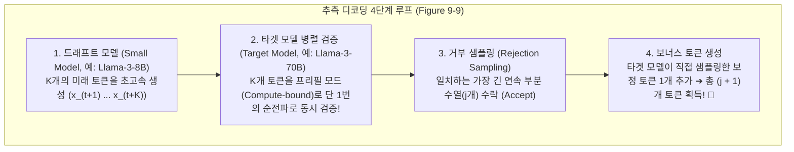
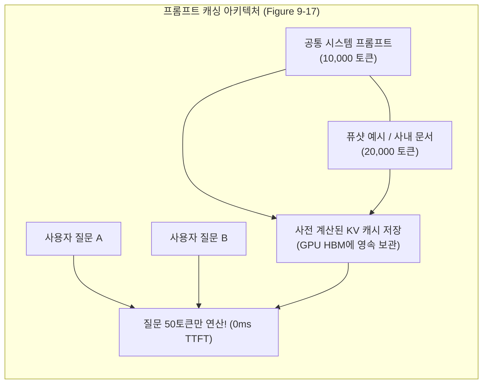
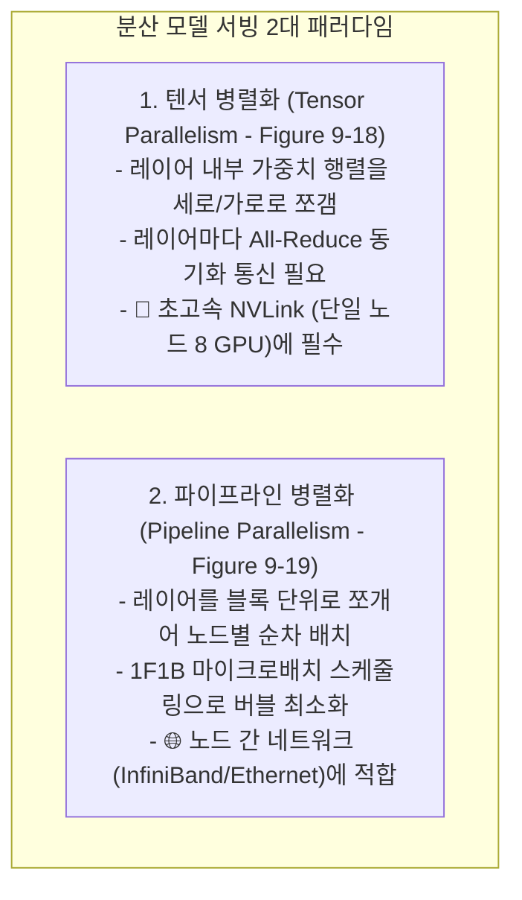

# 03. 추측 디코딩, 프롬프트 캐싱 및 분산 병렬화

## 📌 핵심 요약 & 전체 맥락
> **"단 한 번의 검증으로 $K$개의 토큰을 동시에 수확하고, 수만 토큰의 공통 프롬프트를 0ms로 즉각 재사용한다."**  
> 자기회귀 LLM의 순차적 토큰 생성(Decode Phase) 속도를 극한으로 끌어올리는 3대 핵심 서빙 기법은 **추측 디코딩(Speculative Decoding)**, **프롬프트 캐싱(Prompt/Prefix Caching)**, 그리고 **분산 가중치 분할(Tensor & Pipeline Parallelism)**입니다.  
> 가벼운 소형 모델이 $K$개의 토큰을 빠르게 초안 작성(Draft)하고 대형 모델이 단 1회의 병렬 연산으로 이를 검증(Verify)하여 수학적 무손실 2~3배 가속을 내는 **추측 디코딩(Figure 9-9)**,  
> 반복되는 시스템 프롬프트와 문서의 사전 계산된 KV 캐시를 재활용하여 **비용 90%, 지연시간 85%를 절감하는 프롬프트 캐싱(Figure 9-17, Table 9-3)**,  
> 그리고 70B 이상의 거대 모델을 복수의 GPU에 분할 적재하는 **텐서 병렬화(TP: Figure 9-18)와 파이프라인 병렬화(PP: Figure 9-19)**를 완벽하게 정리합니다.

---

## 🗺️ 도표(Figure & Table) 색인 및 매핑 가이드

본문의 핵심 원리를 시각적으로 확인할 수 있는 책 내 도표의 위치와 해설 매핑입니다:

| 도표 번호 | 도표 제목 및 핵심 내용 | 책 페이지 | 본문 해당 주제 |
| :---: | :--- | :---: | :--- |
| **Figure 9-9** | 드래프트 모델이 $K$개 토큰을 예측하고 메인 타겟 모델이 이를 병렬 검증하여 채택/거부하는 추측 디코딩 메커니즘 | **p. 429-453** | 1. 추측 디코딩 (Speculative Decoding) |
| **Figure 9-10** | 요약이나 문서 편집 작업에서 입력 프롬프트 내 $N$-gram을 드래프트 후보로 직접 추출하는 참조 기반 추측 디코딩 | **p. 431-455** | 1. 참조 기반 추측 (Prompt Lookup) |
| **Figure 9-11** | 단일 모델 상단에 복수의 디코딩 헤드를 장착하여 트리 형태로 토큰 후보군을 동시 예측하는 Medusa 구조 | **p. 433-457** | 1. Medusa 멀티헤드 디코딩 |
| **Figure 9-17** | 공통 시스템 프롬프트와 예시(Few-shot)의 KV 캐시를 고정 저장하고 실제 태스크만 계산하는 프롬프트 캐시 | **p. 443-467** | 2. 프롬프트 캐싱 (Prefix Caching) |
| **Table 9-3** | Anthropic Claude API의 프롬프트 캐싱 적용 시 비용(최대 90% 할인) 및 TTFT 지연시간(최대 85% 단축) 절감표 | **p. 444-468** | 2. 프롬프트 캐싱의 경제성 |
| **Figure 9-18** | 단일 트랜스포머 레이어 내 가중치 행렬을 복수의 디바이스(Device 1, 2)로 열/행 분할하는 텐서 병렬화 (TP) | **p. 446-470** | 3. 텐서 병렬화 (Tensor Parallelism) |
| **Figure 9-19** | 전체 레이어를 장치별로 순차 배치하고 마이크로배치(MB1~MB4)를 인터리빙하여 버블을 줄이는 파이프라인 병렬화 (PP) | **p. 446-470** | 3. 파이프라인 병렬화 (Pipeline Parallelism) |

---

## 1. 추측 디코딩 (Speculative Decoding, Figure 9-9) ⭐

> **"느리고 거대한 모델로 매번 1글자씩 쓰는 대신, 작고 빠른 모델로 한 문장을 통째로 써놓고 대형 모델이 단번에 일괄 채점(Verify)한다."**

### 🌟 왜 수학적으로 100% 무손실(Lossless)인가?
* 타겟 모델의 확률 분포 $P(x)$와 드래프트 모델의 확률 분포 $Q(x)$ 사이에서 **수학적 거부 샘플링(Rejection Sampling)**을 수행합니다.
* 드래프트 토큰이 채택될 확률: $\min\left(1, \frac{P(x)}{Q(x)}\right)$.  
  거부될 경우 타겟 모델이 잔여 확률 분포 $\max(0, P(x) - Q(x))$에서 정확히 샘플링하므로, **최종 출력 분포는 타겟 모델 단독 실행과 수학적으로 100% 동일(Lossless Guarantee)**합니다!

---

### 🚀 추측 디코딩 변형 기법들 (Figure 9-10, Figure 9-11)
1. **참조 기반 추측 (Prompt Lookup Decoding / Inference with Reference, Figure 9-10):**  
   별도의 소형 드래프트 모델 없이, **입력 프롬프트나 문서 본문에서 $N$-gram 매칭으로 미래 토큰을 복사**하여 드래프트로 사용 (문서 요약/코드 리팩토링에서 2~3배 가속).
2. **Medusa 멀티헤드 디코딩 (Cai et al., 2024, Figure 9-11):**  
   타겟 모델의 마지막 히든 스테이트에 여러 개의 경량 헤드를 부착하여, **트리 어텐션(Tree Attention)으로 미래 토큰 후보군을 동시 예측**.

---

## 2. 프롬프트 캐싱 (Prompt / Prefix Caching, Figure 9-17, Table 9-3) 🏆

### 💰 Anthropic 프롬프트 캐싱 실증 효과 (Table 9-3, p. 444)

| 지표 항목 | 기존 표준 API 호출 | 프롬프트 캐싱 적용 시 | 엔지니어링 절감 효과 |
| :--- | :---: | :---: | :--- |
| **캐시된 입력 토큰 비용** | 100% (기본 정가) | **10% (90% 대폭 할인 🚀)** | API 요금 폭탄 방어 |
| **첫 토큰 지연시간 (TTFT)** | 수 초 ~ 수십 초 (30,000 토큰 프리필) | **밀리초(ms) 단위 (최대 85% 단축 ⚡)** | 실시간 인터랙티브 UI 제공 |
| **최소 캐시 요구 토큰** | - | 1,024 토큰 이상 | 긴 컨텍스트에 최적 |

---

## 3. 분산 모델 서빙: 텐서 병렬화 vs 파이프라인 병렬화 (Figures 9-18, 9-19)

단일 GPU VRAM(80GB)에 올라가지 않는 70B~405B 모델을 여러 대의 GPU에 쪼개어 서빙하는 2대 핵심 기법:

### ① 텐서 병렬화 (Megatron-LM 스타일, Figure 9-18)
* **어텐션 블록:** $W_q, W_k, W_v$를 열(Column) 방향으로 쪼개고, $W_o$를 행(Row) 방향으로 쪼갠 뒤 **All-Reduce 1회로 결과 합산**.
* **MLP 블록:** 첫 번째 선형 변환을 열 방향, 두 번째 선형 변환을 행 방향으로 쪼개고 **All-Reduce 1회 수행**.
* **특징:** 통신량이 매우 잦으므로 **단일 머신 내 8장 GPU(NVLink 900GB/s)** 환경에서 주로 사용 ($TP=8$).

---

### ② 파이프라인 병렬화 (Pipeline Parallelism & 1F1B, Figure 9-19)
* **구조:** 레이어 1~20은 GPU 1, 레이어 21~40은 GPU 2, 레이어 41~60은 GPU 3, 레이어 61~80은 GPU 4에 배치.
* **마이크로배치(Micro-batching) 스케줄링 (Figure 9-19):**  
  하나의 거대한 배치를 여러 개의 마이크로배치(MB1, MB2, MB3, MB4)로 잘게 쪼개어 파이프라인에 밀어 넣음으로써, **앞 장치가 다음 배치를 연산하는 동안 뒷 장치가 이전 배치를 연산하는 완전 병렬 랩핑(Overlapping)**을 달성하여 유휴 버블(Idle Bubble)을 최소화합니다.

---

## 🔗 연관 문서
* [[00-ch09-overview|00. Chapter 9 전체 개요 및 목차]]
* [[01-inference-fundamentals-and-hardware-math|01. 추론 기초, 루프라인 모델 및 하드웨어 수학]]
* [[02-kv-cache-flashattention-and-batching|02. KV 캐시, FlashAttention 및 연속 배칭]]
* [[chapter-qa/ch07-fine-tuning-qa/03-peft-lora-and-qlora|Ch07-03. 매개변수 효율적 파인튜닝(PEFT)과 LoRA]]
