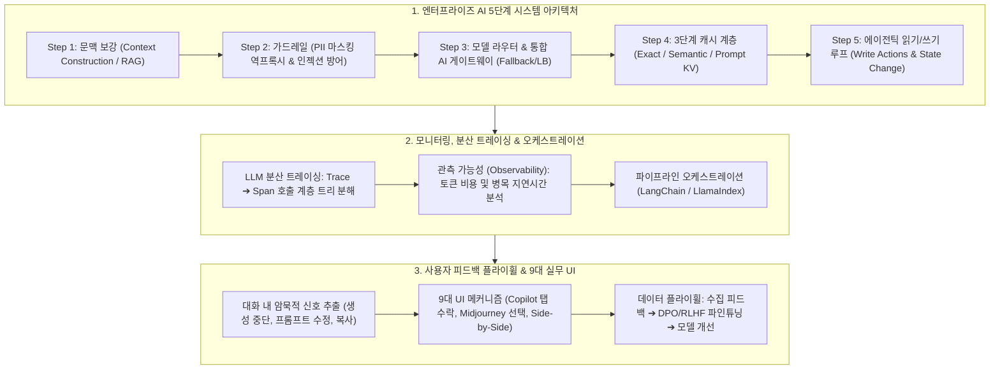

# Chapter 10. 엔터프라이즈 AI 시스템 아키텍처와 사용자 피드백 플라이휠

> **"단순한 데모 챗봇을 만드는 것은 쉽지만, 수백만 명의 사용자와 엄격한 엔터프라이즈 보안, 99.9% 가용성을 감당하는 프로덕션 시스템을 구축하는 것은 완전히 다른 차원의 엔지니어링입니다."**  
> AI 애플리케이션의 성공은 단순히 뛰어난 파운데이션 모델을 호출하는 데 그치지 않고,  
> **1) 문맥 보강(Context Enhancement), 2) 가드레일(Guardrails & PII 마스킹), 3) 모델 라우터 및 통합 게이트웨이, 4) 3단계 캐시 계층, 5) 에이전틱 읽기/쓰기 루프**로 이어지는 견고한 5단계 시스템 아키텍처를 완성하는 것에 달려 있습니다.  
> 또한 분산 트레이싱을 통한 **관측 가능성(Observability)**과, 사용자의 일상적 상호작용에서 암묵적 신호를 추출하여 모델을 지속적으로 진화시키는 **사용자 피드백 플라이휠(Feedback Flywheel) 및 9대 실무 UI 메커니즘**을 총망라합니다.

---

## 🗺️ Chapter 10 학습 로드맵 및 소챕터 구성

| 번호 | 문서 제목 | 핵심 내용 및 주요 키워드 | 원문 페이지 |
| :---: | :--- | :--- | :---: |
| **00** | [[00-ch10-overview\|00. Chapter 10 전체 개요 및 목차]] | 시스템 아키텍처 및 피드백 전체 로드맵, 개념 지도 및 도표 총괄 색인 | pp. 449-494 |
| **01** | [[01-enterprise-ai-application-architecture\|01. 엔터프라이즈 AI 5단계 아키텍처 진화]] | 단순 호출(Figure 10-1) ➔ 문맥 보강(Figure 10-2) ➔ 가드레일 및 PII 마스킹/역프록시(Figure 10-3, 10-4) ➔ 모델 라우터 & 통합 게이트웨이(Figure 10-5, 10-6, 10-7) ➔ 3단계 캐시 계층(Figure 10-8) ➔ 에이전틱 읽기/쓰기 피드백 루프(Figure 10-9, 10-10) (pp. 449-465) | `5-Step Evolution`, `Context Enhancement`, `Guardrails`, `PII Masking`, `Model Router`, `AI Gateway`, `Semantic Cache`, `Agent Loop` |
| **02** | [[02-observability-tracing-and-evalops\|02. 관측 가능성, 분산 트레이싱 및 오케스트레이션]] | 모니터링 vs 관측 가능성, LLM 분산 트레이싱 계층(Trace & Span, 토큰/비용/지연시간 분해, Figure 10-11 LangSmith), 이벤트 기반 AI 파이프라인 오케스트레이션 (Airflow, LangChain, LlamaIndex) (pp. 465-474) | `Observability vs Monitoring`, `Distributed Tracing`, `Trace and Span`, `LangSmith`, `Latency Attribution`, `Pipeline Orchestration` |
| **03** | [[03-user-feedback-flywheel-and-ui-mechanisms\|03. 사용자 피드백 플라이휠과 9대 실무 UI 메커니즘]] | 암묵적 대화 피드백 추출(Figure 10-12, Table 10-1 FITS 8대 클러스터), 9대 실무 피드백 UI 설계(ChatGPT Side-by-Side, Gemini Drafts, Midjourney Upscale, GitHub Copilot Telemetry, DALL-E Inpainting Figure 10-13 ~ 10-21), 피드백 편향 및 한계 (pp. 474-494) | `Feedback Flywheel`, `Implicit Feedback`, `FITS Dataset`, `Side-by-Side`, `Midjourney UI`, `Copilot Telemetry`, `Position Bias` |

---

## 🧠 Chapter 10 전체 개념 아키텍처 다이어그램

---

## 📊 Chapter 10 주요 도표 & 수치 색인

| 도표 번호 | 도표 제목 및 핵심 내용 | 책 페이지 | 해당 소챕터 |
| :---: | :--- | :---: | :--- |
| **Figure 10-1** | 클라이언트가 모델 API를 직접 호출하는 가장 단순한 0단계 AI 아키텍처 | **p. 450** | 01 |
| **Figure 10-2** | 데이터베이스 및 검색 엔진과 연결하여 프롬프트를 구성하는 1단계 문맥 보강 아키텍처 | **p. 451** | 01 |
| **Figure 10-3** | 입력 시 PII를 가명 토큰으로 치환하고 모델 응답 시 원래 값으로 복원하는 역프록시 구조 | **p. 453** | 01 |
| **Figure 10-4** | 입력 가드레일과 출력 가드레일이 모델의 앞뒤를 보호하는 2단계 안전 아키텍처 | **p. 455** | 01 |
| **Figure 10-5** | 질의의 난이도와 비용을 평가하여 소형/대형 모델로 분기하는 모델 라우터 (Model Router) | **p. 457** | 01 |
| **Figure 10-6** | 다양한 모델 벤더(OpenAI, Anthropic, 사내 vLLM)를 단일 인터페이스로 추상화한 AI 게이트웨이 | **p. 458** | 01 |
| **Figure 10-7** | 라우터와 게이트웨이가 통합된 3단계 프로덕션 인프라 구조 | **p. 459** | 01 |
| **Figure 10-8** | 완전 일치, 시맨틱 유사도, 프롬프트 캐시로 구성된 4단계 3중 캐시 아키텍처 | **p. 462** | 01 |
| **Figure 10-9** | 모델의 출력이 시스템의 다음 입력으로 피드백되는 기본 에이전트 루프 | **p. 464** | 01 |
| **Figure 10-10** | 외부 환경(DB, 파일 시스템, 서드파티 API)의 상태를 변경하는 5단계 쓰기 에이전트 아키텍처 | **p. 465** | 01 |
| **Figure 10-11** | LangSmith를 통해 시각화된 RAG 및 다단계 에이전트 호출의 분산 요청 트레이스(Trace) | **p. 471** | 02 |
| **Figure 10-12** | 사용자가 생성을 조기 중단(Stop)하고 프롬프트를 수정한 대화에서 부정적 피드백을 추출하는 흐름 | **p. 477** | 03 |
| **Table 10-1** | FITS 데이터셋 자동 클러스터링을 통해 규명된 8대 대화형 암묵적 피드백 유형 분류표 | **p. 478** | 03 |
| **Figure 10-13** | ChatGPT에서 답변 재생성(Regenerate) 시 이전 답변과 새 답변 중 선호도를 묻는 UI | **p. 479** | 03 |
| **Figure 10-14** | DALL-E에서 이미지의 특정 영역만 브러시로 칠해 재성성하는 인페인팅(Inpainting) 피드백 UI | **p. 481** | 03 |
| **Figure 10-15** | ChatGPT가 두 개의 응답을 나란히 보여주고 사용자가 더 나은 쪽을 고르게 하는 Side-by-Side UI | **p. 482** | 03 |
| **Figure 10-16** | Google Gemini가 3가지 초안(Draft 1, 2, 3)을 제시하고 사용자의 선택을 수집하는 UI | **p. 483** | 03 |
| **Figure 10-17** | Google Photos가 검색 결과가 불확실할 때 사용자에게 질문하여 정답 라벨을 수집하는 UI | **p. 484** | 03 |
| **Figure 10-18** | Midjourney가 4개 이미지를 격자로 생성하고 사용자가 Upscale/Variation을 클릭하도록 유도하는 UI | **p. 485** | 03 |
| **Figure 10-19** | GitHub Copilot이 회색 인라인 제안을 띄우고 Tab(수락) vs 타이핑(거절) 신호를 수집하는 UI | **p. 486** | 03 |
| **Figure 10-20** | ChatGPT가 주기적으로 블라인드 비교를 제시하여 모델 선호도 데이터를 크라우드소싱하는 화면 | **p. 487** | 03 |
| **Figure 10-21** | 분노 이모지(1점)를 눌렀을 때 구체적인 불만 이유를 추가 선택하도록 유도하는 세부 피드백 UI | **p. 488** | 03 |

---

## 💡 주요 축약어 원문 및 해설 사전 (Abbreviations Glossary)

* **PII (Personally Identifiable Information, 개인 식별 정보):** 주민등록번호, 신용카드 번호, 전화번호 등 법적으로 보호받아야 하는 개인정보로, 모델에 전송되기 전 역프록시에서 가명 토큰으로 치환(Masking)되어야 함.
* **Input / Output Guardrails (입출력 가드레일):** 모델 입력 전 프롬프트 인젝션/유해성을 차단하고, 모델 출력 후 환각/비속어/포맷 오류를 검사하여 격리하는 양방향 안전 필터.
* **Model Router (모델 라우터):** 질의의 난이도와 유형을 사전에 평가하여 간단한 질문은 7B 소형 모델로, 복잡한 다단계 추론은 GPT-4/Claude 3.5 같은 대형 모델로 분기하는 지능형 분배기.
* **AI Gateway (AI 통합 게이트웨이):** 여러 LLM 공급자의 서로 다른 API 스펙을 단일 인터페이스로 통합하고, 공급자 장애 시 즉시 대체 모델로 전환(Fallback)하며 호출 속도를 조절하는 인프라 계층.
* **Semantic Cache (시맨틱 캐시):** 이전 질의와 문자열이 정확히 일치하지 않더라도, 벡터 임베딩 유사도가 임계값(예: 0.95) 이상이면 이전 답변을 즉시 반환하는 캐시 기법.
* **Observability (관측 가능성):** 시스템의 외부 출력과 메트릭만을 보는 모니터링을 넘어, 내부 호출 트레이스(Trace)와 스팬(Span)을 추적하여 "왜 지연시간이 폭증했는가?"라는 인과 관계를 밝혀내는 역량.
* **Trace and Span (트레이스 & 스팬):** 단일 사용자 요청이 거치는 전체 여정(Trace)과 그 안의 개별 하위 작업(RAG 검색, 프롬프트 포맷팅, LLM 호출 등)의 단위 실행 구간(Span).
* **LangSmith (랭스미스):** LLM 애플리케이션의 모든 입출력, 프롬프트 버전, 토큰 소비량, 레이턴시 병목을 단계별로 시각화해 주는 대표적인 관측 가능성 플랫폼.
* **Feedback Flywheel (사용자 피드백 플라이휠):** 사용자 인터랙션에서 수집된 고품질 피드백 데이터를 선호도 데이터셋(DPO/RLHF)으로 가공하여 모델을 재학습시키고, 개선된 모델이 더 많은 사용자를 유치하는 선순환 구조.
* **FITS Dataset (Feedback in Text Streams):** 대화형 AI 상호작용 로그에서 사용자가 자연스럽게 표출하는 암묵적 피드백 패턴을 6개 클러스터로 규명한 대표적 연구.
* **Position Bias (위치 편향):** Side-by-Side 비교 시 사용자가 내용과 상관없이 항상 왼쪽(첫 번째)이나 오른쪽 응답을 무의식적으로 더 많이 선택하는 심리적 편향.
