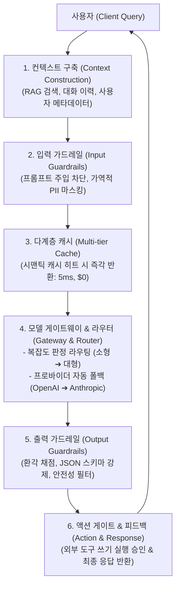
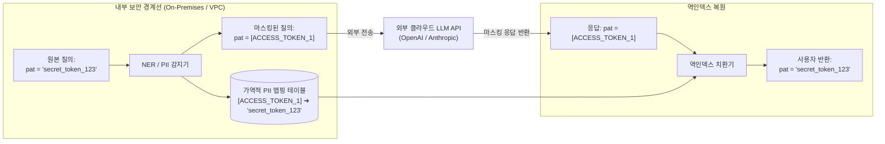
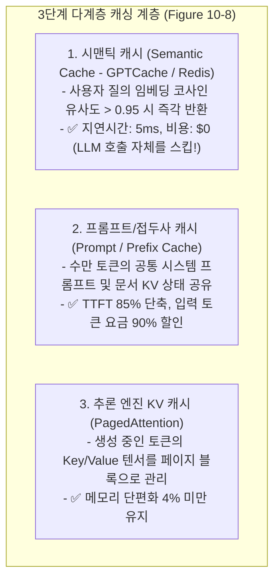

# 01. 엔터프라이즈 AI 플랫폼 시스템 아키텍처

## 📌 핵심 요약 & 전체 맥락
> **"단일 프롬프트 호출에서 출발하여, 보안·안전성·비용 최적화·도구 실행이 완비된 복합 AI 시스템(Compound AI System)으로 진화한다."**  
> 실제 엔터프라이즈 프로덕션 환경의 AI 시스템은 단순히 LLM API를 호출하는 데서 끝나지 않습니다.  
> 개인정보 유출을 원천 차단하는 **가역적 PII 마스킹(Figure 10-3)**, 유해 입력과 비정형 출력을 방어하는 **입출력 가드레일(Figure 10-4)**, 쿼리 난이도에 따라 모델을 지능적으로 분기하고 장애 시 자동 폴백하는 **모델 라우터 및 통합 게이트웨이(Figures 10-5, 10-6, 10-7)**,  
> 중복 질의 비용을 90% 이상 절감하는 **시맨틱/프롬프트 다계층 캐시(Figure 10-8)**, 그리고 데이터베이스를 안전하게 갱신하는 **외부 도구 쓰기(Write) 액션 루프(Figure 10-10)**를 단계별 아키텍처 다이어그램으로 완벽하게 정리합니다.

---

## 🗺️ 도표(Figure & Table) 색인 및 매핑 가이드

본문의 핵심 원리를 시각적으로 확인할 수 있는 책 내 도표의 위치와 해설 매핑입니다:

| 도표 번호 | 도표 제목 및 핵심 내용 | 책 페이지 | 본문 해당 주제 |
| :---: | :--- | :---: | :--- |
| **Figure 10-1** | 클라이언트 질의를 받아 모델 API로 즉시 전달하고 응답하는 가장 기초적인 1단계 아키텍처 | **p. 450-474** | 1. 아키텍처 진화 단계 |
| **Figure 10-2** | RAG 검색, 대화 이력, 사용자 프로필을 결합하는 컨텍스트 구축(Context Construction) 모듈 추가 | **p. 451-475** | 1. 컨텍스트 구축 |
| **Figure 10-3** | 토큰/비밀번호를 `[ACCESS_TOKEN]`으로 치환한 후 응답 시 역인덱스로 복원하는 가역적 PII 마스킹 | **p. 453-477** | 2. 개인정보 보호와 PII 마스킹 |
| **Figure 10-4** | 입력 가드레일(PII/탈옥 방어)과 출력 가드레일(안전성/루브릭/스키마 검증)이 추가된 아키텍처 | **p. 456-480** | 3. 입출력 가드레일 시스템 |
| **Figure 10-5** | 질의 난이도/비용에 따라 경량 모델(Llama-8B)과 고급 모델(GPT-4o)로 분기하는 쿼리 라우터 | **p. 458-482** | 4. 모델 라우터와 게이트웨이 |
| **Figure 10-6** | 통합 API 추상화, 토큰 관리, 장애 시 자동 폴백(Fallback)을 담당하는 중앙 모델 게이트웨이 | **p. 458-482** | 4. 모델 라우터와 게이트웨이 |
| **Figure 10-7** | 컨텍스트 구축, 가드레일, 라우팅, 게이트웨이가 하나로 유기적 결합된 플랫폼 통합 아키텍처 | **p. 460-484** | 4. 통합 아키텍처 청사진 |
| **Figure 10-8** | 시맨틱 캐시(Semantic Cache), 프롬프트 캐시, 엔진 KV 캐시가 통합된 다계층 캐시 아키텍처 | **p. 463-487** | 5. 다계층 캐싱 전략 |
| **Figure 10-9** | 생성된 모델 출력이 평가 스코어러를 거쳐 다시 컨텍스트로 주입되는 다중 턴 에이전트 루프 | **p. 464-488** | 6. 에이전트 루프와 쓰기 액션 |
| **Figure 10-10** | 읽기 전용 검색(Read-only)을 넘어 외부 데이터베이스 수정/발송을 수행하는 쓰기(Write) 액션 아키텍처 | **p. 465-489** | 6. 에이전트 루프와 쓰기 액션 |

---

## 1. 엔터프라이즈 AI 아키텍처 6단계 진화 (Figures 10-1 ~ 10-7) ⭐



---

## 2. 개인정보 보호와 가역적 PII 마스킹 (Figure 10-3, p. 453)

사내 기밀 데이터나 API 키, 고객 주민번호를 외부 상용 LLM API로 전송할 때 사용하는 **양방향 가역적 마스킹(Reversible PII Masking)**:



---

## 3. 입출력 가드레일 시스템 (Figure 10-4, pp. 455 ~ 457)

```
[ 엔터프라이즈 2대 가드레일 레이어 ]

1. 입력 가드레일 (Input Guardrails) :
   - 프롬프트 인젝션 및 탈옥(Jailbreak) 패턴 탐지
   - 개인식별정보(PII) 및 독성 발화 필터링
   - 비즈니스 도메인 이탈 질의(Out-of-Scope) 차단

2. 출력 가드레일 (Output Guardrails) :
   - 사실성/환각 검증 스코어러 (Self-Check / RAG Triad)
   - 구조화 출력 검증 (Pydantic / JSON 스키마 100% 준수 검사)
   - 브랜드 안전성(Brand Safety) 및 경쟁사 언급 차단 필터
```

---

## 4. 지능형 라우팅과 통합 모델 게이트웨이 (Figures 10-5, 10-6, 10-7) 🏆

### ① 쿼리 복잡도 기반 모델 라우팅 (Figure 10-5)
* **경량 라우터 분류기:** 사용자 질의의 복잡도와 필요 추론 단계를 5ms 이내에 판정.
  * **단순 사실 조회 / 번역 / 요약:** 경량·초저가 모델 (`GPT-4o-mini`, `Llama-3-8B`)로 라우팅 ➔ **비용 95% 절감!**
  * **고난도 코딩 / 복합 추론 / 법률 분석:** 프론티어 고성능 모델 (`Claude 3.5 Sonnet`, `o1`, `GPT-4o`)로 라우팅.

### ② 통합 모델 게이트웨이 (Model Gateway, Figure 10-6)
* **단일 인터페이스 추상화 (LiteLLM / Portkey):** 모든 애플리케이션 코드가 단일 엔드포인트를 바라보게 설계.
* **장애 복원력 (Failover & Fallback):** OpenAI 서비스에 503 에러나 레이트 리밋 발생 시, **0.1초 만에 Azure OpenAI 또는 Anthropic Claude 엔드포인트로 무중단 자동 페일오버**.
* **중앙 집중식 토큰 및 비용 거버넌스:** 팀별/프로젝트별 일일 API 사용량 쿼터 제한 및 로깅.

### ③ 안전한 모델 배포 전략 (Shadow & A/B Testing)
엔터프라이즈 환경에서는 새로운 프롬프트나 파인튜닝된 모델을 배포할 때, 게이트웨이 단에서 리스크를 통제합니다.
* **섀도우 모드 (Shadow Mode):** 사용자 요청을 기존 모델(Primary)과 새 모델(Shadow) 양쪽에 동시에 쏘고, 사용자에게는 기존 모델의 응답만 반환합니다. 새 모델의 응답은 로그로만 남겨 성능을 조용히 평가합니다.
* **A/B 테스트 라우팅:** 검증이 끝난 새 모델에 실제 트래픽의 5%만 먼저 흘려보내(Canary Release) 피드백 지표를 모니터링한 후 점진적으로 100%로 확대합니다.

---

## 5. 다계층 캐싱 아키텍처 (Multi-Tier Caching, Figure 10-8)



---

## 6. 에이전트 루프와 외부 도구 쓰기(Write) 액션 (Figure 10-9, 10-10)

* **읽기 전용 액션 (Read-only Actions):** 벡터 검색, SQL 조회, 웹 검색 등 시스템 상태를 바꾸지 않는 안전한 호출.
* **쓰기 액션 (Write Actions, Figure 10-10):**  
  이메일 발송, 결제 승인, DB 레코드 삭제, GitHub 커밋 등 **외부 상태를 영구적으로 변경하는 작업**.  
  ➔ **반드시 휴먼인더루프(Human-in-the-loop) 승인 게이트와 트랜잭션 롤백 메커니즘을 내장**해야 합니다.

---

## 🔗 연관 문서
* [[00-ch10-overview|00. Chapter 10 전체 개요 및 목차]]
* [[02-observability-tracing-and-evalops|02. 옵저버빌리티, 분산 트레이싱 및 프로덕션 EvalOps]]
* [[03-user-feedback-flywheel-and-ui-mechanisms|03. 사용자 피드백 데이터 플라이휠과 UI 메커니즘]]
* [[chapter-qa/ch06-rag-and-agents-qa/03-ai-agents-tools-and-function-calling|Ch06-03. AI 에이전트 기초와 도구 활용 및 함수 호출]]
