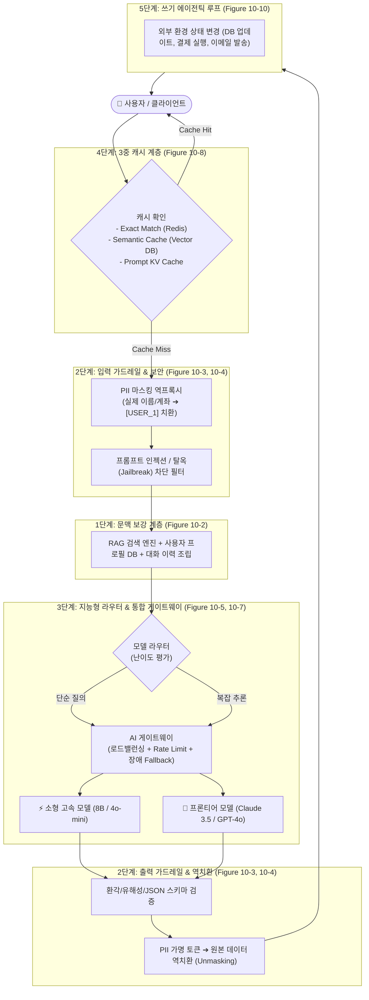
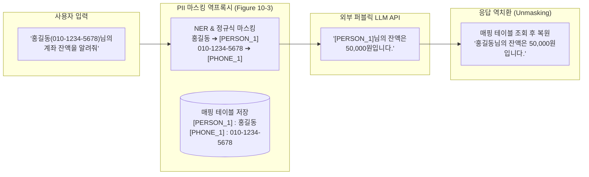
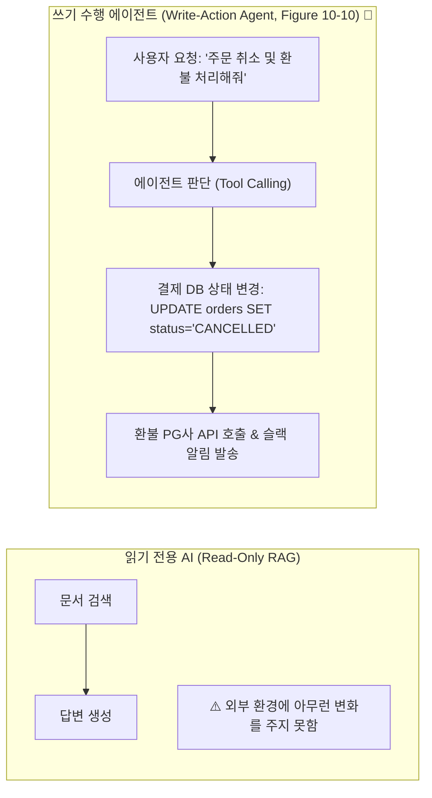

# 01. 엔터프라이즈 AI 5단계 아키텍처 진화

## 📌 핵심 요약 & 전체 맥락
> **"단순한 LLM API 호출(0단계)에서 출발하여, 보안·비용·지연시간·신뢰성을 보장하는 엔터프라이즈 프로덕션 시스템으로 진화하기 위해서는 5단계의 아키텍처 계층이 체계적으로 구축되어야 합니다."**  
> 대부분의 AI 프로젝트는 프로토타입 단계에서는 잘 동작하지만, 실제 고객에게 배포하는 순간 **개인정보(PII) 유출 위험, 프롬프트 인젝션 공격, 폭증하는 API 비용, 공급자 장애로 인한 서비스 중단**이라는 거대한 현실의 벽에 부딪힙니다.  
> 본 섹션에서는 원서(pp. 449~465)에서 제시하는 **엔터프라이즈 AI 시스템의 5단계 진화 로드맵 (Figures 10-1 ~ 10-10)**을 완벽히 정리합니다:  
> **1단계(문맥 보강) ➔ 2단계(가드레일 및 PII 마스킹 역프록시) ➔ 3단계(모델 라우터 및 통합 게이트웨이) ➔ 4단계(3단계 캐시 계층) ➔ 5단계(에이전틱 읽기/쓰기 아키텍처)**.

---

## 🗺️ 도표(Figure & Table) 색인 및 매핑 가이드

본문의 핵심 원리를 시각적으로 확인할 수 있는 책 내 도표의 위치와 해설 매핑입니다:

| 도표 번호 | 도표 제목 및 핵심 내용 | 책 페이지 | 본문 해당 주제 |
| :---: | :--- | :---: | :--- |
| **Figure 10-1** | 클라이언트가 모델 API를 직접 호출하는 가장 단순한 0단계 AI 아키텍처 | **p. 450** | 0단계: 기본 API 호출 |
| **Figure 10-2** | 데이터베이스 및 검색 엔진과 연결하여 프롬프트를 구성하는 1단계 문맥 보강 아키텍처 | **p. 451** | 1단계: 문맥 보강 (Context Enhancement) |
| **Figure 10-3** | 입력 시 PII를 가명 토큰으로 치환하고 모델 응답 시 원래 값으로 복원하는 역프록시 구조 | **p. 453** | 2단계: 가드레일과 PII 역프록시 |
| **Figure 10-4** | 입력 가드레일과 출력 가드레일이 모델의 앞뒤를 보호하는 2단계 안전 아키텍처 | **p. 455** | 2단계: 가드레일과 PII 역프록시 |
| **Figure 10-5** | 질의의 난이도와 비용을 평가하여 소형/대형 모델로 분기하는 모델 라우터 (Model Router) | **p. 457** | 3단계: 모델 라우터와 AI 게이트웨이 |
| **Figure 10-6** | 다양한 모델 벤더(OpenAI, Anthropic, 사내 vLLM)를 단일 인터페이스로 추상화한 AI 게이트웨이 | **p. 458** | 3단계: 모델 라우터와 AI 게이트웨이 |
| **Figure 10-7** | 라우터와 게이트웨이가 통합된 3단계 프로덕션 인프라 구조 | **p. 459** | 3단계: 모델 라우터와 AI 게이트웨이 |
| **Figure 10-8** | 완전 일치, 시맨틱 유사도, 프롬프트 캐시로 구성된 4단계 3중 캐시 아키텍처 | **p. 462** | 4단계: 레이턴시 단축 3중 캐시 |
| **Figure 10-9** | 모델의 출력이 시스템의 다음 입력으로 피드백되는 기본 에이전트 루프 | **p. 464** | 5단계: 에이전트 아키텍처 |
| **Figure 10-10** | 외부 환경(DB, 파일 시스템, 서드파티 API)의 상태를 변경하는 5단계 쓰기 에이전트 아키텍처 | **p. 465** | 5단계: 에이전트 아키텍처 |

---

## 🏗️ 엔터프라이즈 AI 5단계 아키텍처 종합 진화도



---

## 1. 0단계 ~ 2단계: 문맥 보강과 가드레일 (Figures 10-1 ~ 10-4, pp. 450 ~ 456)

### ① 0단계 & 1단계: 단순 호출에서 문맥 보강으로 (Figures 10-1, 10-2)
* **0단계 (Baseline, Figure 10-1):** 클라이언트가 OpenAI 등의 LLM API를 직접 호출. 모델의 지식이 정적이며 사내 데이터를 알지 못함.
* **1단계 (Context Construction, Figure 10-2):**  
  사용자의 질문을 그대로 모델에 보내지 않고, **1) 사내 벡터 DB에서 검색한 RAG 문서, 2) 사용자의 최근 대화 기록, 3) 시스템 지시문**을 결합하여 풍부한 문맥을 완성한 뒤 전송.

---

### ② 2단계: 가드레일과 PII 마스킹 역프록시 (Figures 10-3, 10-4) ⭐

엔터프라이즈 환경에서는 데이터 보호와 유해성 차단을 위해 모델 앞뒤에 가드레일을 배치합니다:



* **PII 마스킹 역프록시의 위력 (Figure 10-3):**  
  외부 상용 LLM 벤더(OpenAI, Anthropic 등)로 데이터가 전송될 때 실제 고객의 개인정보가 절대 노출되지 않도록 가명 토큰으로 치환하여 전송하고, 모델의 최종 응답을 사용자에게 보여줄 때만 사내 역프록시에서 원본으로 복원합니다 (GDPR/개인정보보호법 완벽 준수).
* **입/출력 가드레일 (Figure 10-4):**  
  * **입력 가드레일:** 탈옥(Jailbreak), 시스템 프롬프트 유출 시도, 비속어 차단.
  * **출력 가드레일:** JSON 스키마 문법 유효성 검증, 경쟁사 비방 방지, 환각 검증.

---

## 2. 3단계: 모델 라우터와 통합 AI 게이트웨이 (Figures 10-5 ~ 10-7, pp. 456 ~ 460) ⭐

### ① 모델 라우터 (Model Router, Figure 10-5)
모든 질의를 비싼 최상위 모델(GPT-4o, Claude 3.5 Sonnet)로 보내면 비용이 감당 불가능해집니다:
* **경량 스코어러(Scorer):** 입력된 질문의 복잡도, 필요 추론 깊이, 도메인을 10ms 만에 판별.
* **지능형 분기:**
  * 단순 인사/FAQ/요약 (전체 70%): **초저비용 소형 모델 (Llama 3.1-8B, GPT-4o-mini)**로 라우팅.
  * 복잡한 코딩/수학/다단계 추론 (전체 30%): **프론티어 모델 (Claude 3.5 Sonnet, o1)**로 라우팅.
  * ➔ **품질 저하 없이 전체 API 운영 비용 70% 절감!**

---

### ② 통합 AI 게이트웨이 (AI Gateway, Figures 10-6, 10-7)
여러 파운데이션 모델 벤더를 단일 엔드포인트로 추상화하여 제공합니다:

```
[ AI 게이트웨이의 5대 핵심 인프라 기능 ]

1. 멀티 벤더 추상화 (Unified API)    : OpenAI, Anthropic, Bedrock, 사내 vLLM을 단일 인터페이스로 호출.
2. 장애 자동 복구 (Automatic Failover) : 특정 공급자 장애(500 에러) 발생 시 즉시 대체 벤더 모델로 전환.
3. 속도 제한 및 쿼터 (Rate Limiting)   : 부서별/사용자별 분당 요청 수(RPM) 및 토큰 소비 한도 강제.
4. 로드 밸런싱 (Load Balancing)        : 동일 모델을 여러 리전/엔드포인트로 부하 분산.
5. 토큰 비용 및 지연시간 통합 측정     : 전사 AI 비용을 대시보드에 실시간 집계.
```

---

## 3. 4단계 & 5단계: 3중 캐시와 에이전틱 쓰기 아키텍처 (Figures 10-8 ~ 10-10, pp. 460 ~ 465) ⭐

### ① 4단계: 3중 캐시 계층 (Figure 10-8)
1. **완전 일치 캐시 (Exact Match Cache):**  
   동일한 프롬프트 문자열이 들어오면 Redis에서 1ms 만에 이전 응답을 즉시 반환 (비용 0원).
2. **시맨틱 캐시 (Semantic Cache):**  
   질문의 표현이 살짝 다르더라도(`"비밀번호 변경 어떻게 해?"` vs `"비번 바꾸는 법"`), 벡터 임베딩 코사인 유사도가 0.95 이상이면 저장된 응답 반환.
3. **프롬프트 KV 캐시 (Prompt KV Cache):**  
   동적 질문이더라도 공통 시스템 프롬프트/RAG 문맥의 KV 텐서를 재사용하여 90% 비용 할인.

---

### ② 5단계: 쓰기 작업을 수행하는 에이전틱 아키텍처 (Figures 10-9, 10-10)



* **환경 상태 변경 (State Mutation, Figure 10-10):**  
  현대 AI 시스템은 정보를 보여주는 데 그치지 않고, 데이터베이스 업데이트, API 호출, 이메일 발송 등 **실제 비즈니스 환경의 상태를 변경하는 액션(Write Actions)**을 수행합니다.
* ⚠️ **엔지니어링 안전장치 (HITL, Human-In-The-Loop):**  
  파괴적인 쓰기 작업(DB 삭제, 100만 원 이상 결제 등)에 대해서는 에이전트가 단독으로 실행하지 않고, **사용자에게 최종 확인 버튼(Confirmation Dialog)을 요구하는 안전장치**를 반드시 결합해야 합니다.

---

## 4. 엔지니어링 심화 Q&A

### Q1. 시맨틱 캐시(Semantic Cache)를 사용할 때 발생할 수 있는 가장 위험한 부작용은 무엇인가요?
사용자의 질문 의도가 미세하게 다른 경우에도 캐시가 오작동하여 엉뚱한 이전 답변을 내보내는 **'잘못된 캐시 히트(False Positive Hit)'**입니다.  
예를 들어 `"아이폰 15 프로 가격 알려줘"`와 `"아이폰 15 플러스 가격 알려줘"`는 임베딩 유사도가 0.96 이상으로 매우 높지만 정답은 완전히 다릅니다. 이를 방지하기 위해 **1) 유사도 임계값을 0.97 이상으로 매우 엄격하게 설정하고, 2) 엔티티(아이폰 모델명, 날짜 등) 일치 여부를 정규식으로 추가 검증**해야 합니다.

---

## 🔗 연관 문서
* [[00-ch10-overview|00. Chapter 10 전체 개요 및 목차]]
* [[02-observability-tracing-and-evalops|02. 관측 가능성, 분산 트레이싱 및 오케스트레이션]]
* [[03-user-feedback-flywheel-and-ui-mechanisms|03. 사용자 피드백 플라이휠과 9대 실무 UI 메커니즘]]
* [[chapter-qa/ch06-rag-and-agents-qa/03-agent-architectures-and-evaluation|Ch06-03. 에이전트 아키텍처와 도구 연동]]
