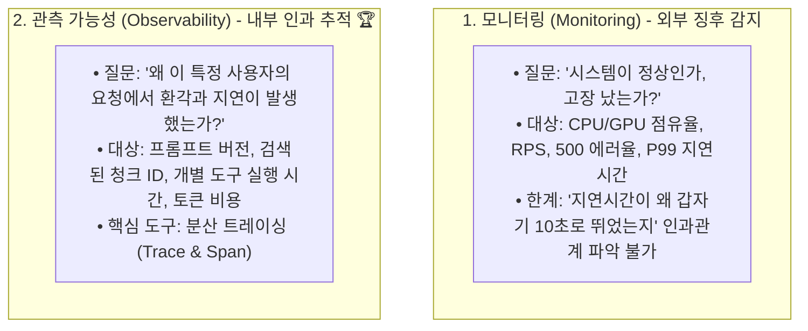
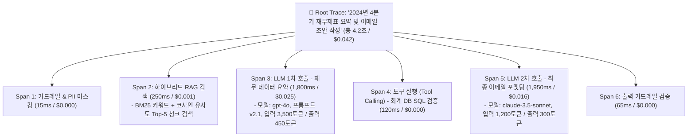

# 02. 관측 가능성, 분산 트레이싱 및 오케스트레이션

## 📌 핵심 요약 & 전체 맥락
> **"모니터링(Monitoring)이 '시스템에 불이 났다'는 것을 알려준다면, 관측 가능성(Observability)은 '어느 방의 어떤 전선에서 스파크가 튀었는가'를 정확히 짚어내는 능력입니다."**  
> 전통적인 웹 서버와 달리, 생성형 AI 시스템은 비결정론적인(Non-deterministic) LLM 호출, 다단계 RAG 검색, 도구 연동(Tool Calling)이 복잡하게 얽혀 있어 단순한 지연시간이나 에러율 모니터링만으로는 장애 원인을 찾을 수 없습니다.  
> 본 섹션에서는 모니터링과 관측 가능성의 본질적 차이, 전체 요청을 계층적 트리 구조로 분해하는 **분산 트레이싱 (Distributed Tracing: Trace & Span, Figure 10-11 LangSmith)**,  
> 복잡한 파이프라인에서 지연시간과 비용 병목을 정확히 추적하는 **지연시간 귀인(Latency Attribution)**,  
> 그리고 상태 지속성과 장애 복구를 보장하는 **AI 파이프라인 오케스트레이션 (Temporal, LangGraph)**의 원리를 완벽하게 정리합니다.

---

## 🗺️ 도표(Figure & Table) 색인 및 매핑 가이드

본문의 핵심 원리를 시각적으로 확인할 수 있는 책 내 도표의 위치와 해설 매핑입니다:

| 도표 번호 | 도표 제목 및 핵심 내용 | 책 페이지 | 본문 해당 주제 |
| :---: | :--- | :---: | :--- |
| **Figure 10-11** | LangSmith를 통해 시각화된 RAG 및 다단계 에이전트 호출의 분산 요청 트레이스(Trace) 계층 트리 | **p. 471** | 2. LLM 분산 트레이싱과 LangSmith |

---

## 1. 모니터링 vs 관측 가능성 (pp. 465 ~ 467)



| 비교 항목 | 모니터링 (Monitoring) | 관측 가능성 (Observability) |
| :--- | :--- | :--- |
| **주요 목적** | 알려진 장애(Known Unknowns) 감지 및 알람 발송 | 예측하지 못한 복잡한 이상(Unknown Unknowns) 원인 규명 |
| **수집 데이터** | 집계된 메트릭 (시계열 수치, 대시보드 그래프) | 개별 요청의 실행 여정 전체 (Trace, Span, Logs, Payloads) |
| **AI 적용 예시** | "지난 1시간 동안 API 평균 지연시간이 4.2초로 증가함" | "사용자 #42의 요청에서 벡터 검색(0.3s)은 정상이지만, 서드파티 SQL 도구 호출(3.8s)에서 병목 발생" |

---

## 2. LLM 분산 트레이싱: Trace & Span 계층 구조 (Figure 10-11, pp. 467 ~ 472) ⭐

복잡한 LLM 애플리케이션의 단일 요청은 여러 컴포넌트를 거치는 **계층적 트리 구조(Span Hierarchy)**로 추적됩니다:



### ① 지연시간 및 비용 귀인 (Latency & Cost Attribution)
분산 트레이싱을 적용하면 각 스팬별로 소비된 **1) 실행 시간(Latency), 2) 입력/출력 토큰 수, 3) 실제 달러 비용**이 정밀하게 분해됩니다:
* 전체 4.2초 중 90%의 시간(3.75초)이 LLM 호출(Span 3, Span 5)에 집중되어 있음을 발견 ➔ **프롬프트 캐싱이나 소형 모델 라우팅을 적용하여 1.5초 이하로 단축 가능**.

---

### ② 관측 가능성 플랫폼: LangSmith 실무 활용 (Figure 10-11)
* **프롬프트 버전 관리:** 각 트레이스마다 어떤 프롬프트 템플릿 버전(v1.2 vs v1.3)이 사용되었는지 기록.
* **실시간 디버깅 & 플레이그라운드:** 실패한 특정 스팬의 입출력 데이터를 단 한 번의 클릭으로 웹 플레이그라운드로 가져와 프롬프트를 수정하며 즉석 재현 테스트.
* **사용자 피드백 태깅:** 사용자가 누른 '좋아요/싫어요'나 재생성 클릭 이벤트가 해당 Trace ID에 즉시 바인딩되어 모델 평가 데이터셋으로 자동 연동.

---

## 3. AI 파이프라인 오케스트레이션 (pp. 472 ~ 474)

생성형 AI 에이전트와 RAG 파이프라인은 네트워크 오류, 토큰 한도 초과, 외부 API 장애에 취약합니다. 이를 안정적으로 운영하기 위한 **오케스트레이션 프레임워크**가 필요합니다:

```
[ 현대 AI 오케스트레이션 3대 도구 ]

1. Temporal (내구성 실행 / Durable Execution) 🏆 :
   • 서버가 다운되거나 재부팅되더라도 작업의 중간 상태(State)가 영구 보존되어 중단 지점부터 즉시 재개.
   • 복잡한 다단계 결제, 문서 승인, 결제 롤백(보상 트랜잭션) 에이전트에 최적.

2. LangGraph (상태 기반 순환 에이전트 / Stateful Graph) :
   • 조건부 분기(Conditional Edges)와 순환 루프(Cycles)를 지원하여 자기 반성(Self-Reflection) 에이전트 구축에 최적.

3. Apache Airflow (배치 파이프라인) :
   • 대규모 데이터 수집, 일일 임베딩 인덱스 갱신, 정기 파인튜닝 배치 작업 오케스트레이션.
```

---

## 4. 드리프트 탐지 (Drift Detection, pp. 471 ~ 472) ⭐

AI 애플리케이션은 모델과 사용자, 시스템이 지속적으로 상호작용하므로 시간이 지남에 따라 여러 형태의 **드리프트(변화)**가 발생할 수 있습니다. 관측 가능성 시스템은 이러한 변화를 조기에 감지해야 합니다:

1. **시스템 프롬프트 변경 (System Prompt Changes):**
   * 의도치 않게 프롬프트 템플릿이 업데이트되거나 동료가 오타를 수정하면서 발생. 시스템 프롬프트의 변경 사항을 추적하는 간단한 로직이 필요합니다.
2. **사용자 행동 변화 (User Behavior Changes):**
   * 사용자가 시스템의 특성을 파악하고 질문 방식을 최적화하면서 발생. (예: 더 짧은 응답을 유도하는 프롬프트 작성) 점진적인 응답 길이의 감소 등 단순 메트릭만으로는 원인을 파악하기 어려우므로 트레이스 조사가 필요합니다.
3. **기반 모델 업데이트 (Underlying Model Changes):**
   * API를 통해 모델을 사용할 때, 제공자가 모델을 몰래 업데이트(예: GPT-3.5-turbo 버전 교체)하면서 성능이나 출력이 달라지는 현상. 벤치마크 점수나 출력 품질이 갑자기 변동될 수 있습니다.

---

## 5. 엔지니어링 심화 Q&A

### Q1. 분산 트레이싱을 프로덕션 전 트래픽에 100% 켜두면 성능 저하나 비용 문제가 없나요?
모든 요청의 전체 페이로드(방대한 프롬프트와 생성 텍스트)를 100% 로깅하면 네트워크 대역폭과 트레이싱 플랫폼 비용이 급증할 수 있습니다.  
따라서 프로덕션에서는 **1) 정상 요청은 5~10%만 샘플링(Sampling)하여 기록하고, 2) 에러(500 오류), P99 지연시간 초과 요청, 사용자가 '싫어요'를 누른 요청은 100% 무조건 캡처하는 지능형 샘플링(Tail-based Sampling)**을 적용합니다.

---

## 🔗 연관 문서
* [[00-ch10-overview|00. Chapter 10 전체 개요 및 목차]]
* [[01-enterprise-ai-application-architecture|01. 엔터프라이즈 AI 5단계 아키텍처 진화]]
* [[03-user-feedback-flywheel-and-ui-mechanisms|03. 사용자 피드백 플라이휠과 9대 실무 UI 메커니즘]]
* [[chapter-qa/ch06-rag-and-agents-qa/03-agent-architectures-and-evaluation|Ch06-03. 에이전트 아키텍처와 도구 연동]]
