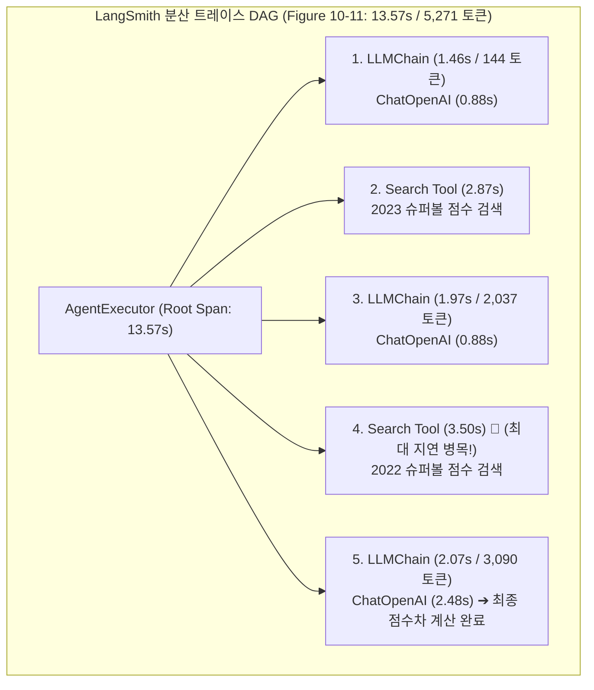

# 02. 옵저버빌리티, 분산 트레이싱 및 프로덕션 EvalOps

## 📌 핵심 요약 & 전체 맥락
> **"모니터링이 '시스템이 고장 났다'는 것을 알려준다면, 옵저버빌리티는 '어디서 왜 고장 났는지'를 코드를 열어보지 않고도 규명하게 해준다."**  
> 단일 모델 호출이 아닌 검색(RAG), 가드레일, 라우팅, 에이전트 도구 호출이 얽힌 복합 AI 시스템에서는 전체 지연시간(13.57초) 중 **어떤 도구(Search: 3.5초)나 어떤 체인 단계가 병목과 비용 폭증을 일으키는지 추적하는 분산 트레이싱(Tracing: Figure 10-11)**이 필수적입니다.  
> 본 섹션에서는 전통적 DevOps의 핵심 안정성 지표(MTTD, MTTR, CFR), AI 옵저버빌리티 3대 기둥(로그, 메트릭, 트레이스), 프로덕션 환경에서 모델 변경 위험을 제로화하는 **섀도우 배포(Shadow)와 카나리 롤아웃**, 그리고 시스템 프롬프트 및 데이터 분포 변화를 감지하는 **드리프트 탐지(Drift Detection)**를 완벽하게 정리합니다.

---

## 🗺️ 도표(Figure & Table) 색인 및 매핑 가이드

본문의 핵심 원리를 시각적으로 확인할 수 있는 책 내 도표의 위치와 해설 매핑입니다:

| 도표 번호 | 도표 제목 및 핵심 내용 | 책 페이지 | 본문 해당 주제 |
| :---: | :--- | :---: | :--- |
| **Figure 10-11** | 에이전트 실행(AgentExecutor, 13.57초/5,271토큰)의 각 하위 LLMChain과 Search Tool 호출별 지연시간 및 토큰 소모를 시각화한 LangSmith 트레이스 그래프 | **p. 471-495** | 2. 분산 트레이싱과 LangSmith |

---

## 1. 모니터링 vs 옵저버빌리티와 SRE 핵심 지표 (pp. 466 ~ 468)

```
[ AI 시스템 안정성을 위한 SRE 3대 메트릭 ]

1. MTTD (Mean Time To Detection) : 장애/성능 저하/환각 발생 시점부터 시스템이 이를 감지할 때까지의 평균 시간.
2. MTTR (Mean Time To Resolution) : 장애 감지 후 정상 상태로 롤백하거나 문제를 해결하는 데 걸리는 평균 시간.
3. CFR (Change Failure Rate) : 새로운 프롬프트나 모델을 배포했을 때 실패하여 롤백을 유발한 배포 비율 (배포 위험도 지표).
```

* **모니터링 (Monitoring):** 시스템의 외부 출력(HTTP 500 에러율, 단순 평균 지연시간)만을 관찰하여 문제가 생겼음을 감지.
* **옵저버빌리티 (Observability):**  
  새로운 코드를 배포하지 않고도, **내부 로그, 집계 메트릭, 분산 트레이스를 통해 복합 파이프라인 내부의 숨겨진 원인과 상태를 즉시 역추적(Inferring Internal State)**할 수 있는 능력.

---

## 2. 분산 트레이싱과 계층적 실행 그래프 (Figure 10-11, p. 471) 🏆

복합 에이전트 시스템에서는 단 한 번의 사용자 질문을 해결하기 위해 수십 번의 내부 호출이 발생합니다:



### 🔍 트레이싱이 제공하는 결정적 통찰 (Key Insights)
* **병목 위치 실시간 식별:** 전체 13.57초 중 LLM 추론 시간은 4.24초에 불과하며, **외부 검색 도구(Search Tool 2회: 6.37초)가 전체 지연시간의 약 50%를 차지**함을 즉시 발견 ➔ 검색 병렬화(`asyncio.gather`) 리팩토링 목표 도출.
* **토큰 비용 누적 추적:** 1단계 144토큰 $\rightarrow$ 2단계 2,037토큰 $\rightarrow$ 3단계 3,090토큰으로 **컨텍스트가 누적되면서 비용이 기하급수적으로 증가**함을 확인.

---

## 3. 프로덕션 EvalOps와 무중단 배포 전략 (pp. 471 ~ 476)

```mermaid
flowchart LR
    subgraph Deploy["프로덕션 안전 배포 3단계 파이프라인"]
        Live["실제 프로덕션 트래픽"] --> Splitter["트래픽 라우터"]
        
        Splitter -->|100% 실제 응답 반환| V1["현재 운영 모델 (v1.0)"]
        Splitter -.->|비동기 트래픽 복제 (Shadow)| V2_Shadow["1. 섀도우 배포 (v2.0)\n- 사용자 영향 0%\n- 실시간 품질/레이턴시 비교"]
        
        V2_Shadow -->|검증 완료 후| Canary["2. 카나리 배포 (Canary)\n1% ➔ 5% ➔ 20% ➔ 100%"]
        Canary --> Rollback["3. 자동 롤백 (Auto-Rollback)\n가드레일 위반율 > 1% 시 즉시 복구"]
    end
```

### ① 섀도우 배포 (Shadow Deployments / Dark Traffic)
* 실제 사용자에게는 기존 모델(v1.0)의 응답을 반환하면서, **동일한 입력 프롬프트를 백그라운드에서 신규 모델(v2.0)로 비동기 전송하여 병렬 실행**.
* 신규 모델의 크래시 여부, 응답 품질, 가드레일 위반율을 **사용자 리스크 0%로 실전 검증**.

### ② 카나리 롤아웃 (Canary Rollout)
* 1%의 소수 사용자에게만 신규 프롬프트/모델을 노출하고, **가드레일 위반율, 사용자 조기 중단율, TTFT 지연시간 지표가 안전할 때만 점진적으로 100%까지 확대**.

---

## 4. 시스템 드리프트 탐지 (Drift Detection, pp. 471 ~ 474)

```
[ 프로덕션 AI 시스템의 3대 드리프트 유형 ]

1. 시스템 프롬프트 드리프트 (System Prompt Drift) :
   동료 엔지니어가 템플릿의 사소한 문구를 수정하면서 모델의 JSON 파싱 성공률이 갑자기 하락하는 현상.
2. 데이터/사용자 분포 드리프트 (Data Drift) :
   새로운 마케팅 캠페인 이후 비전문가 사용자가 대거 유입되어 질의 어휘와 길이가 급변하는 현상.
3. 모델 드리프트 (Upstream Model Drift) :
   외부 API 제공업체(OpenAI 등)가 가중치를 무단 업데이트하여 동일한 프롬프트의 출력이 달라지는 현상.
```

---

## 🔗 연관 문서
* [[00-ch10-overview|00. Chapter 10 전체 개요 및 목차]]
* [[01-enterprise-ai-application-architecture|01. 엔터프라이즈 AI 플랫폼 시스템 아키텍처]]
* [[03-user-feedback-flywheel-and-ui-mechanisms|03. 사용자 피드백 데이터 플라이휠과 UI 메커니즘]]
* [[chapter-qa/ch04-evaluating-ai-systems-qa/04-designing-evaluation-pipeline-and-sample-size|Ch04-04. 평가 파이프라인 설계 및 표본 크기 수학]]
