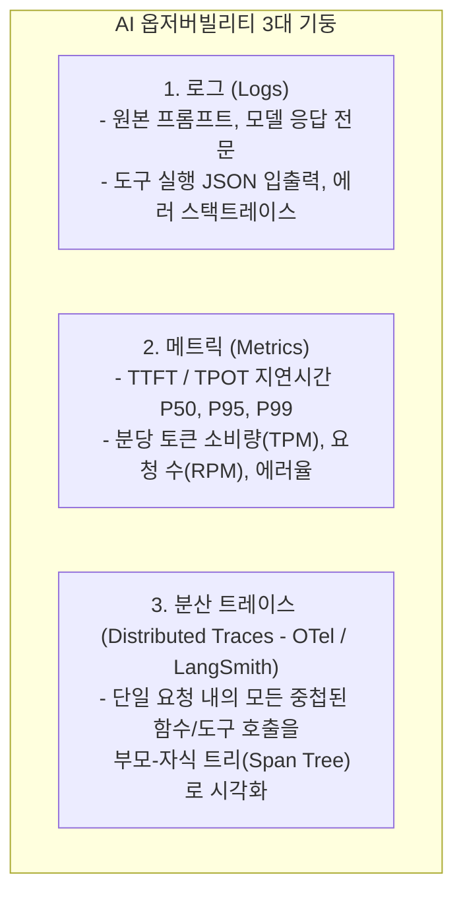

# 02. 옵저버빌리티, 분산 트레이싱 및 프로덕션 EvalOps

## 📌 핵심 요약 & 전체 맥락
> **"측정할 수 없으면 개선할 수 없다. 단일 질의 하나가 수십 개의 에이전트 도구와 RAG 검색을 거치는 복합 시스템에서는 분산 트레이싱(Distributed Tracing)이 시스템의 생명선입니다."**  
> AI 옵저버빌리티(Observability)는 전통적인 소프트웨어 모니터링 3대 기둥인 **로그(Logs), 메트릭(Metrics), 분산 트레이스(Traces)**를 AI 파이프라인에 이식한 체계입니다.  
> 본 섹션에서는 복잡한 에이전트 호출의 병목과 토큰 비용을 시각화하는 **LangSmith / OpenTelemetry 분산 트레이스 그래프(Figure 10-11)**, 실시간 온라인 트래픽의 독성과 환각을 채점하는 **프로덕션 EvalOps (Evaluation Operations)**, 그리고 사용자 장애 없이 안전하게 모델을 교체하는 **섀도우 배포(Shadow Deployment) 및 카나리 롤아웃**을 완벽하게 정리합니다.

---

## 🗺️ 도표(Figure & Table) 색인 및 매핑 가이드

본문의 핵심 원리를 시각적으로 확인할 수 있는 책 내 도표의 위치와 해설 매핑입니다:

| 도표 번호 | 도표 제목 및 핵심 내용 | 책 페이지 | 본문 해당 주제 |
| :---: | :--- | :---: | :--- |
| **Figure 10-11** | 단일 요청에 대한 RAG 검색기, 에이전트 판단, 도구 실행, 최종 생성을 트리 형태로 시각화한 LangSmith 트레이스 그래프 | **p. 468-492** | 1. 분산 트레이싱과 LangSmith |

---

## 1. AI 옵저버빌리티 3대 기둥 (Logs, Metrics, Traces, pp. 466 ~ 468)



---

## 2. 분산 트레이싱과 LangSmith 아키텍처 (Figure 10-11, pp. 468 ~ 471) ⭐

단일 질문에 대해 에이전트가 10번 생각하고 3번 검색하는 복합 파이프라인에서 **"왜 이번 응답이 5초나 걸렸고 0.2달러나 청구되었는가?"**를 추적하는 핵심 도구입니다:

```
[ LangSmith 분산 트레이스 스팬(Span) 트리 구조 (Figure 10-11) ]

Root Trace : "고객 지원 에이전트 전체 파이프라인" ──▶ 총 4.2초, $0.042
  ├── Span 1 : PII 마스킹 및 의도 분류 (0.05초, $0.001)
  ├── Span 2 : RAG 검색기 (Retriever) (0.8초, $0.000)
  │     ├── Sub-Span 2-1 : 쿼리 임베딩 생성 (0.1초)
  │     └── Sub-Span 2-2 : Pinecone HNSW 벡터 검색 (0.7초) ⚠️ (지연시간 병목!)
  ├── Span 3 : Planner LLM 호출 (1.8초, $0.025, 2,500 토큰)
  ├── Span 4 : Python 코드 실행 도구 호출 (0.4초)
  └── Span 5 : 최종 응답 생성 모델 (1.1초, $0.016, 1,200 토큰)
```

* **스팬(Span) 메타데이터 필수 수집 항목:**
  1. `input_tokens` / `output_tokens` (정확한 비용 산정)
  2. `latency_ms` / `time_to_first_token` (지연시간 프로파일링)
  3. `model_name` & `temperature` (재현성 확보)
  4. `user_id` & `session_id` (사용자 단위 분석)

---

## 3. 프로덕션 EvalOps와 실시간 품질 가드 (pp. 471 ~ 474)

* **EvalOps (Evaluation Operations, 지속적 평가 운영 체계):**  
  사전 배포 단계의 정적 벤치마크 평가를 넘어, **프로덕션 라이브 트래픽의 1~5%를 실시간 샘플링하여 AI 판사(LLM-as-a-Judge) 및 규칙 스코어러로 지속 평가**하는 운영 체계.
* **실시간 평가 3대 지표:**
  * **환각 지수 (Faithfulness):** 답변이 검색된 문서의 사실에 근거하고 있는가?
  * **지시 준수율 (Instruction Following):** JSON 스키마와 필수 요구조건을 만족했는가?
  * **독성 및 안전성 (Toxicity & Safety):** 가드레일을 우회한 부적절한 발화가 없는가?

---

## 4. 안전한 모델 배포 전략 (Shadow Deployment & Canary, pp. 474 ~ 476)

```mermaid
flowchart TD
    subgraph Routing["안전한 무중단 배포 파이프라인"]
        Traffic["사용자 실제 트래픽"] --> Splitter{"게이트웨이 트래픽 분기"}
        Splitter -->|95% 메인 트래픽| ProdModel["기존 안정 모델 (v1.0 Production)"]
        Splitter -->|5% 카나리 트래픽| CanaryModel["신규 튜닝 모델 (v2.0 Canary)"]
        Splitter -.->|100% 미러링 (비동기 복제)| ShadowModel["신규 후보 모델 (v2.0 Shadow)"]
        
        ProdModel --> UserResponse["사용자에게 응답 반환"]
        CanaryModel --> UserResponse
        ShadowModel -.->|응답 버림, 로그만 기록| EvalLog[("오프라인 EvalOps 평가 DB")]
    end
```

---

## 🔗 연관 문서
* [[00-ch10-overview|00. Chapter 10 전체 개요 및 목차]]
* [[01-enterprise-ai-application-architecture|01. 엔터프라이즈 AI 플랫폼 시스템 아키텍처]]
* [[03-user-feedback-flywheel-and-ui-mechanisms|03. 사용자 피드백 데이터 플라이휠과 UI 메커니즘]]
* [[chapter-qa/ch09-inference-optimization-qa/01-inference-fundamentals-and-hardware-math|Ch09-01. 추론 기초, 루프라인 모델 및 하드웨어 수학]]
