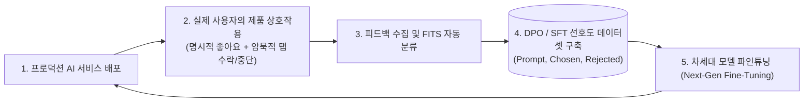
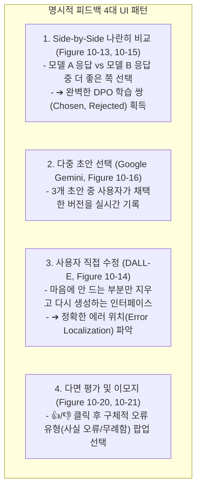

# 03. 사용자 피드백 데이터 플라이휠과 UI 메커니즘

## 📌 핵심 요약 & 전체 맥락
> **"사용자가 AI를 사용하는 매 순간 남기는 클릭, 수정, 복사, 중단 행동은 차세대 모델을 만드는 가장 값진 황금 데이터셋입니다."**  
> AI 애플리케이션의 지속적인 경쟁 우위는 제품을 사용할수록 모델이 더 똑똑해지는 **사용자 피드백 데이터 플라이휠 (User Feedback Flywheel)**에서 비롯됩니다.  
> 사용자가 직접 평가 버튼을 누르는 **명시적 피드백(Explicit Feedback: Side-by-Side 비교, DALL-E 인페인팅 수정)**뿐만 아니라,  
> 답변이 마음에 안 들어 중간에 멈추는 **조기 생성 중단(Early Stop)**, 다시 고쳐 묻는 **쿼리 재작성(Query Reformulation)**, 그리고 **GitHub Copilot의 탭(Tab) 수락/거절**과 같은 **암묵적 피드백(Implicit Feedback)**을 수집하여 FITS 프레임워크를 통해 **DPO (Direct Preference Optimization)** 및 **RLHF** 학습 데이터셋으로 자동 환류하는 UI/UX 메커니즘을 총망라합니다.

---

## 🗺️ 도표(Figure & Table) 색인 및 매핑 가이드

본문의 핵심 원리를 시각적으로 확인할 수 있는 책 내 도표의 위치와 해설 매핑입니다:

| 도표 번호 | 도표 제목 및 핵심 내용 | 책 페이지 | 본문 해당 주제 |
| :---: | :--- | :---: | :--- |
| **Figure 10-12** | 모델이 횡설수설할 때 사용자가 'Stop Generating'을 누르고 질문을 고쳐 쓰는 암묵적 부정 피드백 흐름도 | **p. 477-501** | 2. 암묵적 피드백 신호 |
| **Table 10-1** | FITS 프레임워크의 사용자 피드백 8대 자동 클러스터링 분류표 (사실 오류, 지시 불이행, 톤 부적절 등) | **p. 480-504** | 3. FITS 8대 피드백 분류 체계 |
| **Figure 10-13** | ChatGPT에서 답변 재생성(Regenerate) 시 두 답변 중 더 나은 쪽을 선택하게 유도하는 UI | **p. 482-506** | 1. 명시적 비교 피드백 UI |
| **Figure 10-14** | DALL-E에서 생성된 이미지 중 마음에 안 드는 특정 영역만 브러시로 지우고 재수정하는 인페인팅 UI | **p. 483-507** | 1. 사용자 직접 수정 피드백 UI |
| **Figure 10-15** | ChatGPT가 동일한 프롬프트에 대해 모델 A와 B의 응답을 나란히(Side-by-Side) 보여주고 선호도를 묻는 UI | **p. 484-508** | 1. Side-by-Side 비교 UI |
| **Figure 10-16** | Google Gemini가 3개의 초안(Draft 1, 2, 3)을 제시하고 사용자가 최적본을 탭하도록 유도하는 UI | **p. 485-509** | 1. 다중 초안 선택 UI |
| **Figure 10-17** | Google Photos 검색에서 AI가 결과의 불확실성을 느끼고 "이 사진이 맞나요?"라고 피드백을 요청하는 UI | **p. 486-510** | 1. 모델 주도 불확실성 피드백 |
| **Figure 10-18** | Midjourney가 4장의 그림 중 사용자의 업스케일(U1~U4) 및 변형(V1~V4) 클릭을 기록하는 암묵 피드백 | **p. 488-512** | 2. Midjourney 암묵적 선호 신호 |
| **Figure 10-19** | GitHub Copilot이 회색 코드를 제안하고 사용자가 `Tab`을 눌러 수락하거나 타이핑으로 거절하는 UI | **p. 490-514** | 2. GitHub Copilot 탭 신호 |
| **Figure 10-20** | ChatGPT에서 엄지 척(👍)/엄지 척 다운(👎) 클릭 후 상세 이유(사실 오류, 유해성 등)를 선택하는 UI | **p. 492-516** | 1. 명시적 다면 평가 UI |
| **Figure 10-21** | Luma Dream Machine 비디오 생성 후 5가지 감정 이모지로 즉각적 만족도를 남기는 UI | **p. 493-517** | 1. 이모지 기반 경량 피드백 |

---

## 1. 사용자 피드백 데이터 플라이휠 (Data Flywheel, pp. 476 ~ 478)



---

## 2. 암묵적 피드백: 최고의 무소음 데이터 원천 (Implicit Signals, pp. 477 ~ 482) ⭐

사용자에게 별도의 설문지나 피드백 버튼을 누르게 하는 것은 전환율이 1% 미만으로 매우 낮습니다.  
반면 **사용자의 일상적인 UI 인터랙션 속에서 자연스럽게 발생하는 암묵적 신호**는 100%의 전수 수집이 가능합니다:

```
[ 대표적인 4대 암묵적 피드백 신호 ]

1. 조기 생성 중단 (Early Stop, Figure 10-12) :
   - 모델이 응답을 스트리밍하는 도중 사용자가 [Stop] 버튼을 누름 ➔ 강력한 부정 신호 (Negative Signal)!

2. 쿼리 재작성 (Query Reformulation, Figure 10-12) :
   - 이전 답변을 보고 곧바로 문장을 조금 고쳐서 다시 물어봄 ➔ 이전 응답이 불만족스러웠음을 증명.

3. 복사 및 내보내기 (Copy to Clipboard / Share) :
   - 생성된 코드를 복사하거나 텍스트를 슬랙으로 공유함 ➔ 강력한 긍정 신호 (Positive Signal)!

4. GitHub Copilot의 탭(Tab) 수락/거절 (Figure 10-19) :
   - 회색 제안 코드 수락(Tab) = Chosen (선호 응답)
   - 무시하고 직접 다른 코드 타이핑 = Rejected (거절 응답)
   - ➔ 하루 수억 건의 완벽한 DPO 선호도 데이터셋이 실시간 자동 축적됨!
```

---

## 3. FITS: 피드백 주도 자동 분류 프레임워크 (Table 10-1, pp. 479 ~ 482)

유입되는 수백만 건의 부정 피드백을 AI 판사가 **8가지 카테고리로 자동 클러스터링(Table 10-1)**하여 다음 버전 개발 우선순위를 결정합니다:

| 피드백 분류 | 증상 및 원인 분석 | 해결 엔지니어링 액션 |
| :--- | :--- | :--- |
| **1. 사실 오류 (Factual Incorrectness)** | 모델 환각 또는 잘못된 검색 문서 | RAG 지식베이스 갱신 및 리랭커 도입 |
| **2. 지시 불이행 (Instruction Following)** | JSON 포맷 미준수, 글자 수 제한 초과 | 시스템 프롬프트 Few-shot 보강 및 SFT |
| **3. 문맥 오해 (Context Misunderstanding)** | 대화 이전 맥락이나 지시대명사 놓침 | 쿼리 재작성 모듈 및 메모리 서머라이저 적용 |
| **4. 불완전한 응답 (Incompleteness)** | 답변 도중 잘림 또는 핵심 요점 누락 | Max Output Tokens 확대 및 CoT 강화 |
| **5. 톤 및 스타일 부적절 (Inappropriate Tone)** | 지나치게 무례하거나 장황한 설명 | 페르소나 파인튜닝 및 스타일 가이드라인 |
| **6. 도구 호출 오류 (Tool Failure)** | 존재하지 않는 함수 호출 또는 인자 오타 | Tool Schema 명세 간소화 및 파라미터 검증 |
| **7. 안전성 및 유해성 (Safety Issue)** | 편향, 비속어, 기밀 데이터 노출 | 입력/출력 가드레일 규칙 즉시 업데이트 |
| **8. 지연시간 불만 (Slow Latency)** | TTFT > 3초로 인한 사용자 이탈 | 프롬프트 캐싱, vLLM 서빙 엔진 전환 |

---

## 4. 명시적 피드백 UI 메커니즘 (Figures 10-13 ~ 10-21, pp. 482 ~ 493)



---

## 🔗 연관 문서
* [[00-ch10-overview|00. Chapter 10 전체 개요 및 목차]]
* [[01-enterprise-ai-application-architecture|01. 엔터프라이즈 AI 플랫폼 시스템 아키텍처]]
* [[02-observability-tracing-and-evalops|02. 옵저버빌리티, 분산 트레이싱 및 프로덕션 EvalOps]]
* [[chapter-qa/ch08-datasets-and-data-engineering-qa/01-data-curation-quality-coverage-and-quantity|Ch08-01. 데이터 큐레이션: 품질, 다양성 및 데이터 규모]]
* [[chapter-qa/ch07-fine-tuning-qa/01-finetuning-foundations-and-decision-framework|Ch07-01. 파인튜닝 기초와 엔지니어링 의사결정 프레임워크]]
