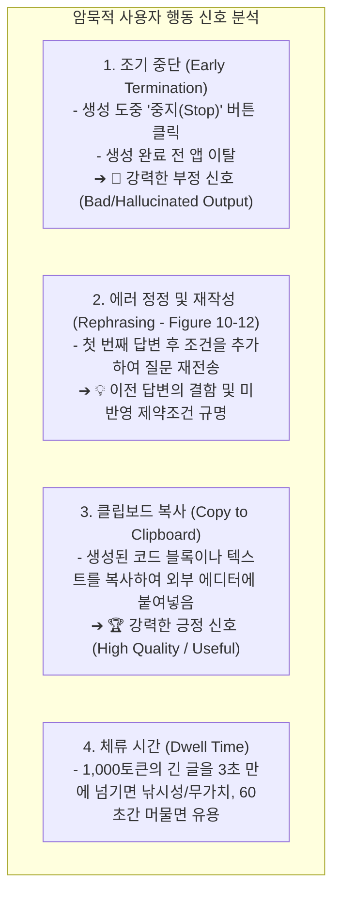
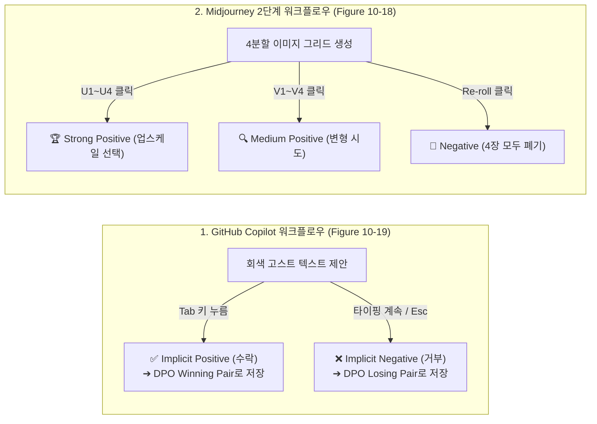
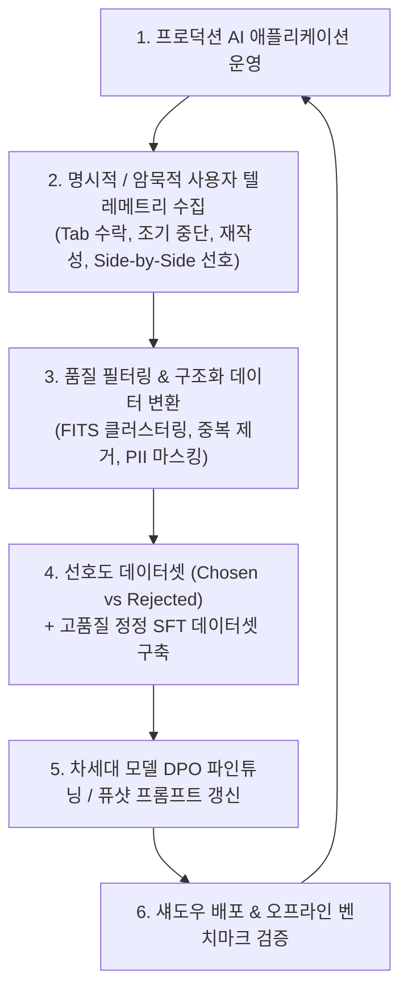

# 03. 사용자 피드백 데이터 플라이휠과 UI 메커니즘

## 📌 핵심 요약 & 전체 맥락
> **"최고의 AI 제품은 피드백을 구걸하지 않는다. 제품을 사용하는 자연스러운 행동(Tab 수락, 재생성, 재작성) 자체가 자동으로 최고급 선호도 데이터가 되도록 UX를 설계한다."**  
> AI 시스템의 지속적 개선(Continuous Improvement)은 사용자의 상호작용에서 발생하는 피드백을 차세대 모델의 학습 데이터(DPO / RLHF / SFT)로 환류하는 **데이터 엔진 플라이휠(Data Flywheel)**에 의해 결정됩니다.  
> 사용자의 조기 생성 중단(Early Stop)과 쿼리 재작성 신호(Figure 10-12), 대규모 대화 데이터셋에서 추출한 **FITS 8대 사용자 불만 분류 체계(Table 10-1)**,  
> Side-by-Side 비교(Figure 10-15) 및 부분 초안 비교(Figure 10-16) 같은 **명시적 평가 UI**,  
> 그리고 GitHub Copilot의 `Tab` 키 수락(Figure 10-19)과 Midjourney의 `U1~U4` 업스케일 선택(Figure 10-18) 등 **마찰 없는 암묵적 피드백 UX 설계 패턴**을 완벽하게 정리합니다.

---

## 🗺️ 도표(Figure & Table) 색인 및 매핑 가이드

본문의 핵심 원리를 시각적으로 확인할 수 있는 책 내 도표의 위치와 해설 매핑입니다:

| 도표 번호 | 도표 제목 및 핵심 내용 | 책 페이지 | 본문 해당 주제 |
| :---: | :--- | :---: | :--- |
| **Figure 10-12** | 사용자가 답변 생성을 도중에 중단(Stop Generation)하고 쿼리를 더 구체적으로 재작성하는 암묵적 부정 신호 | **p. 477-501** | 1. 암묵적 자연어 행동 피드백 |
| **Table 10-1** | FITS 데이터셋 자동 클러스터링 기반 사용자 피드백 8대 분류표 (요구 재명시 26.5%, 관련 없는 답변 16.2% 등) | **p. 478-502** | 2. FITS 피드백 8대 분류 체계 |
| **Figure 10-13** | ChatGPT에서 답변 재생성(Regenerate) 시 이전 답변과 비교하여 선호도를 묻는 피드백 다이얼로그 | **p. 479-503** | 3. 명시적 피드백 수집 UI |
| **Figure 10-14** | DALL-E에서 이미지의 특정 결함 영역을 브러시로 선택하고 프롬프트로 수정하는 인페인팅(Inpainting) UI | **p. 482-506** | 3. 명시적 피드백 수집 UI |
| **Figure 10-15** | 프로덕션 ChatGPT에서 두 개의 상이한 모델 출력을 나란히 제시하고 선호도를 선택하게 하는 Side-by-Side 비교 | **p. 483-507** | 3. Side-by-Side 실시간 평가 |
| **Figure 10-16** | Google Gemini에서 긴 전체 텍스트 대신 첫 몇 문장(Partial Drafts)만을 나란히 보여주어 피로도를 낮춘 비교 UI | **p. 484-508** | 3. Side-by-Side 실시간 평가 |
| **Figure 10-17** | Google Photos에서 "이 두 고양이가 같은 고양이인가요?"처럼 AI가 불확실할 때만 사용자에게 묻는 능동적 확인 UI | **p. 484-508** | 3. 능동적 불확실성 피드백 |
| **Figure 10-18** | Midjourney에서 4분할 그리드 생성 후 `U1~U4`(업스케일) 및 `V1~V4`(변형) 클릭을 통해 수집되는 암묵적 선호 신호 | **p. 486-510** | 4. 워크플로우 내재화 암묵적 피드백 |
| **Figure 10-19** | GitHub Copilot에서 회색 고스트 텍스트를 `Tab` 키로 즉시 수락하거나 무시하고 타이핑을 지속하는 마찰 제로 UX | **p. 486-510** | 4. 워크플로우 내재화 암묵적 피드백 |
| **Figure 10-20** | 통계 질문에 대해 ChatGPT가 두 가지 관점의 답변을 생성하고 사용자가 선호하는 쪽을 선택하도록 유도하는 UI | **p. 488-512** | 3. 명시적 피드백 수집 UI |
| **Figure 10-21** | Luma Dream Machine에서 1~5점 별점 대신 화난 표정부터 웃는 표정까지 5단계 이모지로 수집하는 감정 피드백 | **p. 489-513** | 3. 명시적 피드백 수집 UI |

---

## 1. 암묵적 자연어 행동 피드백 (Implicit Signals, Figure 10-12) ⭐

사용자가 설문조사나 좋아요/싫어요 버튼을 누르지 않아도, **일상적인 앱 사용 행동 패턴**에서 강력한 품질 신호를 추출할 수 있습니다:

---

## 2. FITS 데이터셋 8대 사용자 피드백 분류 체계 (Table 10-1, p. 478) 🏆

Xu et al. (2022)과 Yuan et al. (2023)이 실제 대화형 검색 봇(FITS) 데이터셋에서 **사용자 불만 텍스트를 자동 클러스터링하여 도출한 8대 피드백 유형**:

| 그룹 | 피드백 유형 (Feedback Type) | 발생 건수 | 비율 (%) | 제품 엔지니어링 개선 방향 |
| :---: | :--- | :---: | :---: | :--- |
| **1** | 자신의 요구사항을 다시 명확히 설명함 (Clarify demand again) | 3,702 | **26.54%** | 질문 의도 파악 및 다중 턴 문맥 유지력 강화 |
| **2** | 봇이 질문에 답하지 않거나 무관한 내용을 말함 | 2,260 | **16.20%** | 관련성(Relevance) 평가 및 탈주 방지 가드레일 |
| **3** | 질문에 답할 수 있는 구체적인 검색 결과를 직접 지목함 | 2,255 | **16.17%** | RAG 검색기(Retriever)의 상위 랭킹(Recall) 개선 |
| **4** | 봇에게 주어진 검색 결과를 제대로 활용하라고 제안함 | 2,130 | **15.27%** | RAG 생성 프롬프트의 Context Grounding 지시 강화 |
| **5** | 답변이 사실과 다르거나 검색 결과에 근거하지 않음 (환각) | 1,572 | **11.27%** | 사실성(Factuality) 스코어러 및 인용 출처 명시 |
| **6** | 답변이 구체적이지 않고 모호하거나 불완전함 | 1,309 | **9.39%** | 응답 상세도(Detail Level) 및 시스템 프롬프트 튜닝 |
| **7** | 봇이 자신감 없이 "잘 모르겠습니다"로만 일관함 | 582 | **4.17%** | 과도한 보수적 거절(Refusal) 완화 및 추론 유도 |
| **8** | 답변의 반복(Repetition)이나 무례한 톤에 대해 항의함 | 137 | **0.99%** | 반복 억제 페널티(Frequency Penalty) 및 톤 교정 |

---

## 3. 마찰 없는 피드백 UX 설계 패턴 (Figures 10-18, 10-19) ⭐

> 💡 **"사용자에게 피드백을 달라고 부탁하지 말고, 사용자가 원하는 다음 행동을 완료하는 과정에서 피드백이 저절로 남도록 설계하라."**

* **GitHub Copilot의 혁신 (Figure 10-19):**  
  수억 명의 개발자가 코딩 중에 자연스럽게 누르는 `Tab`(수락)과 무시(거부)가 매일 **수억 쌍의 고품질 페어와이즈(Chosen vs Rejected) 선호도 데이터셋으로 무한 축적**됨!

---

## 4. 데이터 플라이휠과 지속적 개선 루프 (The Continuous Flywheel)

* **플라이휠 완결:**  
  사용자가 늘어날수록 피드백 데이터가 정밀해지고, 이 데이터로 파인튜닝된 다음 세대 모델은 환각과 거절 빈도가 낮아져 더 많은 사용자를 유치하는 **AI 제품의 영구적 경쟁 우위(Data Flywheel Moat)**가 완성됩니다.

---

## 🔗 연관 문서
* [[00-ch10-overview|00. Chapter 10 전체 개요 및 목차]]
* [[01-enterprise-ai-application-architecture|01. 엔터프라이즈 AI 플랫폼 시스템 아키텍처]]
* [[02-observability-tracing-and-evalops|02. 옵저버빌리티, 분산 트레이싱 및 프로덕션 EvalOps]]
* [[chapter-qa/ch07-fine-tuning-qa/01-finetuning-foundations-and-decision-framework|Ch07-01. 파인튜닝 기초 개념과 학습 파이프라인]]
* [[chapter-qa/ch08-datasets-and-data-engineering-qa/01-data-curation-quality-coverage-and-quantity|Ch08-01. 데이터 큐레이션: 품질, 다양성 및 데이터 규모]]
