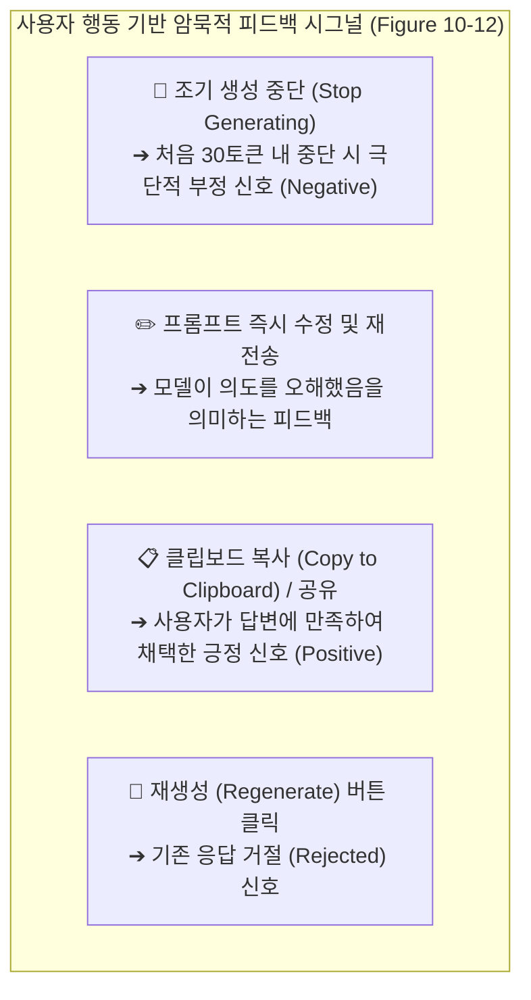
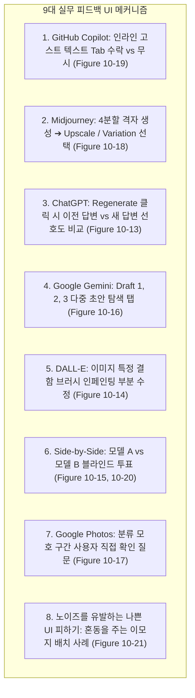
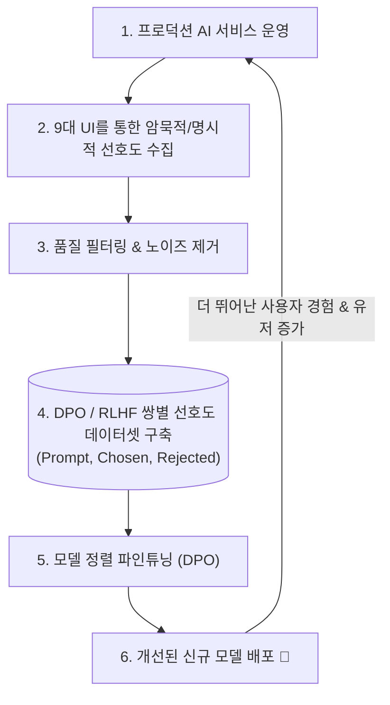

# 03. 사용자 피드백 플라이휠과 9대 실무 UI 메커니즘

## 📌 핵심 요약 & 전체 맥락
> **"사용자에게 '이 답변을 평가해 주세요'라는 설문창을 띄우는 순간 99%의 사용자는 이탈합니다. 최고의 AI 제품은 사용자가 제품을 자연스럽게 사용하는 행동 자체가 완벽한 선호도 라벨(Preference Label)이 되도록 UI를 설계합니다."**  
> AI 시스템을 지속적으로 개선하는 원동력은 바로 **사용자 피드백 플라이휠 (Feedback Flywheel)**입니다.  
> 본 섹션에서는 사용자의 생성 중단, 메시지 수정, 복사하기 행동에서 암묵적 신호를 추출하는 **대화형 피드백 마이닝 (Figure 10-12, Table 10-1 FITS 데이터셋)**부터,  
> Midjourney의 4분할 업스케일, GitHub Copilot의 인라인 탭 수락, ChatGPT/Gemini의 다중 초안 비교 등 **프론티어 AI 기업들의 9대 실무 피드백 UI 설계 패턴(Figures 10-13 ~ 10-21)**,  
> 그리고 수집된 피드백을 DPO/RLHF 학습 데이터로 연결하는 파이프라인과 **위치 편향(Position Bias) 등 피드백의 한계**를 완벽하게 정리합니다.

---

## 🗺️ 도표(Figure & Table) 색인 및 매핑 가이드

본문의 핵심 원리를 시각적으로 확인할 수 있는 책 내 도표의 위치와 해설 매핑입니다:

| 도표 번호 | 도표 제목 및 핵심 내용 | 책 페이지 | 본문 해당 주제 |
| :---: | :--- | :---: | :--- |
| **Figure 10-12** | 사용자가 생성을 조기 중단(Stop)하고 프롬프트를 수정한 대화에서 부정적 피드백을 추출하는 흐름 | **p. 477** | 1. 대화 내 암묵적 피드백 추출 |
| **Table 10-1** | FITS 데이터셋 자동 클러스터링을 통해 규명된 8가지 사용자 불만 피드백 유형 분류표 | **p. 478** | 1. 대화 내 암묵적 피드백 추출 |
| **Figure 10-13** | ChatGPT에서 답변 재생성(Regenerate) 시 이전 답변과 새 답변 중 선호도를 묻는 UI | **p. 479** | 2. 9대 실무 피드백 UI 메커니즘 |
| **Figure 10-14** | DALL-E에서 이미지의 특정 영역만 브러시로 칠해 재성성하는 인페인팅(Inpainting) 피드백 UI | **p. 481** | 2. 9대 실무 피드백 UI 메커니즘 |
| **Figure 10-15** | ChatGPT가 두 개의 응답을 나란히 보여주고 사용자가 더 나은 쪽을 고르게 하는 Side-by-Side UI | **p. 482** | 2. 9대 실무 피드백 UI 메커니즘 |
| **Figure 10-16** | Google Gemini가 3가지 초안(Draft 1, 2, 3)을 제시하고 사용자의 선택을 수집하는 UI | **p. 483** | 2. 9대 실무 피드백 UI 메커니즘 |
| **Figure 10-17** | Google Photos가 검색 결과가 불확실할 때 사용자에게 질문하여 정답 라벨을 수집하는 UI | **p. 484** | 2. 9대 실무 피드백 UI 메커니즘 |
| **Figure 10-18** | Midjourney가 4개 이미지를 격자로 생성하고 사용자가 Upscale/Variation을 클릭하도록 유도하는 UI | **p. 485** | 2. 9대 실무 피드백 UI 메커니즘 |
| **Figure 10-19** | GitHub Copilot이 회색 인라인 제안을 띄우고 Tab(수락) vs 타이핑(거절) 신호를 수집하는 UI | **p. 486** | 2. 9대 실무 피드백 UI 메커니즘 |
| **Figure 10-20** | ChatGPT가 주기적으로 블라인드 비교를 제시하여 모델 선호도 데이터를 크라우드소싱하는 화면 | **p. 487** | 2. 9대 실무 피드백 UI 메커니즘 |
| **Figure 10-21** | 5점 만점 위치에 분노 이모지를 배치하여 사용자 혼란과 노이즈 피드백을 유발한 잘못된 UI 디자인 사례 (Luma) | **p. 488** | 2. 9대 실무 피드백 UI 메커니즘 |

---

## 1. 대화 내 암묵적 피드백 추출 (Figure 10-12, Table 10-1, pp. 474 ~ 480) ⭐

명시적 피드백(좋아요/싫어요 버튼)은 전체 사용자의 **1% 미만**만 참여합니다. 따라서 일상적인 사용 행동에서 **암묵적 피드백(Implicit Feedback)**을 정밀하게 추출해야 합니다:

### ① FITS 데이터셋의 사용자 불만 피드백 유형 8가지 (Table 10-1)
사용자의 자연어 피드백(특히 불만사항)을 분석하면 모델이 어떻게 실패했는지 구체적으로 파악하고 개선할 수 있습니다:
1. 요구사항 다시 명확히 하기 (Clarify demand)
2. 봇이 질문에 답하지 않거나 무관한 답변을 함
3. 정답이 포함된 특정 검색 결과를 직접 짚어줌
4. 봇에게 특정 검색 결과를 사용하라고 제안함
5. 답변이 사실과 다르거나 근거가 없다고 지적함 (Factually incorrect)
6. 답변이 구체적이지 않거나 불완전하다고 지적함
7. 봇이 너무 확신 없이 대답("잘 모르겠지만...")한다고 지적함
8. 봇의 답변이 지나치게 반복적이거나 무례하다고 불평함
➔ **활용 방향:** 사용자가 "구체성이 부족하다(6번)"고 주로 불평한다면 시스템 프롬프트를 더 상세하게 답하도록 수정하는 식의 직접적인 피드백 루프를 구축할 수 있습니다.

---

## 2. 프론티어 AI 제품의 9대 실무 피드백 UI 메커니즘 (Figures 10-13 ~ 10-21, pp. 480 ~ 490) ⭐

성공적인 AI 서비스들은 사용자가 의식하지 않고도 최고 품질의 피드백을 남기도록 UI를 설계합니다:

### 💡 대표 4대 UI 메커니즘 심층 분석

#### 1. GitHub Copilot의 회색 고스트 텍스트 (Figure 10-19) 🏆
* 회색 텍스트로 인라인 추천을 띄우고, 개발자가 **`Tab`을 누르면 즉시 수락(Positive)**, 무시하고 타이핑을 계속하거나 **`Esc`를 누르면 즉시 거절(Negative)**로 기록.
* 사용자의 작업 흐름을 0.1초도 방해하지 않으면서 매일 수십억 개의 실시간 코드 선호도 토큰을 수집.

#### 2. Midjourney의 $2 \times 2$ 그리드 및 업스케일 (Figure 10-18) 🏆
* 단 1장의 이미지를 주는 대신 **4장의 서로 다른 스타일 이미지를 격자로 제공**.
* 사용자가 고해상도로 키우고 싶은 이미지(`U1~U4`)를 클릭하는 순간, **나머지 3개는 '버려진(Rejected) 데이터', 선택된 1개는 '선택된(Chosen) 데이터'**로 완벽한 4지 선다 DPO 데이터셋이 자동 완성됨.

#### 3. Google Gemini의 3중 초안 (Drafts 1, 2, 3, Figure 10-16)
* 백그라운드에서 3개의 응답 초안을 동시 생성해 두고 상단 탭으로 제공하여, 사용자가 다른 초안을 클릭하는 행동을 실시간 선호도 신호로 추적.

#### 4. DALL-E 인페인팅 부분 수정 (Figure 10-14)
* 전체 이미지를 다시 그리지 않고, 손가락이나 텍스트 등 어색한 부분만 브러시로 지우고 재생성하게 하여 **정확히 어느 좌표의 어떤 요소가 실패했는지에 대한 미세 결함 라벨**을 획득.

---

## 3. 사용자 피드백 플라이휠 (Feedback Flywheel, pp. 490 ~ 492)

---

## 4. 피드백 수집의 한계와 편향 (Biases, pp. 490 ~ 492)
책에서는 수집된 피드백을 활용할 때 주의해야 할 주요 편향(Bias)들을 강조합니다:

1. **관대함 편향 (Leniency Bias):**  
   갈등을 피하거나 귀찮음을 이유로 실제보다 더 긍정적인 평가(예: 무조건 5점)를 내리는 경향. "아주 좋음", "개선 필요" 등 구체적인 텍스트 옵션을 제공하여 완화할 수 있습니다.
2. **위치 편향 (Position Bias):**  
   Side-by-Side 비교 시 무의식적으로 첫 번째(왼쪽) 응답을 선택하는 경향. 옵션의 위치를 무작위로 섞어 노출하여 해결해야 합니다.
3. **무작위성 (Randomness) 및 선호도 편향 (Preference Bias):**  
   너무 길고 복잡한 선택지 앞에서는 대충 무작위로 고르거나, 답변의 정확도보다 '더 긴 답변(Length)'을 선호하는 편향이 발생합니다.
4. **퇴화 피드백 루프 (Degenerate Feedback Loop):**  
   모델의 예측이 사용자의 피드백에 영향을 주고, 이것이 다시 모델 학습에 반영되어 초기 편향(예: 특정 주제 편향, 아부하는 성향-Sycophancy)이 증폭되는 '필터 버블' 현상입니다.

---

## 5. 엔지니어링 심화 Q&A

### Q1. 수집된 사용자 피드백을 DPO(Direct Preference Optimization) 학습 데이터로 가공할 때 가장 주의해야 할 점은 무엇인가요?
**Chosen(선택된 답변)과 Rejected(거절된 답변)의 품질 격차가 명확해야 합니다.**  
두 답변이 거의 대등하거나 둘 다 훌륭한데 사소한 취향 차이로 갈린 데이터를 무분별하게 DPO에 넣으면 모델의 로짓 확률 분포가 흔들리고 성능이 저하됩니다. LLM-as-a-Judge로 두 응답 간의 의미론적 품질 점수 차이가 일정 기준 이상 벌어진 **확실한 고신뢰도 피드백 쌍만 선별하여 학습**시켜야 합니다.

---

## 🔗 연관 문서
* [[00-ch10-overview|00. Chapter 10 전체 개요 및 목차]]
* [[01-enterprise-ai-application-architecture|01. 엔터프라이즈 AI 5단계 아키텍처 진화]]
* [[02-observability-tracing-and-evalops|02. 관측 가능성, 분산 트레이싱 및 오케스트레이션]]
* [[chapter-qa/ch07-fine-tuning-qa/01-finetuning-foundations-and-decision-framework|Ch07-01. 파인튜닝 기초와 엔지니어링 의사결정 프레임워크]]
